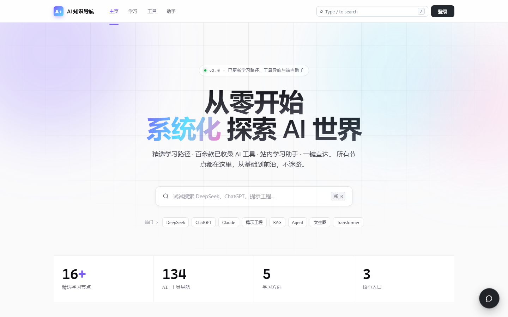
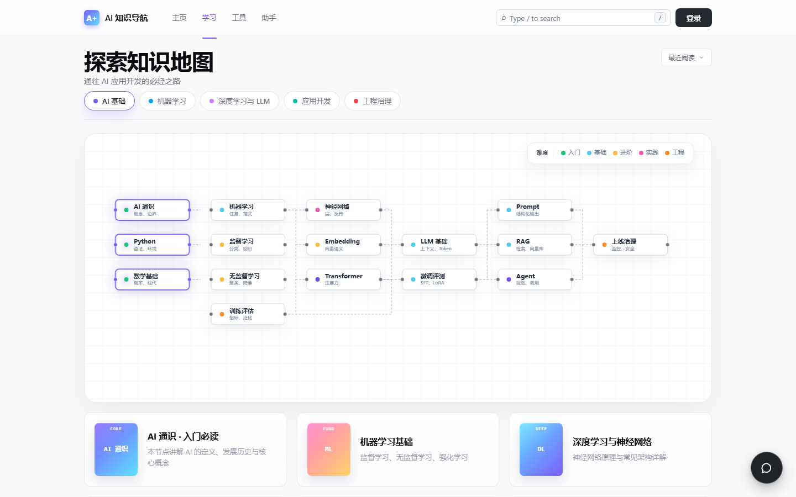
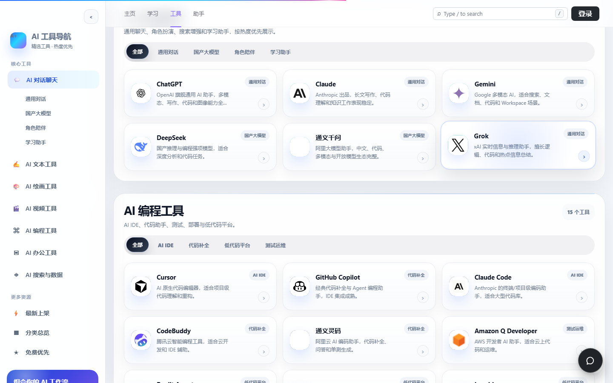
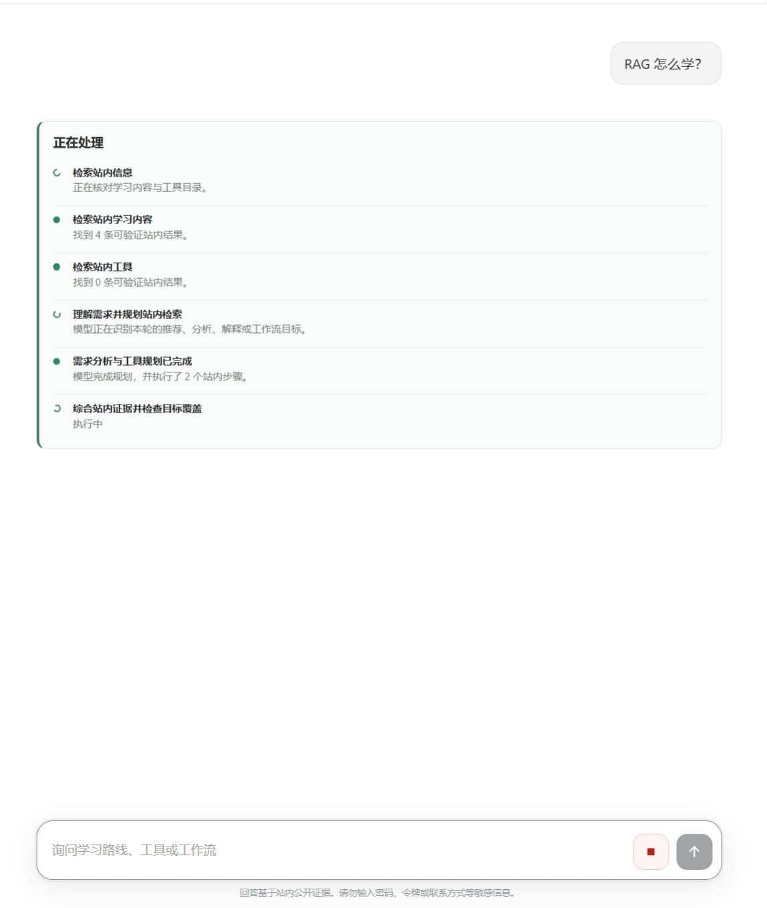
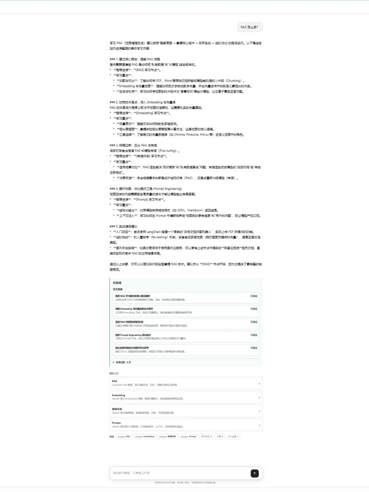
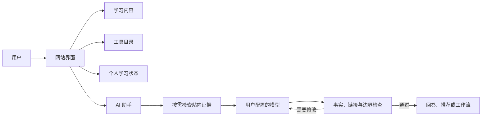

# AI 知识导航

> 把 AI 学习路线、工具目录和可追溯的个性化助手放进同一个网站。

<p align="center">
  <a href="https://github.com/WNIK7750/StarChart-AI/actions/workflows/ai-nav-foundation-ci.yml"></a>
  
  
  
</p>

AI 知识导航（StarChart AI）是一个面向 AI 学习者的源码公开项目。它用知识地图组织学习内容，
用结构化目录整理工具，再由用户自己配置的模型结合站内证据回答问题、推荐资源和规划工作流。

当前版本优先支持 **Windows 单机本地运行**。学习区和工具区可以直接浏览；助手需要登录，
并使用用户自己的 OpenAI-compatible 模型与 API Key。网站不提供默认模型，也不会把用户的
API Key 写入 SQLite。

> [!NOTE]
> 本项目允许学习、研究和其他非商业用途，但不允许未经授权的商业使用。它属于
> source-available，而不是 OSI 定义的开源软件。完整条款见 [LICENSE](LICENSE)。

<p align="center">
  <a href="docs/assets/screenshots/readme/home-desktop.png">
    
  </a>
</p>

<p align="center"><sub>真实运行界面：首页、学习入口、工具目录与助手入口</sub></p>

## 为什么做这个项目

AI 学习资料很多，但“找到内容”并不等于“知道下一步做什么”。常见问题是资料、工具、进度和
AI 对话彼此割裂，模型给出的建议也很难回到站内实际内容。

| 常见体验 | AI 知识导航的做法 |
| --- | --- |
| 学习资料散落在收藏夹和搜索结果中 | 用知识地图、前置关系和学习节点组织内容 |
| 工具推荐依赖模型记忆，容易过时或答非所问 | 先检索站内工具事实，再由模型解释选择理由 |
| AI 回答没有出处，也无法继续操作 | 回答绑定站内学习节点、工具卡片和可点击入口 |
| 平台限定模型或代管用户密钥 | 用户自行配置 Provider、模型 ID 和 API Key |
| 复杂任务失败后只剩一句报错 | 展示处理阶段，并在边界内重试、重写或降级为可执行建议 |

## 主要能力

### 探索学习知识地图

- 按领域、难度和前置关系浏览学习路线；
- 查看章节、主资料、补充资料、建议时长与相关节点；
- 登录后记录进度、最近阅读和收藏；
- 公开学习内容不依赖 Agent 或用户状态。

<p align="center">
  <a href="docs/assets/screenshots/readme/learning-map-desktop.png">
    
  </a>
</p>

<p align="center"><sub>知识地图：从 AI 通识、Python 和数学基础逐步进入 LLM、RAG 与 Agent</sub></p>

### 查找和比较 AI 工具

- 浏览分类、子分类和经过维护的工具条目；
- 按关键词、访问方式和免费优先等条件筛选；
- 查看工具说明、站内状态和实际访问入口；
- 让助手基于同一份站内目录完成推荐和组合建议。

<p align="center">
  <a href="docs/assets/screenshots/readme/tools-search-desktop.png">
    
  </a>
</p>

<p align="center"><sub>工具目录：输入“代码”后的真实搜索结果</sub></p>

### 用助手完成学习与规划任务

助手会先理解目标并检索用户有权访问的站内内容，再让用户配置的模型完成分析、讲解、推荐或
文本工作流设计。输出会保留来源和站内入口，不会把模型的自由发挥冒充站内事实。

- 支持学习路线、工具推荐、原因分析和任务拆解；
- 支持为用户生成可确认保存的个人工作流；
- 支持流式展示准备、检索、综合和结果检查阶段；
- 输出不符合站内链接、事实或隐私边界时，会携带修改建议重新生成；
- 网站不能直接完成的任务会降级为草案、步骤或替代方案，不伪造执行结果。

<table>
  <tr>
    <td width="50%" align="center"><a href="docs/assets/screenshots/readme/assistant-preparing.jpg"></a></td>
    <td width="50%" align="center"><a href="docs/assets/screenshots/readme/assistant-complete.jpg"></a></td>
  </tr>
  <tr>
    <td align="center">准备阶段：检索并核对站内内容</td>
    <td align="center">完整结果：学习路径、需求覆盖与站内入口</td>
  </tr>
</table>

### 保存自己的学习状态

注册用户可以管理公开资料、学习偏好、进度、收藏、最近阅读、设备会话，以及自己确认保存的
工作流。普通对话记忆只在当前会话中使用，不会自动进入其他对话；跨对话内容需要由用户主动
确认保存。

## 快速开始

### 环境要求

- Windows（当前主要在 Windows 11 验证）；
- Python `3.11+`，项目 CI 使用 Python `3.12`；
- PowerShell 5.1 或 PowerShell 7；
- 首次安装依赖时需要网络连接。

### 安装并启动

```powershell
git clone https://github.com/WNIK7750/StarChart-AI.git
cd StarChart-AI

Copy-Item .env.example .env
.\start.ps1
```

`start.ps1` 会检查 Python、创建或修复项目虚拟环境、安装依赖，并在服务健康后保持本地运行。
打开 [http://127.0.0.1:8088](http://127.0.0.1:8088) 即可使用。

```powershell
# 重启当前仓库启动的服务
.\start.ps1 -Restart

# 停止当前仓库启动的服务
.\start.ps1 -Stop
```

### 配置自己的模型

1. 注册或登录；
2. 打开“设置 → AI 模型”；
3. 选择预设或填写 Provider 名称与 API 地址；
4. 填写模型显示名称、模型 ID 和自己的 API Key；
5. 保存并执行连接测试；
6. 返回助手页开始提问。

最大输出 Tokens 可以留空，由模型提供商决定；也可以使用页面中的快捷值。当前允许的 Provider
主机由本地 `.env` 控制，新增主机前应先确认其 API 与数据处理条款。

可以从这个问题开始：

```text
我想从零学习 RAG。请根据站内内容给出学习顺序、推荐资料和实践建议，并说明原因。
```

## 工作原理



学习和工具领域负责提供真实内容，用户领域负责身份与个人数据，助手负责按当前目标选择所需
证据并组织模型调用。路由、工具和模型不会直接复制数据库业务规则。

对于复杂任务，助手使用 Base + Domain 上下文组合、动态工具选择、结构化计划、会话内状态与
反思重编。工具连续失败时，会保留脱敏诊断并让模型基于已经取得的证据主导后续处理；网站仍然
负责链接、隐私、权限和写入边界。

## 模型、隐私与安全

- 网站不提供默认模型、共享 API Key 或平台成本额度；
- 用户 API Key 不写入 SQLite，也不保存在普通浏览器存储中；
- Windows 本地版使用当前系统账号绑定的 DPAPI 独立凭据目录；
- 日志、诊断、对话导出和发布包不得包含 API Key 或 Provider 原始载荷；
- 助手只通过授权工具读取当前用户有权访问的数据；
- 生产部署必须启用 HTTPS，并把凭据后端替换为独立 Secret Manager。

本地保护可以降低数据库、备份或误查询泄露密钥的风险，但不能在 Windows 账号或运行进程被
完全攻陷时承诺绝对安全。生产要求见
[HTTPS 生产部署手册](docs/04-operations/deployment/https-production-deployment-runbook.md)。

## 技术栈

| 层级 | 技术 |
| --- | --- |
| Web | 原生 HTML、CSS、ES Modules |
| API | Python、FastAPI、Pydantic、Uvicorn |
| Agent | LangChain、LangGraph、SSE |
| 数据 | SQLite、本地上传与独立凭据存储 |
| 测试 | pytest、Node.js Test Runner、Playwright、PowerShell |
| 部署 | Windows 本地启动器、HTTP 测试覆盖层、HTTPS 生产覆盖层 |

## 项目边界

当前项目聚焦“发现内容、理解内容、选择工具和规划下一步”，而不是通用执行平台：

- 不提供托管模型或共享密钥；
- 不允许助手绕过站内权限直接读取数据库；
- 不把生成海报、操作第三方账号等站外动作伪装成已完成；
- 不自动把普通对话写入跨会话长期记忆；
- 不把本地 HTTP 启动结果视为已通过生产上线验收。

## 开发与验证

仓库采用模块化单体结构，领域服务保存业务规则，API Router 和 Agent Tool 保持轻量。

```text
backend/                FastAPI 应用、领域服务与 Agent
database/               初始结构、基础数据与增量迁移
frontend/               页面、样式、脚本与静态资源
deploy/                 HTTP 测试和 HTTPS 生产覆盖层
scripts/                启动、验证、维护、备份与发布工具
tests/                  Python 和前端契约测试
docs/                   设计、运维、质量证据与历史资料
```

开发时请按修改范围运行对应测试；提交前至少应执行：

```powershell
.\scripts\verify-foundation.ps1
.\scripts\verify-agent.ps1
git diff --check
```

涉及助手交互的修改还应在网页输入框中走通完整用户链路。测试数量和覆盖率以当前命令输出为准，
README 不保存容易失效的历史数字。

## 文档导航

| 内容 | 入口 |
| --- | --- |
| 文档总览 | [文档地图](docs/00-index/documentation-map.md) |
| 仓库目录规则 | [Repository Layout](docs/00-index/repository-layout.md) |
| Agent 推荐工作流 | [设计文档](docs/03-domains/agent/agent-content-recommendation-workflow-design.md) |
| Agent 优化与验证 | [任务流程](docs/03-domains/agent/agent-content-recommendation-optimization-flow.md) |
| HTTPS 部署 | [生产部署手册](docs/04-operations/deployment/https-production-deployment-runbook.md) |

## 参与项目

欢迎通过 [GitHub Issues](https://github.com/WNIK7750/StarChart-AI/issues) 报告问题或提出建议。
提交代码前，请先说明要解决的用户问题，为相关行为补充测试，并同步受影响的契约和文档。

请勿提交 `.env`、API Key、SQLite 运行库、上传文件、日志、缓存、测试输出或发布压缩包。

## 许可

除文件中另有说明的第三方组件外，本仓库采用
[PolyForm Noncommercial License 1.0.0](LICENSE)。允许个人学习、研究、实验及许可证列明的
非商业组织使用；商业使用、商业集成、收费服务或预期商业应用需要另行取得书面授权。
