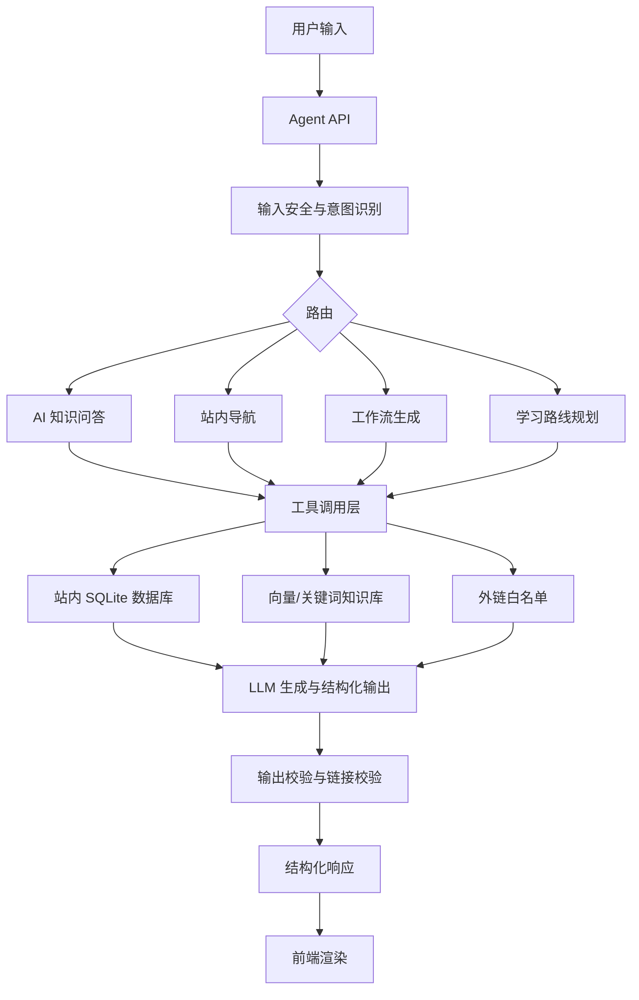

# AI 知识导航 Agent 设计文档

版本：v0.1  
日期：2026-07-08  
适用项目：AI 知识导航前后端分离版  
设计目标：先大胆设计，再分期验证

## 1. 背景与目标

AI 知识导航已经具备三类高价值数据：

- 学习区：AI 知识地图、学习节点、主资料、目录、国内可访问资料、外网资料。
- 工具区：AI 工具分类、工具列表、最新工具、内置工作流。
- 站内页面：主页、学习路径页、学习节点介绍页、工具页。

下一阶段的 Agent 不应只是一个聊天框，而应该成为“会解释、会导航、会规划工作流”的站内智能入口。

核心目标：

1. 回答 AI、Agent、机器学习、LLM、RAG、Prompt、工具使用等相关问题。
2. 根据回答内容返回可点击的站内页面、学习节点、外部资料和工具链接。
3. 根据用户需求和站内工具库，生成用户专属工作流。
4. 能解释为什么推荐这些资料或工具，并允许用户继续追问、修改和保存。
5. 保持可控、可验证、可观测，避免“看起来很聪明但不可维护”的黑盒 Agent。

## 2. 参考原则

本设计参考了公开资料中的几类成熟思路：

- Claude Code 相关公开分析：分层架构、Agent 循环、工具系统、记忆系统、上下文压缩、权限与安全、Feature Flag。
- Anthropic《Building effective agents》：优先使用简单、可组合的模式；只有在任务确实需要时才增加 Agent 复杂度。
- LangGraph：适合长任务、状态化、可恢复、可插入人工确认的 Agent 编排。
- OpenAI Agents SDK：将 Agent、工具、handoff、guardrail、session、tracing 作为基础原语。
- AutoGen：多 Agent、团队协作、工作流图、记忆和日志等设计思路。

对本项目的取舍：

- 第一版不追求全自动复杂 Agent，优先做“检索增强问答 + 结构化导航 + 工作流生成”。
- 工作流生成使用“预定义流程 + LLM 填充”的方式，不让模型自由编造不存在的工具。
- 所有跳转都必须来自站内数据库或白名单外链。
- 所有高风险动作默认关闭，第一阶段只做读操作和导航建议。

## 3. 用户场景

### 3.1 AI 问答

用户问：

- “RAG 和微调有什么区别？”
- “我该先学 Prompt 还是先学 Embedding？”
- “Agent 和普通聊天机器人的区别是什么？”
- “国内能访问的大模型学习资源有哪些？”

Agent 应该：

- 用中文解释概念。
- 引用站内学习节点或资料。
- 返回相关跳转，例如 `learn-node.html?slug=rag`、`learn-node.html?slug=fine-tuning-eval`。
- 给出下一步学习建议。

### 3.2 站内导航

用户问：

- “带我去学习 Transformer。”
- “我想找 RAG 的教程。”
- “有没有适合做 PPT 的 AI 工具？”

Agent 应该：

- 识别用户意图是“导航/检索”。
- 返回一组结构化链接。
- 前端展示为“可点击卡片”，而不是纯文本链接。

### 3.3 个性化工作流生成

用户问：

- “我要做一个公众号选题到成稿的工作流。”
- “我想用 AI 做一个课程学习计划。”
- “我需要做市场调研、写报告、生成 PPT。”
- “我是学生，想低成本完成论文资料整理和写作辅助。”

Agent 应该：

- 先澄清必要信息：目标、输入、输出、预算、国内访问要求、是否需要免费工具。
- 从站内工具库检索候选工具。
- 生成步骤化工作流，每一步绑定具体工具和跳转链接。
- 给出替代方案，例如“国内可访问优先版 / 效果优先版 / 免费优先版”。

### 3.4 学习路线规划

用户问：

- “我想 30 天入门 AI 应用开发。”
- “我只会 Python，怎么学到能做 RAG？”
- “我想成为 AI 产品经理，应该学哪些节点？”

Agent 应该：

- 根据知识地图生成路线。
- 将学习节点排序。
- 每个节点推荐主资料和国内可访问资料。
- 输出可跳转的学习路径。

## 4. 产品形态

### 4.1 入口

建议提供三种入口：

- 全站右下角悬浮 Agent：随时问问题。
- 独立 Agent 页面：适合长对话、工作流生成、保存方案。
- 页面内上下文 Agent：在学习节点或工具页内，自动带入当前页面上下文。

### 4.2 回答结构

Agent 不只返回 `reply` 文本，而是返回结构化响应：

```json
{
  "answer": "自然语言回答",
  "intent": "qa | navigation | workflow | learning_plan | clarification",
  "confidence": 0.86,
  "cards": [
    {
      "type": "learning_node",
      "title": "RAG",
      "description": "检索增强生成学习节点",
      "href": "learn-node.html?slug=rag"
    }
  ],
  "workflow": {
    "title": "公众号内容生产工作流",
    "steps": []
  },
  "followups": [
    "是否只推荐国内可访问工具？",
    "是否优先选择免费工具？"
  ],
  "trace": {
    "usedTools": ["search_learning_nodes", "search_ai_tools"],
    "retrievalCount": 8
  }
}
```

### 4.3 前端展示

前端应展示四类结果：

- 文本回答：概念解释、建议、总结。
- 跳转卡片：站内页面、学习节点、工具、资料。
- 工作流画布：步骤、工具、输入输出、注意事项。
- 澄清问题：按钮式快捷回答，例如“免费优先 / 国内可访问优先 / 效果优先”。

## 5. Agent 总体架构



推荐采用“路由器 + 专家能力 + 工具层”的模式：

- Router：判断意图和任务复杂度。
- QA Agent：负责 AI 知识解释和资料引用。
- Navigation Agent：负责站内跳转和链接卡片。
- Workflow Agent：负责工具组合和步骤生成。
- Learning Planner Agent：负责学习路线规划。
- Evaluator：负责检查输出是否引用了不存在的工具、页面或链接。

第一阶段可以不拆成多个真实 Agent，而是在一个 Agent 内用路由提示词和工具分组实现。等复杂度上来后，再迁移到 LangGraph 的显式节点。

## 6. 分层设计

### 6.1 UI 层

职责：

- 发送用户输入和当前页面上下文。
- 展示流式输出。
- 渲染卡片、链接、工作流步骤。
- 提供“复制工作流 / 保存方案 / 跳转页面 / 继续追问”操作。

建议组件：

- `AgentChatPanel`
- `AgentMessage`
- `AgentLinkCard`
- `AgentWorkflowCard`
- `AgentStepList`
- `AgentClarifyButtons`

### 6.2 API 层

建议新增接口：

- `POST /api/v1/agent/chat`
- `POST /api/v1/agent/chat/stream`
- `POST /api/v1/agent/workflows/generate`
- `GET /api/v1/agent/sessions/{session_id}`
- `POST /api/v1/agent/feedback`

请求示例：

```json
{
  "message": "我想做一个 AI 辅助论文资料整理工作流",
  "sessionId": "optional",
  "pageContext": {
    "page": "tools",
    "url": "tools.html",
    "selectedCategory": "office"
  },
  "preferences": {
    "cnFirst": true,
    "freeFirst": true,
    "experienceLevel": "beginner"
  }
}
```

### 6.3 编排层

职责：

- 意图识别。
- 模型路由。
- 工具选择。
- 多步执行。
- 中断与恢复。
- 输出校验。

建议状态：

```python
class AgentState:
    session_id: str
    user_message: str
    intent: str
    page_context: dict
    preferences: dict
    retrieved_items: list
    candidate_tools: list
    candidate_links: list
    draft_answer: str
    workflow_plan: dict | None
    validation_errors: list
    final_response: dict
```

### 6.4 工具层

工具设计原则：

- 工具名清晰。
- 参数少而明确。
- 返回结构化数据。
- 只返回必要字段，避免把整张表塞进上下文。
- 默认只读。
- 需要写入或外部动作时必须有人工确认。

建议工具：

| 工具名 | 用途 | 读写 | 第一阶段 |
| --- | --- | --- | --- |
| `search_learning_nodes` | 搜索学习节点 | 只读 | 必做 |
| `get_learning_node_detail` | 获取节点主资料、目录、资料 | 只读 | 必做 |
| `search_learning_materials` | 搜索学习资料和视频 | 只读 | 必做 |
| `search_ai_tools` | 搜索站内 AI 工具 | 只读 | 必做 |
| `get_tool_detail` | 获取工具详情 | 只读 | 必做 |
| `list_tool_categories` | 列出工具分类 | 只读 | 必做 |
| `get_builtin_workflows` | 获取已有工具工作流 | 只读 | 必做 |
| `generate_site_link` | 生成站内跳转链接 | 只读 | 必做 |
| `validate_links` | 校验链接存在性和白名单 | 只读 | 必做 |
| `save_user_workflow` | 保存用户工作流 | 写入 | 第二阶段 |
| `export_workflow` | 导出 Markdown/JSON | 只读 | 第二阶段 |

### 6.5 数据层

现有可复用表：

- `roadmap_nodes`
- `learning_materials`
- `learning_material_sections`
- `learning_node_links`
- `learning_node_tags`
- `ai_tools`
- `tool_categories`
- `tool_subcategories`
- `tool_workflows`
- `workflow_tools`

建议新增表：

```sql
CREATE TABLE agent_sessions (
  id INTEGER PRIMARY KEY AUTOINCREMENT,
  session_uid TEXT NOT NULL UNIQUE,
  title TEXT NOT NULL DEFAULT '新对话',
  created_at TEXT NOT NULL DEFAULT CURRENT_TIMESTAMP,
  updated_at TEXT NOT NULL DEFAULT CURRENT_TIMESTAMP
);

CREATE TABLE agent_messages (
  id INTEGER PRIMARY KEY AUTOINCREMENT,
  session_uid TEXT NOT NULL,
  role TEXT NOT NULL CHECK (role IN ('user', 'assistant', 'tool', 'system')),
  content TEXT NOT NULL,
  structured_payload TEXT,
  created_at TEXT NOT NULL DEFAULT CURRENT_TIMESTAMP,
  FOREIGN KEY (session_uid) REFERENCES agent_sessions(session_uid)
);

CREATE TABLE user_workflows (
  id INTEGER PRIMARY KEY AUTOINCREMENT,
  workflow_uid TEXT NOT NULL UNIQUE,
  session_uid TEXT,
  title TEXT NOT NULL,
  user_goal TEXT NOT NULL,
  summary TEXT NOT NULL,
  workflow_json TEXT NOT NULL,
  created_at TEXT NOT NULL DEFAULT CURRENT_TIMESTAMP,
  updated_at TEXT NOT NULL DEFAULT CURRENT_TIMESTAMP
);

CREATE TABLE agent_feedback (
  id INTEGER PRIMARY KEY AUTOINCREMENT,
  session_uid TEXT,
  message_id INTEGER,
  rating INTEGER CHECK (rating IN (-1, 0, 1)),
  feedback_text TEXT,
  created_at TEXT NOT NULL DEFAULT CURRENT_TIMESTAMP
);
```

## 7. 知识库设计

### 7.1 知识来源

第一阶段优先使用站内结构化数据：

- 学习节点和资料。
- 工具分类和工具详情。
- 内置工作流。
- README 和数据库文档。

第二阶段再加入：

- 高质量 AI 教程摘要。
- 站内 FAQ。
- 用户保存的工作流模板。
- 项目维护者手写知识卡片。

### 7.2 检索策略

采用混合检索：

- 结构化 SQL 检索：适合精确查工具、节点、slug、分类。
- 关键词 BM25：适合中文短查询和工具名。
- 向量检索：适合模糊需求，例如“写论文”“做视频号”“学习 RAG”。
- Agentic Search：对于复杂问题，让模型决定是否继续查节点、查工具、查资料。

第一版可以先做 SQL + 简单关键词，避免过早依赖向量库。

### 7.3 资料引用规则

Agent 回答中的链接必须满足：

- 站内页面来自固定路由生成器。
- 工具链接来自 `ai_tools.official_url`。
- 学习资料链接来自 `learning_materials` 或 `learning_node_links`。
- 外链必须在数据库中存在，不能由模型自由生成。

## 8. 意图识别与路由

建议意图类型：

| 意图 | 示例 | 处理方式 |
| --- | --- | --- |
| `qa` | “RAG 是什么？” | 检索学习资料后回答 |
| `navigation` | “带我去学 Agent” | 返回站内链接卡片 |
| `tool_recommendation` | “有什么 AI PPT 工具？” | 检索工具库 |
| `workflow_generation` | “帮我做公众号工作流” | 生成工作流 |
| `learning_plan` | “30 天学会 AI 应用开发” | 生成学习路线 |
| `clarification` | “我想做 AI 项目” | 追问目标和限制 |
| `unsupported` | 非 AI 或高风险请求 | 礼貌拒绝或转回站内范围 |

路由逻辑：

```text
用户输入
  -> 安全检查
  -> 意图识别
  -> 是否信息不足
    -> 是：返回澄清问题
    -> 否：调用对应工具
  -> LLM 生成
  -> 链接和工具校验
  -> 返回结构化响应
```

## 9. 工作流生成设计

### 9.1 工作流输出结构

```json
{
  "title": "AI 辅助市场调研到 PPT 工作流",
  "goal": "从行业问题出发，生成调研报告和演示文稿",
  "profile": {
    "cnFirst": true,
    "freeFirst": true,
    "level": "beginner"
  },
  "steps": [
    {
      "order": 1,
      "name": "明确研究问题",
      "objective": "把模糊需求拆成可检索的问题清单",
      "input": "用户主题",
      "output": "研究问题列表",
      "tools": [
        {
          "slug": "kimi",
          "name": "Kimi",
          "reason": "长文本阅读和中文资料整理体验较好",
          "href": "https://kimi.moonshot.cn/"
        }
      ],
      "tips": ["先限定行业、地区、时间范围"]
    }
  ],
  "alternatives": [
    {
      "name": "外网效果优先版",
      "description": "允许使用 Perplexity、ChatGPT、Gamma 等工具"
    }
  ],
  "risks": ["资料来源需要人工复核", "生成内容不能直接作为最终事实"]
}
```

### 9.2 工作流生成流程

1. 提取用户目标。
2. 判断输出物类型：文章、PPT、代码、图片、视频、学习计划、数据报告等。
3. 识别约束：国内可访问、免费、中文、团队协作、低门槛、专业效果。
4. 从工具库中按分类检索候选工具。
5. 选择工具组合。
6. 生成步骤。
7. 校验每一步是否有输入、输出、工具和注意事项。
8. 返回结构化工作流。

### 9.3 工作流模板

建议内置模板：

- 内容创作：选题 -> 资料搜集 -> 大纲 -> 初稿 -> 润色 -> 配图 -> 发布。
- 学术资料整理：检索 -> 阅读 -> 摘要 -> 知识卡片 -> 论文辅助写作。
- 视频创作：脚本 -> 分镜 -> 图像/视频生成 -> 配音 -> 剪辑 -> 封面。
- 编程开发：需求澄清 -> 技术选型 -> 代码生成 -> 调试 -> 文档 -> 部署。
- 商业分析：问题定义 -> 数据收集 -> 洞察提取 -> 报告 -> PPT。
- 学习计划：目标诊断 -> 路线规划 -> 节点学习 -> 项目练习 -> 复盘。

第一版可以先做模板匹配，再让 LLM 填充细节。

## 10. 记忆与上下文设计

### 10.1 三层记忆

借鉴“热 / 温 / 冷”分层：

- 热记忆：当前会话摘要、用户当前目标、偏好，随每轮加载。
- 温记忆：用户保存的工作流、最近学习节点、常用工具，按需加载。
- 冷记忆：历史对话全文，只在用户主动要求或检索命中时加载。

### 10.2 记忆内容边界

建议记忆：

- 用户偏好：国内可访问优先、免费优先、学习基础。
- 长期目标：想学 AI 应用开发、想做内容创作。
- 已保存工作流。
- 用户对推荐结果的反馈。

不建议记忆：

- 站内数据库事实的副本。
- 过期链接的结论。
- 用户敏感信息。
- 未经确认的个人身份信息。

### 10.3 上下文压缩

建议五级压缩策略：

1. 保留最近 N 轮完整对话。
2. 旧工具调用结果只保留标题和 ID。
3. 长工具结果转为摘要。
4. 会话超过阈值时生成滚动摘要。
5. 模型报上下文过长时触发应急压缩，并提示用户。

压缩失败要有断路器，例如连续失败 3 次后停止自动压缩，改为提示用户开启新对话。

## 11. 安全与权限

第一阶段只允许读操作：

- 查学习节点。
- 查工具库。
- 查资料链接。
- 生成站内跳转。
- 生成工作流草案。

第二阶段写操作必须人工确认：

- 保存工作流。
- 修改用户偏好。
- 写入长期记忆。
- 导出文件。

安全策略：

- 默认失败即拒绝：参数解析失败、链接校验失败、工具不存在，都不放行。
- 链接白名单：外链必须来自数据库。
- 输出校验：不得生成不存在的工具 slug 或学习节点 slug。
- 提示注入防护：数据库资料中的文本只作为资料，不允许覆盖系统规则。
- 速率限制：避免被滥用刷接口。
- 审计日志：记录工具调用、检索结果数量、生成工作流 ID。

## 12. 可观测与评估

### 12.1 日志

记录：

- session_id
- intent
- used_tools
- retrieval_count
- latency_ms
- model_name
- validation_errors
- user_feedback

### 12.2 评估集

建议建立 `agent/evals/`：

- `qa_cases.jsonl`：AI 概念问答。
- `navigation_cases.jsonl`：站内跳转。
- `workflow_cases.jsonl`：工作流生成。
- `safety_cases.jsonl`：不该回答或不该生成链接的请求。

### 12.3 指标

- 意图识别准确率。
- 链接有效率。
- 工具推荐命中率。
- 工作流步骤完整率。
- 国内可访问约束满足率。
- 用户点赞率。
- 平均延迟。
- 平均 token 成本。

## 13. 与现有代码的融合方案

现有 `agent/` 已经具备：

- FastAPI 服务。
- 非流式和 SSE 流式对话。
- LangGraph ReAct Agent。
- 工具检索。
- Chroma 向量库。
- API / Ollama 双模式。

建议改造方向：

1. 将 `agent/` 从独立服务逐步合并或网关化到 `ai-nav-fullstack/backend/app/api/v1/routers/agent.py`。
2. 让 Agent 工具直接读取 `ai-nav-fullstack/database/ai_nav.sqlite3`，不要再从旧版 `search-data.js` 解析工具。
3. 保留现有 SSE 能力，用于前端流式回答。
4. 把工具返回改为结构化 JSON，而不是纯文本列表。
5. 增加链接校验器和输出 schema 校验。
6. 第一阶段仍可使用 LangGraph `create_react_agent`，后续再迁移到显式 StateGraph。

推荐目录：

```text
ai-nav-fullstack/
  backend/app/api/v1/routers/agent.py
  backend/app/agent/
    prompts/
      system.md
      workflow.md
      evaluator.md
    tools/
      learning_tools.py
      tool_tools.py
      link_tools.py
      workflow_tools.py
    schemas.py
    router.py
    memory.py
    evaluator.py
    service.py
  database/
    agent_schema.sql
```

## 14. 分期路线

### Phase 1：可用的站内 Agent

目标：回答 AI 问题、返回站内链接、推荐工具。

功能：

- Agent 聊天接口。
- 学习节点检索工具。
- 工具检索工具。
- 站内链接卡片。
- 流式回答。
- 输出 JSON schema 校验。

验收：

- 能回答至少 30 个 AI 学习问题。
- 能正确跳转学习节点和工具页。
- 不生成不存在的站内链接。

### Phase 2：个性化工作流生成

目标：根据用户需求生成可执行工作流。

功能：

- 工作流生成接口。
- 用户偏好参数。
- 工具组合推荐。
- 工作流卡片 UI。
- 复制 Markdown / JSON。

验收：

- 10 个典型任务都能生成完整工作流。
- 每一步都有输入、输出、工具、理由和注意事项。
- 国内可访问优先模式下，推荐工具满足国内使用预期。

### Phase 3：记忆与保存

目标：让用户能保存方案，下一次继续修改。

功能：

- 会话保存。
- 工作流保存。
- 用户偏好保存。
- 历史对话摘要。

验收：

- 用户能打开历史工作流继续追问。
- Agent 能记住用户选择“免费优先 / 国内优先”。

### Phase 4：多 Agent 与评估闭环

目标：提高复杂任务质量和可观测性。

功能：

- Planner / Researcher / Tool Matcher / Evaluator 分工。
- Agent trace。
- 自动评估集。
- 用户反馈面板。
- Feature Flag 灰度开关。

验收：

- 复杂工作流生成质量稳定提升。
- 可追踪每次推荐使用了哪些工具和数据。
- 新能力可以灰度开启和回滚。

## 15. 风险与对策

| 风险 | 表现 | 对策 |
| --- | --- | --- |
| 幻觉链接 | 编造不存在的页面或工具 | 统一链接生成器 + 数据库校验 |
| 推荐不准 | 工具与用户目标不匹配 | 先澄清需求，再检索，再生成 |
| 上下文过长 | 长对话成本高、报错 | 滚动摘要 + 压缩断路器 |
| 工具过多 | 系统提示词膨胀 | 工具先摘要注册，按需加载完整定义 |
| 国内访问不满足 | 推荐外网工具给国内用户 | `cnFirst` 约束 + 工具访问标签 |
| 黑盒难调试 | 不知道 Agent 为什么这样答 | trace、used_tools、retrieval_count |
| 用户过度信任 | 把生成结果当事实 | 展示资料来源和“需复核”提示 |

## 16. MVP 范围建议

第一版不要做：

- 多 Agent 并发。
- 自动浏览网页。
- 自动注册外部工具。
- 自动修改数据库。
- 复杂长期记忆。

第一版必须做：

- 问答。
- 检索学习节点。
- 检索工具。
- 返回结构化链接。
- 工作流草案生成。
- 输出校验。
- 流式回答。

一句话 MVP：

> 用户问一句话，Agent 能用站内真实数据回答，并给出可以直接点击的学习节点、工具链接或工作流步骤。

## 17. 参考资料

- Claude Code 公开分析文章：https://www.codefather.cn/post/2039551862717313025
- Anthropic《Building effective agents》：https://www.anthropic.com/engineering/building-effective-agents
- LangGraph 官方概览：https://docs.langchain.com/oss/python/langgraph/overview
- OpenAI Agents SDK：https://openai.github.io/openai-agents-python/
- Microsoft AutoGen AgentChat：https://microsoft.github.io/autogen/stable/user-guide/agentchat-user-guide/index.html
