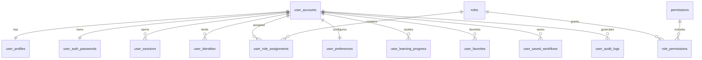

# 用户账号模块设计规划

版本：v0.1  
日期：2026-07-08  
适用项目：AI 知识导航
设计目标：按企业级数据库标准规划用户、认证、权限、学习行为和 Agent 个性化能力

## 1. 设计背景

当前项目已经具备学习路径、工具库、学习资料、Agent 设计规划等核心能力，但用户体系尚未开始建设。接下来如果要支持个性化学习、收藏、历史记录、工作流保存、Agent 记忆、用户反馈，就必须先把账号模块作为底层能力规划清楚。

用户模块不只是“登录注册”，而是整个系统的身份底座：

- 谁在访问系统。
- 用户有什么权限。
- 用户保存了什么偏好。
- 用户学习到了哪里。
- 用户收藏了哪些工具、资料和工作流。
- Agent 是否可以基于用户历史生成更贴合的建议。
- 管理员如何审计用户行为和系统风险。

## 2. 总体原则

### 2.1 企业级数据库原则

- 所有核心业务表使用稳定主键。
- 对外暴露使用 `uid` / `slug`，避免暴露自增主键。
- 高频查询字段必须建立索引。
- 外键字段必须建立索引，方便 JOIN 和级联操作。
- 所有用户私有数据必须可迁移到 PostgreSQL RLS 模式。
- 敏感信息分表存储，避免普通查询误取。
- 用户个人数据支持软删除、冻结、审计和恢复。
- 认证、授权、业务资料、行为记录分层设计，避免一个 `users` 表承担所有职责。

### 2.2 当前技术取舍

当前运行库是 SQLite，但表结构要按可迁移到 PostgreSQL/MySQL 的方式设计。

建议：

- 近期仍可用 SQLite 实现课程作业版本。
- 主键使用 `INTEGER PRIMARY KEY AUTOINCREMENT` 保持当前风格。
- 每张核心表额外保留 `*_uid TEXT UNIQUE`，未来迁移 PostgreSQL 时可改为 UUIDv7 / ULID。
- 权限和用户私有数据设计时预留 RLS 逻辑。

## 3. 用户模块边界

用户模块拆成 8 个子模块：

| 模块 | 作用 | 第一阶段 |
| --- | --- | --- |
| 账号身份 | 用户基础账号、状态、登录名 | 必做 |
| 认证安全 | 密码、登录会话、刷新令牌、验证码 | 必做 |
| 用户资料 | 昵称、头像、简介、学习身份 | 必做 |
| 权限角色 | 普通用户、管理员、运营、审核员 | 必做 |
| 用户偏好 | 国内优先、免费优先、学习水平、主题语言 | 必做 |
| 学习行为 | 学习进度、节点完成、资料访问记录 | 第二阶段 |
| 收藏与工作流 | 收藏工具/资料/节点、保存 Agent 工作流 | 第二阶段 |
| 审计风控 | 登录日志、敏感操作、封禁记录 | 必做 |

## 4. ER 关系概览



## 5. 核心表设计

### 5.1 用户账号表：`user_accounts`

保存用户身份的主记录，不放密码、不放大段资料。

```sql
CREATE TABLE IF NOT EXISTS user_accounts (
  id INTEGER PRIMARY KEY AUTOINCREMENT,
  user_uid TEXT NOT NULL UNIQUE,
  username TEXT UNIQUE,
  email TEXT UNIQUE,
  phone TEXT UNIQUE,
  account_status TEXT NOT NULL DEFAULT 'active'
    CHECK (account_status IN ('active', 'pending', 'locked', 'disabled', 'deleted')),
  email_verified INTEGER NOT NULL DEFAULT 0 CHECK (email_verified IN (0, 1)),
  phone_verified INTEGER NOT NULL DEFAULT 0 CHECK (phone_verified IN (0, 1)),
  last_login_at TEXT,
  last_login_ip TEXT,
  deleted_at TEXT,
  created_at TEXT NOT NULL DEFAULT CURRENT_TIMESTAMP,
  updated_at TEXT NOT NULL DEFAULT CURRENT_TIMESTAMP
);

CREATE INDEX IF NOT EXISTS idx_user_accounts_status
ON user_accounts(account_status);

CREATE INDEX IF NOT EXISTS idx_user_accounts_created
ON user_accounts(created_at);
```

设计说明：

- `user_uid` 用于 API 和前端展示，不暴露 `id`。
- `email`、`phone` 可为空，但如果存在必须唯一。
- `account_status` 区分待验证、正常、锁定、禁用、删除。
- `deleted_at` 用于软删除。

### 5.2 用户密码表：`user_auth_passwords`

密码独立存储，便于限制查询权限和后续支持无密码登录。

```sql
CREATE TABLE IF NOT EXISTS user_auth_passwords (
  id INTEGER PRIMARY KEY AUTOINCREMENT,
  user_id INTEGER NOT NULL UNIQUE,
  password_hash TEXT NOT NULL,
  password_algo TEXT NOT NULL DEFAULT 'argon2id',
  password_updated_at TEXT NOT NULL DEFAULT CURRENT_TIMESTAMP,
  failed_attempts INTEGER NOT NULL DEFAULT 0,
  locked_until TEXT,
  created_at TEXT NOT NULL DEFAULT CURRENT_TIMESTAMP,
  updated_at TEXT NOT NULL DEFAULT CURRENT_TIMESTAMP,
  FOREIGN KEY (user_id) REFERENCES user_accounts(id)
);

CREATE INDEX IF NOT EXISTS idx_user_auth_passwords_locked_until
ON user_auth_passwords(locked_until);
```

设计说明：

- 不保存明文密码。
- 推荐 Argon2id；如果先用 bcrypt，也要保留 `password_algo` 方便以后迁移。
- `failed_attempts` 和 `locked_until` 用于登录风控。

### 5.3 第三方身份表：`user_identities`

为以后接入 GitHub、Gitee、微信、QQ、Google 等登录方式预留。

```sql
CREATE TABLE IF NOT EXISTS user_identities (
  id INTEGER PRIMARY KEY AUTOINCREMENT,
  user_id INTEGER NOT NULL,
  provider TEXT NOT NULL,
  provider_user_id TEXT NOT NULL,
  provider_username TEXT,
  provider_email TEXT,
  access_token_encrypted TEXT,
  refresh_token_encrypted TEXT,
  expires_at TEXT,
  created_at TEXT NOT NULL DEFAULT CURRENT_TIMESTAMP,
  updated_at TEXT NOT NULL DEFAULT CURRENT_TIMESTAMP,
  FOREIGN KEY (user_id) REFERENCES user_accounts(id),
  UNIQUE (provider, provider_user_id)
);

CREATE INDEX IF NOT EXISTS idx_user_identities_user
ON user_identities(user_id);
```

第一阶段可以不实现第三方登录，但表结构先规划好。

### 5.4 用户资料表：`user_profiles`

保存展示资料，不参与认证。

```sql
CREATE TABLE IF NOT EXISTS user_profiles (
  id INTEGER PRIMARY KEY AUTOINCREMENT,
  user_id INTEGER NOT NULL UNIQUE,
  display_name TEXT NOT NULL,
  avatar_url TEXT,
  bio TEXT,
  role_title TEXT,
  learning_level TEXT NOT NULL DEFAULT 'beginner'
    CHECK (learning_level IN ('beginner', 'intermediate', 'advanced')),
  target_direction TEXT,
  created_at TEXT NOT NULL DEFAULT CURRENT_TIMESTAMP,
  updated_at TEXT NOT NULL DEFAULT CURRENT_TIMESTAMP,
  FOREIGN KEY (user_id) REFERENCES user_accounts(id)
);
```

示例：

- `learning_level = beginner`
- `target_direction = AI 应用开发 / AI 产品经理 / AIGC 创作者 / 机器学习工程`

### 5.5 用户偏好表：`user_preferences`

保存影响推荐和 Agent 回答的长期偏好。

```sql
CREATE TABLE IF NOT EXISTS user_preferences (
  id INTEGER PRIMARY KEY AUTOINCREMENT,
  user_id INTEGER NOT NULL UNIQUE,
  theme TEXT NOT NULL DEFAULT 'light' CHECK (theme IN ('light', 'dark', 'system')),
  language TEXT NOT NULL DEFAULT 'zh-CN',
  cn_first INTEGER NOT NULL DEFAULT 1 CHECK (cn_first IN (0, 1)),
  free_first INTEGER NOT NULL DEFAULT 0 CHECK (free_first IN (0, 1)),
  show_external_resources INTEGER NOT NULL DEFAULT 1 CHECK (show_external_resources IN (0, 1)),
  agent_memory_enabled INTEGER NOT NULL DEFAULT 0 CHECK (agent_memory_enabled IN (0, 1)),
  preference_json TEXT,
  created_at TEXT NOT NULL DEFAULT CURRENT_TIMESTAMP,
  updated_at TEXT NOT NULL DEFAULT CURRENT_TIMESTAMP,
  FOREIGN KEY (user_id) REFERENCES user_accounts(id)
);
```

设计说明：

- 常用偏好用明确字段，方便索引和筛选。
- 低频扩展偏好放 `preference_json`。
- Agent 长期记忆默认关闭，用户主动开启。

### 5.6 登录会话表：`user_sessions`

用于维护登录态、刷新令牌和设备管理。

```sql
CREATE TABLE IF NOT EXISTS user_sessions (
  id INTEGER PRIMARY KEY AUTOINCREMENT,
  session_uid TEXT NOT NULL UNIQUE,
  user_id INTEGER NOT NULL,
  refresh_token_hash TEXT NOT NULL UNIQUE,
  device_name TEXT,
  user_agent TEXT,
  ip_address TEXT,
  country_region TEXT,
  is_revoked INTEGER NOT NULL DEFAULT 0 CHECK (is_revoked IN (0, 1)),
  revoked_at TEXT,
  expires_at TEXT NOT NULL,
  last_seen_at TEXT,
  created_at TEXT NOT NULL DEFAULT CURRENT_TIMESTAMP,
  FOREIGN KEY (user_id) REFERENCES user_accounts(id)
);

CREATE INDEX IF NOT EXISTS idx_user_sessions_user
ON user_sessions(user_id, is_revoked, expires_at);

CREATE INDEX IF NOT EXISTS idx_user_sessions_expires
ON user_sessions(expires_at);
```

设计说明：

- Access Token 可短期无状态。
- Refresh Token 必须只保存 hash。
- 用户可在“账号安全”页面退出某台设备。

### 5.7 验证码/一次性令牌表：`user_verification_tokens`

用于邮箱验证、找回密码、换绑邮箱等。

```sql
CREATE TABLE IF NOT EXISTS user_verification_tokens (
  id INTEGER PRIMARY KEY AUTOINCREMENT,
  token_uid TEXT NOT NULL UNIQUE,
  user_id INTEGER,
  target TEXT NOT NULL,
  purpose TEXT NOT NULL
    CHECK (purpose IN ('email_verify', 'phone_verify', 'password_reset', 'email_change')),
  token_hash TEXT NOT NULL UNIQUE,
  consumed_at TEXT,
  expires_at TEXT NOT NULL,
  created_at TEXT NOT NULL DEFAULT CURRENT_TIMESTAMP,
  FOREIGN KEY (user_id) REFERENCES user_accounts(id)
);

CREATE INDEX IF NOT EXISTS idx_user_verification_tokens_target
ON user_verification_tokens(target, purpose, expires_at);
```

### 5.8 角色表：`roles`

```sql
CREATE TABLE IF NOT EXISTS roles (
  id INTEGER PRIMARY KEY AUTOINCREMENT,
  code TEXT NOT NULL UNIQUE,
  name TEXT NOT NULL,
  description TEXT,
  is_system INTEGER NOT NULL DEFAULT 0 CHECK (is_system IN (0, 1)),
  created_at TEXT NOT NULL DEFAULT CURRENT_TIMESTAMP,
  updated_at TEXT NOT NULL DEFAULT CURRENT_TIMESTAMP
);
```

建议初始角色：

- `user`：普通用户。
- `admin`：系统管理员。
- `operator`：内容运营。
- `reviewer`：审核员。

### 5.9 权限表：`permissions`

```sql
CREATE TABLE IF NOT EXISTS permissions (
  id INTEGER PRIMARY KEY AUTOINCREMENT,
  code TEXT NOT NULL UNIQUE,
  name TEXT NOT NULL,
  resource TEXT NOT NULL,
  action TEXT NOT NULL,
  description TEXT,
  created_at TEXT NOT NULL DEFAULT CURRENT_TIMESTAMP,
  updated_at TEXT NOT NULL DEFAULT CURRENT_TIMESTAMP,
  UNIQUE (resource, action)
);
```

权限示例：

- `learning:read`
- `learning:manage`
- `tools:read`
- `tools:manage`
- `agent:chat`
- `agent:manage`
- `users:read`
- `users:manage`
- `audit:read`

### 5.10 角色权限表：`role_permissions`

```sql
CREATE TABLE IF NOT EXISTS role_permissions (
  role_id INTEGER NOT NULL,
  permission_id INTEGER NOT NULL,
  created_at TEXT NOT NULL DEFAULT CURRENT_TIMESTAMP,
  PRIMARY KEY (role_id, permission_id),
  FOREIGN KEY (role_id) REFERENCES roles(id),
  FOREIGN KEY (permission_id) REFERENCES permissions(id)
);

CREATE INDEX IF NOT EXISTS idx_role_permissions_permission
ON role_permissions(permission_id);
```

### 5.11 用户角色表：`user_role_assignments`

```sql
CREATE TABLE IF NOT EXISTS user_role_assignments (
  user_id INTEGER NOT NULL,
  role_id INTEGER NOT NULL,
  assigned_by INTEGER,
  assigned_at TEXT NOT NULL DEFAULT CURRENT_TIMESTAMP,
  expires_at TEXT,
  PRIMARY KEY (user_id, role_id),
  FOREIGN KEY (user_id) REFERENCES user_accounts(id),
  FOREIGN KEY (role_id) REFERENCES roles(id),
  FOREIGN KEY (assigned_by) REFERENCES user_accounts(id)
);

CREATE INDEX IF NOT EXISTS idx_user_role_assignments_role
ON user_role_assignments(role_id);
```

## 6. 与学习区相关的用户表

### 6.1 学习进度表：`user_learning_progress`

记录用户在每个学习节点上的状态。

```sql
CREATE TABLE IF NOT EXISTS user_learning_progress (
  id INTEGER PRIMARY KEY AUTOINCREMENT,
  user_id INTEGER NOT NULL,
  node_slug TEXT NOT NULL,
  status TEXT NOT NULL DEFAULT 'not_started'
    CHECK (status IN ('not_started', 'learning', 'completed', 'skipped')),
  progress_percent INTEGER NOT NULL DEFAULT 0 CHECK (progress_percent BETWEEN 0 AND 100),
  started_at TEXT,
  completed_at TEXT,
  last_studied_at TEXT,
  note TEXT,
  created_at TEXT NOT NULL DEFAULT CURRENT_TIMESTAMP,
  updated_at TEXT NOT NULL DEFAULT CURRENT_TIMESTAMP,
  FOREIGN KEY (user_id) REFERENCES user_accounts(id),
  FOREIGN KEY (node_slug) REFERENCES roadmap_nodes(slug),
  UNIQUE (user_id, node_slug)
);

CREATE INDEX IF NOT EXISTS idx_user_learning_progress_user
ON user_learning_progress(user_id, status, last_studied_at);

CREATE INDEX IF NOT EXISTS idx_user_learning_progress_node
ON user_learning_progress(node_slug);
```

### 6.2 学习资料访问记录：`user_learning_activity`

记录用户点击资料、开始学习、完成章节等事件。

```sql
CREATE TABLE IF NOT EXISTS user_learning_activity (
  id INTEGER PRIMARY KEY AUTOINCREMENT,
  user_id INTEGER NOT NULL,
  node_slug TEXT,
  material_id INTEGER,
  link_id INTEGER,
  activity_type TEXT NOT NULL
    CHECK (activity_type IN ('view_node', 'start_material', 'open_resource', 'complete_section', 'add_note')),
  metadata_json TEXT,
  created_at TEXT NOT NULL DEFAULT CURRENT_TIMESTAMP,
  FOREIGN KEY (user_id) REFERENCES user_accounts(id),
  FOREIGN KEY (node_slug) REFERENCES roadmap_nodes(slug),
  FOREIGN KEY (material_id) REFERENCES learning_materials(id),
  FOREIGN KEY (link_id) REFERENCES learning_node_links(id)
);

CREATE INDEX IF NOT EXISTS idx_user_learning_activity_user_time
ON user_learning_activity(user_id, created_at);

CREATE INDEX IF NOT EXISTS idx_user_learning_activity_node
ON user_learning_activity(node_slug, created_at);
```

设计说明：

- 这是事件表，数据会增长较快。
- PostgreSQL 阶段可以按月分区。

## 7. 收藏与用户资产表

### 7.1 收藏表：`user_favorites`

统一收藏学习节点、学习资料、工具和工作流。

```sql
CREATE TABLE IF NOT EXISTS user_favorites (
  id INTEGER PRIMARY KEY AUTOINCREMENT,
  user_id INTEGER NOT NULL,
  target_type TEXT NOT NULL
    CHECK (target_type IN ('learning_node', 'learning_material', 'learning_link', 'tool', 'workflow')),
  target_key TEXT NOT NULL,
  title_snapshot TEXT NOT NULL,
  description_snapshot TEXT,
  created_at TEXT NOT NULL DEFAULT CURRENT_TIMESTAMP,
  FOREIGN KEY (user_id) REFERENCES user_accounts(id),
  UNIQUE (user_id, target_type, target_key)
);

CREATE INDEX IF NOT EXISTS idx_user_favorites_user
ON user_favorites(user_id, target_type, created_at);
```

设计说明：

- `target_key` 存 `slug`、`id` 或 `workflow_uid`。
- 快照字段用于目标内容改名后仍能展示历史收藏。

### 7.2 用户保存工作流：`user_saved_workflows`

承接未来 Agent 工作流生成。

```sql
CREATE TABLE IF NOT EXISTS user_saved_workflows (
  id INTEGER PRIMARY KEY AUTOINCREMENT,
  workflow_uid TEXT NOT NULL UNIQUE,
  user_id INTEGER NOT NULL,
  title TEXT NOT NULL,
  goal TEXT NOT NULL,
  summary TEXT NOT NULL,
  workflow_json TEXT NOT NULL,
  visibility TEXT NOT NULL DEFAULT 'private'
    CHECK (visibility IN ('private', 'shared', 'public')),
  source TEXT NOT NULL DEFAULT 'agent'
    CHECK (source IN ('agent', 'manual', 'template')),
  is_archived INTEGER NOT NULL DEFAULT 0 CHECK (is_archived IN (0, 1)),
  created_at TEXT NOT NULL DEFAULT CURRENT_TIMESTAMP,
  updated_at TEXT NOT NULL DEFAULT CURRENT_TIMESTAMP,
  FOREIGN KEY (user_id) REFERENCES user_accounts(id)
);

CREATE INDEX IF NOT EXISTS idx_user_saved_workflows_user
ON user_saved_workflows(user_id, is_archived, updated_at);
```

## 8. Agent 用户化相关表

### 8.1 Agent 会话表：`agent_sessions`

```sql
CREATE TABLE IF NOT EXISTS agent_sessions (
  id INTEGER PRIMARY KEY AUTOINCREMENT,
  session_uid TEXT NOT NULL UNIQUE,
  user_id INTEGER,
  title TEXT NOT NULL DEFAULT '新对话',
  source_page TEXT,
  status TEXT NOT NULL DEFAULT 'active'
    CHECK (status IN ('active', 'archived', 'deleted')),
  summary TEXT,
  created_at TEXT NOT NULL DEFAULT CURRENT_TIMESTAMP,
  updated_at TEXT NOT NULL DEFAULT CURRENT_TIMESTAMP,
  FOREIGN KEY (user_id) REFERENCES user_accounts(id)
);

CREATE INDEX IF NOT EXISTS idx_agent_sessions_user
ON agent_sessions(user_id, status, updated_at);
```

### 8.2 Agent 消息表：`agent_messages`

```sql
CREATE TABLE IF NOT EXISTS agent_messages (
  id INTEGER PRIMARY KEY AUTOINCREMENT,
  message_uid TEXT NOT NULL UNIQUE,
  session_id INTEGER NOT NULL,
  role TEXT NOT NULL CHECK (role IN ('user', 'assistant', 'tool', 'system')),
  content TEXT NOT NULL,
  structured_payload TEXT,
  token_count INTEGER NOT NULL DEFAULT 0,
  created_at TEXT NOT NULL DEFAULT CURRENT_TIMESTAMP,
  FOREIGN KEY (session_id) REFERENCES agent_sessions(id)
);

CREATE INDEX IF NOT EXISTS idx_agent_messages_session
ON agent_messages(session_id, created_at);
```

### 8.3 Agent 用户记忆表：`agent_user_memories`

```sql
CREATE TABLE IF NOT EXISTS agent_user_memories (
  id INTEGER PRIMARY KEY AUTOINCREMENT,
  memory_uid TEXT NOT NULL UNIQUE,
  user_id INTEGER NOT NULL,
  memory_type TEXT NOT NULL
    CHECK (memory_type IN ('preference', 'goal', 'workflow_hint', 'learning_state')),
  content TEXT NOT NULL,
  confidence REAL NOT NULL DEFAULT 1.0 CHECK (confidence >= 0 AND confidence <= 1),
  source_session_uid TEXT,
  is_active INTEGER NOT NULL DEFAULT 1 CHECK (is_active IN (0, 1)),
  created_at TEXT NOT NULL DEFAULT CURRENT_TIMESTAMP,
  updated_at TEXT NOT NULL DEFAULT CURRENT_TIMESTAMP,
  FOREIGN KEY (user_id) REFERENCES user_accounts(id)
);

CREATE INDEX IF NOT EXISTS idx_agent_user_memories_user
ON agent_user_memories(user_id, memory_type, is_active);
```

第一阶段不建议自动写入长期记忆。必须先在产品层做用户确认，例如：

> “是否记住你偏好国内可访问、免费优先的工具？”

## 9. 审计与风控表

### 9.1 登录日志：`user_login_logs`

```sql
CREATE TABLE IF NOT EXISTS user_login_logs (
  id INTEGER PRIMARY KEY AUTOINCREMENT,
  user_id INTEGER,
  login_identifier TEXT NOT NULL,
  result TEXT NOT NULL CHECK (result IN ('success', 'failed')),
  failure_reason TEXT,
  ip_address TEXT,
  user_agent TEXT,
  created_at TEXT NOT NULL DEFAULT CURRENT_TIMESTAMP,
  FOREIGN KEY (user_id) REFERENCES user_accounts(id)
);

CREATE INDEX IF NOT EXISTS idx_user_login_logs_user_time
ON user_login_logs(user_id, created_at);

CREATE INDEX IF NOT EXISTS idx_user_login_logs_identifier_time
ON user_login_logs(login_identifier, created_at);
```

### 9.2 审计日志：`user_audit_logs`

记录权限变更、账号冻结、管理员操作、敏感资料变更。

```sql
CREATE TABLE IF NOT EXISTS user_audit_logs (
  id INTEGER PRIMARY KEY AUTOINCREMENT,
  actor_user_id INTEGER,
  target_user_id INTEGER,
  action TEXT NOT NULL,
  resource_type TEXT NOT NULL,
  resource_id TEXT,
  ip_address TEXT,
  user_agent TEXT,
  metadata_json TEXT,
  created_at TEXT NOT NULL DEFAULT CURRENT_TIMESTAMP,
  FOREIGN KEY (actor_user_id) REFERENCES user_accounts(id),
  FOREIGN KEY (target_user_id) REFERENCES user_accounts(id)
);

CREATE INDEX IF NOT EXISTS idx_user_audit_logs_actor
ON user_audit_logs(actor_user_id, created_at);

CREATE INDEX IF NOT EXISTS idx_user_audit_logs_target
ON user_audit_logs(target_user_id, created_at);
```

## 10. 推荐 API 规划

### 10.1 认证 API

- `POST /api/v1/auth/register`
- `POST /api/v1/auth/login`
- `POST /api/v1/auth/logout`
- `POST /api/v1/auth/refresh`
- `POST /api/v1/auth/password/reset/request`
- `POST /api/v1/auth/password/reset/confirm`
- `POST /api/v1/auth/password-reset/security/start`
- `POST /api/v1/auth/password-reset/security/verify`
- `POST /api/v1/auth/password-reset/security/confirm`
- `GET /api/v1/auth/me`

### 10.2 用户 API

- `GET /api/v1/users/me/profile`
- `PATCH /api/v1/users/me/profile`
- `GET /api/v1/users/me/preferences`
- `PATCH /api/v1/users/me/preferences`
- `GET /api/v1/users/me/sessions`
- `DELETE /api/v1/users/me/sessions/{session_uid}`
- `GET /api/v1/users/me/security-questions`
- `PUT /api/v1/users/me/security-questions`

### 10.3 学习与收藏 API

- `GET /api/v1/users/me/learning/progress`
- `PUT /api/v1/users/me/learning/progress/{node_slug}`
- `POST /api/v1/users/me/learning/activity`
- `GET /api/v1/users/me/favorites`
- `POST /api/v1/users/me/favorites`
- `DELETE /api/v1/users/me/favorites/{favorite_id}`

### 10.4 Agent 用户资产 API

- `GET /api/v1/users/me/agent/sessions`
- `GET /api/v1/users/me/agent/sessions/{session_uid}`
- `GET /api/v1/users/me/workflows`
- `POST /api/v1/users/me/workflows`
- `PATCH /api/v1/users/me/workflows/{workflow_uid}`
- `DELETE /api/v1/users/me/workflows/{workflow_uid}`

## 11. 权限模型

### 11.1 普通用户

允许：

- 查看公开学习资源和工具。
- 修改自己的资料和偏好。
- 管理自己的学习记录、收藏、工作流和 Agent 会话。

禁止：

- 查看其他用户资料。
- 修改站内学习资源和工具库。
- 查看审计日志。

### 11.2 内容运营

允许：

- 管理学习资料。
- 管理工具库。
- 查看内容数据统计。

禁止：

- 查看用户敏感认证信息。
- 修改用户角色。

### 11.3 管理员

允许：

- 管理用户状态。
- 分配角色。
- 查看审计日志。
- 处理风险账号。

禁止：

- 直接读取用户密码 hash。
- 未审计地修改用户私有数据。

## 12. 安全策略

### 12.1 密码安全

- 使用 Argon2id 或 bcrypt。
- 密码 hash 不出现在普通用户查询接口中。
- 登录失败次数限制。
- 同一 IP / 同一账号短时间失败过多时限流。

### 12.2 Token 安全

- Access Token 短有效期。
- Refresh Token 入库只存 hash。
- 支持单设备退出和全设备退出。
- 账号禁用后撤销所有 session。

### 12.3 数据隔离

未来 PostgreSQL 版本启用 RLS：

- 用户只能读取 `user_id = current_user_id` 的私有数据。
- 管理员操作走单独角色和审计策略。
- 对 Agent 会话、收藏、工作流、学习进度都启用行级隔离。

### 12.4 隐私合规

- 长期记忆默认关闭。
- 删除账号时软删除账号，敏感资料可匿名化。
- 用户可导出自己的收藏、学习记录和工作流。
- 用户可清空 Agent 对话和记忆。

## 13. 索引策略

高频索引：

- 登录：`email`、`phone`、`username`
- 会话：`refresh_token_hash`、`user_id + is_revoked + expires_at`
- 用户私有数据：`user_id + status / updated_at / created_at`
- 学习进度：`user_id + node_slug`
- 收藏：`user_id + target_type + target_key`
- 审计：`actor_user_id + created_at`、`target_user_id + created_at`

原则：

- 所有外键字段建立索引。
- 所有列表页按分页字段建立组合索引。
- 活跃数据较多时使用局部索引，例如 PostgreSQL：

```sql
CREATE INDEX idx_user_sessions_active
ON user_sessions(user_id, expires_at)
WHERE is_revoked = 0;
```

SQLite 阶段可先使用普通组合索引。

## 14. 数据生命周期

| 数据 | 保存策略 |
| --- | --- |
| 用户账号 | 长期保存，删除时软删除 |
| 密码 hash | 密码更新后保留当前版本即可 |
| 登录日志 | 建议保留 180 天 |
| 审计日志 | 建议长期保存 |
| Agent 对话 | 用户可手动删除 |
| Agent 长期记忆 | 默认关闭，用户确认后保存 |
| 学习活动日志 | 可按月归档 |
| 收藏和工作流 | 用户主动删除前保留 |

## 15. 分期落地建议

### Phase 1：账号基础能力

目标：让用户能注册、登录、维护个人资料。

实现：

- `user_accounts`
- `user_auth_passwords`
- `user_profiles`
- `user_preferences`
- `user_sessions`
- `user_login_logs`
- `roles`
- `permissions`
- `role_permissions`
- `user_role_assignments`

接口：

- 注册
- 登录
- 刷新 token
- 退出登录
- 获取当前用户
- 修改资料
- 修改偏好

### Phase 2：学习个性化

目标：用户学习行为可保存。

实现：

- 学习进度。
- 学习活动。
- 收藏学习节点、资料和工具。

页面：

- 我的学习。
- 我的收藏。
- 最近学习。

### Phase 3：Agent 用户资产

目标：Agent 能保存会话、工作流和用户确认过的偏好。

实现：

- Agent 会话。
- Agent 消息。
- 用户保存工作流。
- 用户确认式长期记忆。

### Phase 4：后台与审计

目标：具备管理端的企业级能力。

实现：

- 用户管理。
- 角色权限管理。
- 登录日志查询。
- 审计日志查询。
- 封禁/解封。
- 数据导出和清理。

## 16. MVP 建议

第一版用户系统不要贪多，建议只做：

1. 邮箱/用户名 + 密码注册登录。
2. JWT Access Token + Refresh Token。
3. 当前用户资料。
4. 用户偏好：国内可访问优先、免费优先、学习水平。
5. 收藏节点/工具/资料。
6. 学习进度。
7. 基础登录日志。

暂时不做：

- 第三方登录。
- 手机验证码。
- 多租户组织。
- 付费订阅。
- 复杂管理员后台。
- 自动长期记忆。

## 17. 与现有模块的连接点

用户模块上线后，现有模块可以这样增强：

- 学习节点页：显示“已开始 / 学习中 / 已完成”。
- 学习资料：支持收藏和最近打开。
- 工具页：支持收藏工具、按用户偏好排序。
- Agent：读取用户偏好，生成更贴合的回答和工作流。
- 首页：展示“继续学习”和“推荐工作流”。

## 18. 开发注意事项

- 不要在前端保存敏感 token 到不安全位置；第一版可以用 HttpOnly Cookie 更稳。
- 所有 `/users/me/*` 接口必须从 token 解析用户，不允许前端传 user_id 决定身份。
- 所有写操作都要记录 `updated_at`。
- 所有用户私有列表都要分页。
- 管理员接口与普通用户接口分开。
- 密码和 token 相关接口要限流。
- Agent 使用用户记忆前要检查用户是否开启 `agent_memory_enabled`。

## 19. 后续可扩展方向

- 组织/团队空间。
- 成员邀请。
- 学习班级或课程群组。
- 工作流模板市场。
- 用户成就系统。
- AI 学习报告。
- 管理员运营后台。
- 用户数据导出与注销流程。
