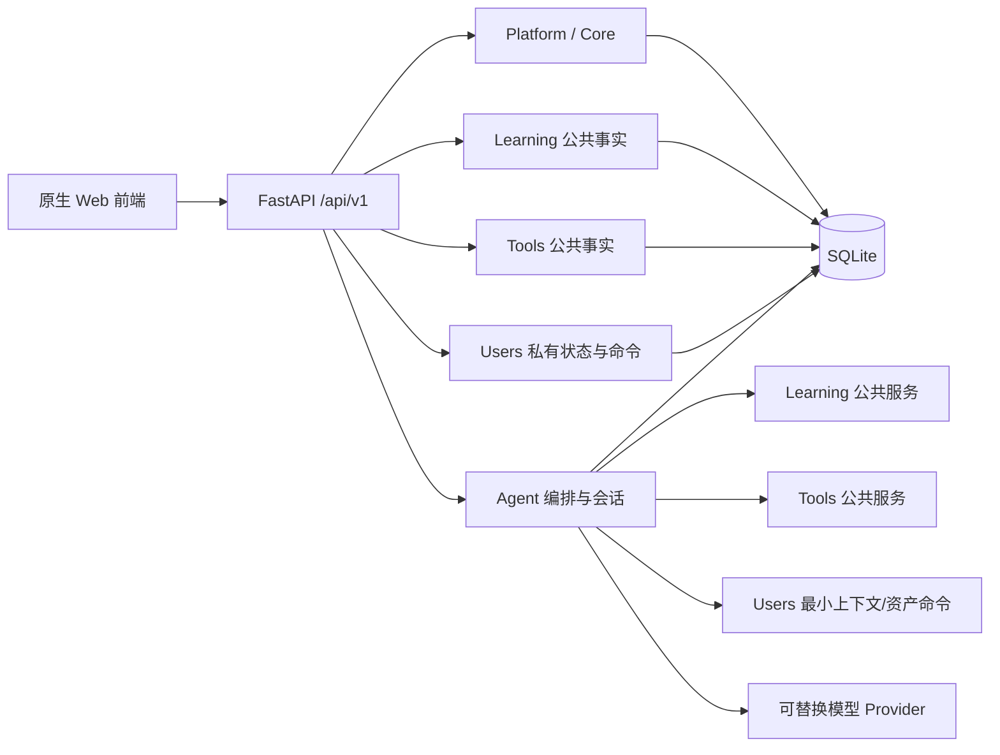

# AI 知识导航：全栈开发成果与全项目审计交接

> 文档状态：当前开发成果的权威交接快照  
> 基准日期：2026-07-28
> 工作区：`<PROJECT_ROOT>`
> 当前分支：`agent/sync-agent-foundation-cn`  
> 已部署应用提交：`0025cbb0403659995374be09b239b839d751d341`
> 当前结论：**本地整改候选与 deterministic HTTP 测试部署通过；生产发布继续 NO-GO**
> 主要受众：下一轮全项目代码、测试、安全、数据、架构和发布审计人员

---

> 当前审计权威入口：
> `docs/05-quality/audits/full-project-remediation-verification-report.md`。
> 2026-07-25 独立复验及后续整改确认所有本地整改项已经关闭：176/176 Python、
> 34/34 Node、36/36 JavaScript 语法、85.9% 分支覆盖率、Ruff 0、依赖漏洞 0；
> 84/84 个 JSON 操作使用字段级响应 DTO，原 44 个宽泛响应模型归零，并有内部字段
> 注入过滤反例。生产发布仍因真实恢复发送服务、Provider 合规与受控调用、生产网络与
> 容量、生产备份恢复、回滚演练和外部责任人签收而保持 NO-GO。

> 2026-07-28 部署补充：公开 HTTP 测试实例已完成不可变发布、旧站兼容、独立单账号
> 数据库、Nginx/systemd、deterministic smoke 和 24 项账号/游客全功能验证。真实
> Provider、HTTPS、容量、备份恢复、回滚演练和生产签收未执行。服务器脱敏证据位于
> `docs/06-evidence/platform/http-test-server-validation.json`。

## 0. 如何使用本交接文档

本文件用于把当前全栈成果交给新的开发对话或审计人员。它不是早期规划文档，也不是产品宣传材料。审计时采用以下证据优先级：

1. 当前代码、数据库迁移和自动化测试；
2. 机器可读的验收产物；
3. 本交接文档；
4. 各模块设计、运行手册和任务文档；
5. README 与历史规划文档。

如果历史文档与当前代码冲突，以当前代码和测试为准。特别注意：

- 历史 README 快照曾出现“17 个迁移”“尚未实现 SSE/会话”等旧描述，本轮已同步修正；当前事实是 **20 个迁移**，SSE、短期会话、长期对话及其隐私生命周期已经完成离线开发。
- `docs/03-domains/agent/agent-development-tasks.md` 保留了阶段演进过程。当前完成结论以
  `docs/06-evidence/agent/agent_development_completion_audit.json` 为机器证据。
- 本工作区存在尚未提交的累计开发改动。**审计人员不得执行 `git reset --hard`、不得覆盖未跟踪文件、不得把删除项当作可恢复垃圾处理。**
- 不要读取、复制、打印或提交真实 `.env`。审计配置契约只读取 `.env.example` 和
  `backend/app/core/config.py`。

推荐审计顺序：

1. 阅读本文件的“成果总览”“架构”和“上线剩余项”；
2. 检查 `git status --short`，保存变更清单；
3. 运行 Foundation 与 Agent 两套门禁；
4. 按 Platform → Frontend → Learning → Tools → Users → Agent 顺序审计；
5. 检查数据迁移、隐私生命周期、备份恢复和生产配置；
6. 最后才评估可选扩展，不要把尚无证据的复杂架构误判为缺失。

---

## 1. 成果总览

### 1.1 当前交付状态

| 范围 | 状态 | 当前成果 |
| --- | --- | --- |
| Platform | 完成 | FastAPI 应用装配、SQLite 初始化、20 个校验迁移、健康检查、CORS、安全启动校验 |
| Frontend | 完成 | 6 个原生页面、统一壳层、响应式布局、键盘/读屏/减弱动画支持、统一 API 适配 |
| Learning | 完成 | 公共知识路线、节点详情、搜索、上下游关系、内容治理、Agent 只读上下文 |
| Tools | 完成 | 数据库单一事实源、分类/检索/最新/工作流、链接治理、Agent 只读工具能力 |
| Users | 完成 | 认证、RBAC、资料、偏好、设备会话、学习状态、工作流资产、隐私、审计、可观测性 |
| Agent | 离线开发完成 | 可替换 Provider、确定性回退、SSE、短期会话、长期对话、评测、成本与并发治理 |
| 数据库 | 完成 | 46 张非 SQLite 内部表、55 个显式索引、20 个带 SHA-256 校验的增量迁移 |
| 测试与发布证据 | 完成 | 分模块门禁、性能基线、安全基线、备份恢复、真实移动端和 Narrator 验收 |
| 生产上线 | 待执行 | Provider 合规、北京业务空间端点、上海出口白名单/容量、生产密钥、受控真机调用 |

### 1.2 当前可复核数字

以下数字来自 2026-07-25 的当前代码、运行库或机器验收产物：

| 指标 | 当前值 | 证据 |
| --- | ---: | --- |
| OpenAPI 路径 | 51 | `docs/06-evidence/users/users_final_acceptance.json` |
| 数据库迁移 | 20 | `database/migrations/` |
| 非内部数据表 | 46 | 当前 `database/ai_nav.sqlite3` |
| 显式索引 | 55 | 当前 `database/ai_nav.sqlite3` |
| Agent Python 测试 | 91 | Agent 完成审计 |
| Agent Node/SSE 测试 | 3 | Agent 完成审计 |
| Frontend Node 测试 | 28 | 当前独立复验 |
| Tools Python 测试 | 6 | 阶段 5 体验审计 |
| Learning Python/Node 测试 | 19 / 2 | 阶段 5 体验审计 |
| Users Python 测试 | 48 | 当前独立复验 |
| 导航项 | 4 | 当前运行库 |
| 学习节点 | 16 | 当前运行库 |
| 学习主资料/章节/补充链接 | 16 / 64 / 88 | 当前运行库 |
| 工具记录 | 144 | 当前运行库 |
| 工具分类/子分类/展示位 | 9 / 37 / 138 | 当前运行库 |
| 公共工具工作流/步骤关联 | 3 / 11 | 当前运行库 |

数据库内容数量会随运营数据更新而变化；迁移数量、测试数量和 OpenAPI 路径数量属于当前代码快照，新增能力后应同步更新。

### 1.3 当前不属于缺陷的事项

下列能力被有意延后，只有评测、负载或业务证据证明必要时才引入：

- 自动长期记忆与从全部对话中自动提取画像；
- Redis 或跨进程 Agent 运行态；
- 第二 Provider 自动切换；
- 向量数据库和向量检索；
- LangGraph/状态图；
- 多 Agent 协作；
- 微服务拆分；
- 多进程 API Worker。

当前体量下，模块化单体、SQLite 和单 Worker 是明确的成本/复杂度平衡，不是临时遗漏。

---

## 2. 技术生态与版本

### 2.1 后端

| 技术 | 版本/方式 | 用途 |
| --- | --- | --- |
| Python | 项目脚本支持本机/虚拟环境解析 | 后端、迁移、验证、基准和发布演练 |
| FastAPI | `0.139.2` | HTTP API、OpenAPI、依赖注入、参数校验 |
| Uvicorn | `0.35.0` | ASGI 运行时 |
| HTTPX | `0.28.1` | OpenAI-compatible Provider HTTP 调用 |
| python-multipart | `0.0.32` | 头像上传 |
| Pillow | `12.3.0` | 头像解码、裁剪、压缩和像素限制 |
| python-dotenv | `1.2.2` | 本地 `.env` 加载；进程环境变量优先 |
| SQLite | Python 标准库驱动 | 当前单机持久化、事务、WAL、备份恢复 |
| Pydantic | 由 FastAPI 依赖提供 | 严格 DTO 与响应契约 |

后端没有引入 ORM。SQL 只允许存在于所属模块的 repository 或数据库初始化/迁移层。

### 2.2 前端

| 技术 | 方式 | 用途 |
| --- | --- | --- |
| HTML5 | 6 个静态入口 | 首页、学习、学习节点、工具、助手、设置 |
| CSS | 原生 CSS、共享变量和页面样式 | Codex 风格中性色、响应式布局、焦点和减弱动画 |
| JavaScript | 原生 ES Modules | 页面控制器、API 适配、鉴权状态、SSE、交互 |
| Fetch API | 浏览器原生 | JSON API 与认证刷新 |
| Event stream parser | 项目实现 | Agent SSE 增量事件解析与取消 |
| Local Storage | 仅必要客户端状态 | 同意记录、头像 URL 和匿名真实阅读快照；不存 Access Token、Refresh Token 或 API Key |

没有 React/Vue/Angular、没有前端构建器、没有运行时 UI 组件库。这样保持体量、部署和审计成本可控。

### 2.3 测试与工程

| 技术/入口 | 用途 |
| --- | --- |
| Python `unittest` | 后端服务、迁移、Provider、会话、安全与治理测试 |
| Node 内置 test runner | 前端契约、入口、SSE、可访问性静态约束 |
| `py_compile` / `node --check` | Python/JavaScript 语法门禁 |
| PowerShell | Windows 11 主验收入口 |
| Playwright 系浏览器自动化 | Chromium/WebKit/Firefox、移动设备模拟、阶段 5 UI 验收 |
| Opera Browser Connector | Opera 页面树与截图复核 |
| Windows Narrator | 真实读屏人工验收 |
| GitHub Actions | Windows + Python 3.12，顺序执行 Foundation 和 Agent 门禁 |

### 2.4 外部服务生态

当前仅预留一个真实模型服务边界：

- 阶段 1 默认 Provider：阿里云百炼，OpenAI-compatible API；
- 唯一默认模型：`qwen3.5-flash`；
- 已接配置但默认 0% 的升级模型：`qwen3.7-plus`；
- DeepSeek：阶段 2 可插拔备用 Provider，当前未接入生产路由；
- Cloudflare Quick Tunnel：只用于无敏感数据的阶段 5 临时移动端验收，已关闭，不是生产依赖。

---

## 3. 总体架构

### 3.1 架构形态

项目采用**小型企业级模块化单体**：



部署特征：

- 一个 FastAPI 进程；
- 一个部署单元；
- 一个 SQLite 数据库；
- 一套顺序迁移；
- 静态前端由同一 FastAPI 应用挂载；
- 当前固定一个 API Worker；
- Agent 的并发、成本、重放缓存和指标是进程内状态。

### 3.2 稳定模块所有权

| 模块 | 拥有 | 不拥有 |
| --- | --- | --- |
| Platform/Core | 配置、数据库、迁移、健康检查、导航基础设施、日志装配 | 领域业务规则 |
| Frontend | 页面呈现、交互、客户端状态、API 适配、可访问性 | 业务事实、权限最终判定 |
| Learning | 路线、节点、材料、章节、关系、公共搜索与内容治理 | 用户进度、收藏、Agent 编排 |
| Tools | 工具事实、分类、展示位、搜索、公共工作流建议 | 用户资产、页面静态副本 |
| Users | 身份、权限、私有状态、偏好、学习状态、资产、隐私与审计 | 公共学习/工具事实、模型推理 |
| Agent | 意图路由、只读工具编排、Provider、引用组装、会话、评测与治理 | 直接拥有 Learning/Tools/Users 业务事实 |

### 3.3 依赖规则

必须保持：

1. Router 只处理 HTTP、鉴权依赖、DTO 和错误映射；
2. Service 处理用例和业务规则；
3. Repository 处理 SQL、事务和持久化；
4. 跨模块只调用公开 service/facade；
5. Agent 不直接访问 Learning/Tools/Users 领域表；
6. 数据库共享不代表所有权共享，每张业务表只有一个写入所有者；
7. 不用内部 loopback HTTP 模拟模块边界；
8. Provider SDK/响应对象不得泄漏到 router、service、前端或数据库。

### 3.4 典型请求链路

公共内容读取：

```text
浏览器 -> /api/v1/learning|tools -> router -> service -> repository -> SQLite
```

用户命令：

```text
浏览器 -> 鉴权/权限 -> router -> Users service -> repository 事务
       -> 乐观并发/幂等 -> 审计事件 -> 稳定响应
```

Agent 只读回答：

```text
浏览器 -> agent/chat 或 agent/chat/stream
       -> 权限 + 当前隐私同意
       -> 固定意图路由
       -> Learning/Tools/Navigation/最小 Users Context
       -> 有界证据包
       -> Provider 或确定性回答
       -> 输出守卫
       -> 由确定性代码组装引用、卡片、步骤和元数据
       -> 可选短期/长期会话落库
```

Agent 写操作：

```text
模型只产生草案 -> 页面显示确认 -> 用户明确确认
-> 独立 Users Command -> 权限 + Idempotency-Key + 事务 + 审计
```

---

## 4. 目录与关键入口

```text
ai-nav-fullstack/
├─ backend/
│  ├─ app/
│  │  ├─ api/v1/routers/       HTTP 适配层
│  │  ├─ agent/                Agent 编排、Provider、会话、评测、治理
│  │  ├─ core/                 配置与安全基础
│  │  ├─ db/                   数据库初始化与迁移执行
│  │  ├─ learning/             公共学习领域
│  │  ├─ platform/             公共导航等平台能力
│  │  ├─ tools/                公共工具领域
│  │  └─ users/                用户私有状态和治理
│  ├─ requirements.txt
│  └─ run.py
├─ database/
│  ├─ schema.sql               初始结构
│  ├─ seed.sql                 基础字典和导航数据
│  ├─ learning_content.sql     学习内容
│  ├─ migrations/              001—020
│  └─ ai_nav.sqlite3           本地运行库
├─ frontend/
│  ├─ *.html                   6 个页面
│  └─ assets/
│     ├─ css/
│     └─ js/
├─ scripts/                    门禁、基准、备份、内容检查、发布演练
├─ tests/                      Python 与 Node 测试
├─ docs/                       设计、任务、运行手册和机器证据
├─ .env.example               本地开发无密钥配置模板
├─ production.env.example    生产无密钥配置契约
└─ README.md
```

应用入口：

- FastAPI 装配：`backend/app/main.py`
- 本地运行：`backend/run.py`
- 配置校验：`backend/app/core/config.py`
- 数据库初始化：`backend/app/db/database.py`
- API 文档：运行后访问 `/docs`
- 本地默认地址：`http://127.0.0.1:8088/`

---

## 5. Platform、Core 与运行时

### 5.1 已交付能力

- FastAPI lifespan 启动时初始化数据库；
- `schema.sql`、`seed.sql`、`learning_content.sql` 与增量迁移统一装配；
- SQLite 外键开启、`busy_timeout=5000`、WAL；
- 迁移使用 `BEGIN IMMEDIATE`，防止并发迁移；
- 每个迁移记录文件名和 SHA-256，已应用文件发生漂移时失败；
- 统一 HTTP/参数校验错误结构；
- 显式 CORS 来源和请求头白名单；
- 上传目录与静态前端挂载；
- 健康检查、就绪检查、存活检查；
- Learning 请求的请求编号、`Server-Timing`、结构化访问日志和公共缓存头；
- Users 请求脱敏观测中间件；
- 生产启动时拒绝不安全配置。

### 5.2 公共接口

| 方法 | 路径 | 用途 |
| --- | --- | --- |
| GET | `/api/v1/navigation` | 主导航 |
| GET | `/api/v1/health/live` | 进程存活 |
| GET | `/api/v1/health/ready` | 数据库/应用就绪 |
| GET | `/api/v1/health` | 兼容健康检查 |

### 5.3 生产启动硬校验

`AI_NAV_ENV=production` 时：

- `RESET_DATABASE_ON_START` 必须为 `0`；
- 数据库与上传目录必须显式位于源码树外的持久路径；
- `AI_NAV_SECRET_KEY` 不能是开发默认值，且至少 32 字符；
- CORS 来源必须是明确 HTTPS origin，不能包含 `*`、凭据、路径、查询或片段；
- Refresh Cookie 必须启用 Secure；
- `SameSite=None` 只有在 Secure Cookie 下允许；
- 可信代理不能覆盖全部 IPv4/IPv6 地址空间；
- 账号删除宽限/保留期和 Provider 成本阈值必须处于安全范围；
- fake Provider 被拒绝；
- live Provider 必须是 `openai_compatible`；
- 默认模型必须是 `qwen3.5-flash`；
- 升级模型必须是 `qwen3.7-plus` 且升级比例必须是 0；
- live Provider 主机必须在显式 allowlist；
- 当前 CN 发布约束要求阿里云百炼北京业务空间域名；
- `AI_NAV_API_WORKERS` 必须为 1；
- Agent 运行态后端必须为 `process_local`。

### 5.4 审计重点

- 确认任何新 Router 都在 `main.py` 显式装配；
- 确认错误响应不泄漏 SQL、堆栈、Token 或 Provider body；
- 确认代理后的真实客户端地址只信任配置的代理网段；
- 确认生产不会启用 `RESET_DATABASE_ON_START`；
- 确认部署数据目录、上传目录和数据库文件具有最小权限；
- 确认多 Worker 没有被平台环境变量隐式覆盖。

---

## 6. Frontend 模块

### 6.1 页面入口

| 页面 | 文件 | 职责 |
| --- | --- | --- |
| 首页 | `frontend/index.html` | 公共内容入口、搜索、导航 |
| 学习路线 | `frontend/learn.html` | 路线图、领域筛选、资源入口 |
| 学习节点 | `frontend/learn-node.html` | 材料、章节、关系、进度和收藏 |
| 工具 | `frontend/tools.html` | 分类、搜索、最新和工作流建议 |
| AI 助手 | `frontend/assistant.html` | 传统生成式 AI 工作区、会话和回答 |
| 用户设置 | `frontend/settings.html` | 账户、资料、偏好、安全、隐私和资产 |

### 6.2 JavaScript 分层

| 类别 | 关键文件 | 职责 |
| --- | --- | --- |
| HTTP 基础 | `api.js`, `v2-api.js` | JSON 请求、错误标准化、鉴权刷新 |
| Users API | `users-api.js` | 用户模块前端 facade |
| Learning API | `learning-api.js` | 公共内容与用户学习状态适配 |
| Agent SSE | `agent-sse.js` | SSE 解码、事件投影、取消和错误 |
| 鉴权状态 | `auth-local-state.js`, `auth-ui.js` | 客户端登录状态和统一登录 UI |
| 公共壳层 | `page-shell.js` | 导航、页面身份、稳定横栏 |
| 首页 | `home-page.js` | 首页交互 |
| 学习 | `learning-pages.js`, `learn-page.js`, `learn-node-page.js`, `learning-state.js` | 页面控制器和状态 |
| 匿名阅读 | `anonymous-learning-state.js` | 只记录真实节点访问，登录后幂等导入 |
| 工具 | `tools-entry.js`, `tools-page.js`, `tool-data.js`, `tool-page-lists.js` | 工具页呈现和数据适配 |
| 助手 | `assistant-page.js` | 会话、长期对话、流式回答、恢复 |
| 设置 | `settings.js` | 用户空间控制器 |
| 通用安全 | `url-safety.js`, `ui-feedback.js`, `time-format.js` | URL 白名单、反馈、时间本地化 |
| 偏好消费者 | `user-preference-consumers.js` | 把用户偏好送到明确的页面消费者 |

### 6.3 视觉与交互约束

- 采用 Codex 风格的中性灰、白、深色主操作，不使用传统蓝紫渐变插件风；
- 助手采用传统生成式 AI 网页布局：桌面常驻侧边栏、开放阅读区、底部输入框；
- 移动端会话区使用抽屉和遮罩；
- 页面分区切换时顶部横栏尽量零偏移；
- 用户消息右对齐，助手内容保持开放阅读流；
- 引用、工具轨迹、恢复操作就近呈现；
- 网页只显示完成用户任务所必需的文字、状态、错误恢复和用户引导；
- 当前对话中的工程说明、截图标注说明、内部 Provider 状态不得写入产品界面；
- 工作流圆标使用组件级选择器固定双轴居中、等宽数字和零外边距。

### 6.4 可访问性与兼容性结果

已验证：

- Chromium、Firefox、WebKit、Opera；
- Pixel 7、iPhone 15 模拟；
- 390×844 移动端抽屉；
- 真实移动设备横竖屏；
- Windows Narrator；
- `aria-live="polite"` 状态播报；
- Escape 停止生成/关闭抽屉；
- 焦点返回触发器或输入框；
- `prefers-reduced-motion`；
- 4000 字长输入；
- 无横向溢出、无框架错误浮层、浏览器控制台错误为 0。

证据：`docs/06-evidence/agent/agent_stage5_experience_audit.json`。

### 6.5 前端审计重点

- 不允许页面直接拼接不可信外链；
- 不允许 API Key、Refresh Token 或 Provider 原始响应进入 DOM；
- 访问令牌用途必须维持最小化，Refresh Token 只走 HttpOnly Cookie；
- 公共 Learning/Tools 页面在 Users 或 Agent 不可用时仍可阅读；
- 错误态应提供恢复操作，但不能展示内部错误；
- 新会话按钮只有当前草稿正式开启后才能再建；
- 短期/长期会话标题、置顶和排序必须与服务端结果一致；
- 所有交互控件应有可访问名称、键盘路径和可见焦点。

---

## 7. Learning 模块

### 7.1 所有权与边界

Learning 是**与用户无关的公共知识内容服务**。它拥有：

- 难度、知识领域；
- 路线节点、边、领域映射；
- 学习资源；
- 主资料、章节、标签、补充链接；
- 节点前后关系、相关推荐和下一步；
- 公共搜索；
- 面向 Agent 的紧凑证据上下文；
- 内容发布、版本、质量、来源可信度和复核信息。

Learning 不拥有：

- 用户进度、章节完成、最近阅读、收藏；
- 匿名用户身份；
- Agent 会话、提示词或模型；
- 内容运营人员的工作流状态。

用户学习状态写入归 `backend/app/users/learning_state`。

### 7.2 后端结构

```text
backend/app/learning/
├─ schemas.py
├─ policies.py
├─ ports.py
├─ service.py
└─ repositories/sqlite.py
```

- `schemas.py`：严格响应 DTO 与外链校验；
- `policies.py`：内容可见性和领域规则；
- `ports.py`：Learning repository 契约；
- `service.py`：路线、详情、搜索、关系和 Agent 上下文用例；
- `repositories/sqlite.py`：公共内容 SQL。

### 7.3 公共 API

| 方法 | 路径 | 用途 |
| --- | --- | --- |
| GET | `/api/v1/learning/roadmap` | 路线图 |
| GET | `/api/v1/learning/resources` | 推荐资源 |
| GET | `/api/v1/learning/search` | 公共内容搜索 |
| GET | `/api/v1/learning/agent-context` | 有界 Agent 证据 |
| GET | `/api/v1/learning/nodes/{slug}` | 节点详情 |
| GET | `/api/v1/learning/nodes/{slug}/next` | 推荐下一节点 |
| GET | `/api/v1/learning/nodes/{slug}/relations` | 关系和相关节点 |

### 7.4 数据表

- `difficulty_levels`
- `knowledge_domains`
- `roadmap_nodes`
- `roadmap_edges`
- `roadmap_domain_nodes`
- `learning_resources`
- `learning_materials`
- `learning_material_sections`
- `learning_node_tags`
- `learning_node_links`

### 7.5 内容治理

- 材料和链接具有稳定 UID；
- 公开内容有发布状态和内容版本；
- 记录质量状态、来源可信级别和最后复核时间；
- 节点 slug、链接类型、访问类型和 URL 有严格约束；
- 跨域内容链接由 `scripts/check-content-links.py` 检查；
- 内容完整性由 `scripts/check-learning-content.py` 检查；
- 公共 GET 带 60 秒缓存和 300 秒 stale-while-revalidate。

### 7.6 用户状态协作

Users 的学习状态提供：

- 节点进度和乐观并发版本；
- 章节完成状态；
- append-only 阅读活动和幂等键；
- 最近阅读、继续学习；
- 收藏；
- 匿名真实阅读快照导入。

匿名导入只接受实际访问过的节点，不推断完成度，不伪造学习进度。

### 7.7 验证

- Python：19 项（服务/迁移、内容治理、Platform 导航）；
- Node：2 项；
- Python 全量编译；
- 前端 JavaScript 语法；
- 内容和跨域链接检查；
- Learning p95 性能预算 250ms；
- whitespace 检查。

入口：`scripts/verify-learning.ps1`。

---

## 8. Tools 模块

### 8.1 所有权与边界

Tools 是公共工具事实的单一来源，拥有：

- 工具分类和子分类；
- 工具记录；
- 页面展示位；
- 最新工具槽位；
- 公共工具工作流和步骤关联；
- 免费优先、分类过滤、检索评分和推荐理由；
- 面向 Agent 的工具卡片和工作流建议。

不允许再维护一份与数据库竞争的前端工具事实副本。

### 8.2 后端结构

```text
backend/app/tools/
├─ repository.py
└─ service.py
```

- repository 加载数据库目录；
- service 负责文本归一化、查询扩展、匹配、评分、分页和工作流推荐；
- Agent 通过 `backend/app/agent/tools/catalog_tools.py` 调用公开服务，不读表。

### 8.3 API

| 方法 | 路径 | 用途 |
| --- | --- | --- |
| GET | `/api/v1/tools/catalog` | 完整目录 |
| GET | `/api/v1/tools/categories` | 分类 |
| GET | `/api/v1/tools/search` | 搜索 |
| GET | `/api/v1/tools/agent-context` | Agent 有界工具上下文 |
| GET | `/api/v1/tools` | 兼容列表/分页 |
| GET | `/api/v1/tools/latest` | 最新工具 |
| GET | `/api/v1/tools/workflows` | 公共工作流建议 |

### 8.4 数据表

- `tool_categories`
- `tool_subcategories`
- `ai_tools`
- `tool_placements`
- `tool_latest_slots`
- `tool_workflows`
- `workflow_tools`

当前运行库：144 条工具、9 个分类、37 个子分类、138 个展示位、3 个公共工作流。

### 8.5 维护和验证

- `scripts/audit-tool-data.mjs`：审计前端来源快照；
- `scripts/generate-tool-catalog-migration.py`：生成受控迁移；
- `scripts/check-content-links.py`：外链/内容一致性；
- `scripts/sync-tool-icons.mjs`：图标维护；
- `scripts/verify-tools.ps1`：6 项 Python 测试、语法和 whitespace。

审计时重点检查迁移的精确文件集合，而不是硬编码迁移数量；检查归档工具是否从公共结果中正确隐藏。

---

## 9. Users 模块

### 9.1 内部分区

Users 是体量最大的业务模块，但仍是同一部署单元内的内聚子包：

| 分区 | 目录 | 职责 |
| --- | --- | --- |
| Identity | `authentication`, `account`, `security`, `sessions`, `authorization` | 注册登录、账号、密码、设备会话、RBAC |
| Settings | `profile`, `preferences` | 资料、头像、偏好及消费者裁剪 |
| Learning state | `learning_state` | 用户进度、活动、最近、继续、收藏、导入 |
| Assets | `assets` | 用户保存的工作流和步骤 |
| Governance | `privacy`, `audit`, `observability`, `command_safety` | 隐私生命周期、审计、指标、写命令约束 |
| Agent context | `context` | 面向 Agent 的最小用户上下文 facade |

每个主要子区采用 service + port + SQLite repository；facade 只用于真实跨模块边界。

### 9.2 认证与令牌

- 密码：`PBKDF2-HMAC-SHA256`，默认 180,000 轮，16 字节随机盐；
- 登录成功时可检测并升级旧密码 hash；
- Access Token：HMAC-SHA256 签名的有界 JSON token，默认 10 分钟；
- Refresh Token：40 字节级随机 token，数据库只存 HMAC hash；
- Refresh Token 轮换，旧 token 失效；
- 浏览器 Refresh Token 使用 HttpOnly Cookie；
- 默认有效期 14 天；
- 登录失败默认 5 次、锁定 15 分钟；
- 用户名、邮箱和手机号可登录；
- 联系方式变更要求当前密码；
- 手机号规范化存储；
- 安全问题答案 hash 存储，永不回传明文。

### 9.3 权限

采用 RBAC：

- `roles`
- `permissions`
- `role_permissions`
- `user_role_assignments`

Router 使用 `require_permission(...)`。私有资源同时执行 user ownership 检查。跨用户资源与不存在资源统一使用 404，降低枚举风险。

### 9.4 账户与设置 API

认证：

- `GET /api/v1/auth/username-available`
- `POST /api/v1/auth/register`
- `POST /api/v1/auth/login`
- `POST /api/v1/auth/refresh`
- `POST /api/v1/auth/logout`
- `GET /api/v1/auth/me`
- `POST /api/v1/auth/password-reset/start`
- `POST /api/v1/auth/password-reset/confirm`
- `POST /api/v1/auth/password-reset/security/start`（弃用别名）
- `POST /api/v1/auth/password-reset/security/verify`（弃用，固定 410）
- `POST /api/v1/auth/password-reset/security/confirm`（弃用别名）

密码恢复凭据只通过已验证外部通道的可替换发送端交付，服务端仅保存 HMAC，
并在单次使用、过期或成功重置后失效。当前默认发送端关闭并 fail-closed；
真实邮件/短信服务尚未完成外部签收。

账户、资料和偏好：

- `GET|PATCH /api/v1/users/me/account`
- `PATCH /api/v1/users/me/password`
- `GET|PUT /api/v1/users/me/security-questions`
- `GET|PATCH /api/v1/users/me/profile`
- `POST /api/v1/users/me/avatar`
- `GET|PATCH /api/v1/users/me/preferences`
- `GET /api/v1/users/me/preferences/context`

设备会话：

- `GET /api/v1/users/me/sessions`
- `POST /api/v1/users/me/sessions/revoke-others`
- `DELETE /api/v1/users/me/sessions/{session_uid}`

### 9.5 用户学习状态 API

- `GET /api/v1/users/me/learning/dashboard`
- `GET /api/v1/users/me/learning/progress`
- `GET /api/v1/users/me/learning/nodes/{node_slug}`
- `PUT /api/v1/users/me/learning/nodes/{node_slug}/sections/{section_uid}`
- `PUT /api/v1/users/me/learning/progress/{node_slug}`
- `POST /api/v1/users/me/learning/activity`
- `POST /api/v1/users/me/learning/import`
- `GET /api/v1/users/me/learning/recent`
- `GET /api/v1/users/me/learning/resume`
- `GET|POST /api/v1/users/me/favorites`
- `DELETE /api/v1/users/me/favorites/{favorite_uid}`

写入使用期望版本、幂等键或两者，冲突返回稳定 409。

### 9.6 用户工作流资产

API：

- `GET|POST /api/v1/users/me/assets/workflows`
- `GET|PATCH /api/v1/users/me/assets/workflows/{workflow_uid}`
- `POST /api/v1/users/me/assets/workflows/{workflow_uid}/archive`
- `POST /api/v1/users/me/assets/workflows/{workflow_uid}/restore`
- `GET /api/v1/users/me/workflows`（摘要/兼容消费者）

规则：

- 创建要求 `Idempotency-Key`；
- 更新、归档、恢复使用乐观并发版本；
- 工具步骤引用公共 Tools 事实；
- 写入具有权限、事务、审计和稳定错误码；
- Agent 只能在用户确认后调用这一命令。

### 9.7 隐私生命周期

API：

- `GET /api/v1/users/me/privacy/consents`
- `PUT /api/v1/users/me/privacy/consents/{consent_type}`
- `POST /api/v1/users/me/privacy/export`
- `GET /api/v1/users/me/privacy/deletion-requests/current`
- `POST /api/v1/users/me/privacy/deletion-requests`
- `DELETE /api/v1/users/me/privacy/deletion-requests/{request_uid}`
- 管理员 execute / restore / anonymize 三个命令。

当前策略：

- 隐私政策版本默认 `2026-07-20`；
- Agent memory policy 默认 `2026-07-01`；
- 注销宽限默认 7 天；
- 软删除保留默认 30 天；
- 最终匿名化删除目标用户的短期/长期 Agent 会话并级联消息；
- 其他用户数据不受影响；
- 数据导出包含目标用户可见的短期会话、长期对话和消息；
- 导出不包含 `request_id`、`source_session_uid`、Provider 原始请求/响应、系统提示、推理过程或密钥。

### 9.8 头像

- 源文件默认最大 2MB；
- 解码像素默认最大 20,000,000；
- 输出最长边默认 512px；
- 输出默认最大 360KB；
- 解码、格式和输出均受控；
- 文件名和路径由服务端生成，禁止客户端路径穿越。

### 9.9 可观测性与命令安全

- 用户请求中间件记录操作、状态、时延和稳定错误码；
- 指标端点：`GET /api/v1/users/operations/metrics`；
- 审计元数据使用事件目录与字段白名单；
- 密码、Token、答案、联系方式等敏感字段禁止进入审计；
- `docs/03-domains/users/users-command-safety-matrix.md` 冻结写命令的权限、并发、幂等、审计和重放策略；
- `scripts/check-users-command-safety.py` 自动检查覆盖。

### 9.10 验证

`scripts/verify-users.ps1` 覆盖：

- 43 项 Users 服务测试；
- 前端 facade 和语法；
- OpenAPI/响应契约冻结；
- 28 项安全基线，0 known risk、0 fail；
- 命令安全矩阵；
- 20 个迁移与备份恢复演练；
- 8 个性能操作和 3 个查询计划；
- 最终验收报告；
- whitespace。

性能快照见 `docs/06-evidence/users/users_performance_baseline.json`。本地样本中登录 p95 约 70.56ms，其余核心查询/轮换均在各自预算内；这些是当前机器的回归基线，不是生产 SLA。

---

## 10. Agent 模块

### 10.1 已交付范围

离线开发已经完成：

- 确定性意图路由和站内证据检索；
- 可替换 Provider 接口；
- OpenAI-compatible Provider；
- Provider 关闭、拒绝、超时、失败和解析失败时的确定性回退；
- 输入/证据/输出边界；
- 输出守卫；
- 引用、卡片、步骤由确定性代码组装；
- JSON 与 SSE 共用一个编排结果；
- 停止、断线、超时、背压和增量渲染；
- 请求编号重放与冲突检测；
- 短期会话；
- 长期对话；
- 用户确认后的工作流保存；
- 并发和成本治理；
- 脱敏指标和运行快照；
- 评测清单、盲评协议、模型升级门禁；
- 桌面、移动、Opera、真实设备、Narrator 验收；
- 会话隐私导出、删除和匿名化。

### 10.2 代码分区

| 文件/目录 | 职责 |
| --- | --- |
| `schemas.py` | HTTP、编排、流事件和会话 DTO |
| `router.py` | 确定性意图/能力选择 |
| `service.py` | 证据检索与结构化回答基础 |
| `orchestrator.py` | Provider、回退、治理和最终结果编排 |
| `factory.py` | 组合根与 Provider 注入 |
| `providers/base.py` | 最小可替换 Provider 契约 |
| `providers/openai_compatible.py` | 真实 HTTP Provider |
| `providers/fake.py` | 测试/离线注入，生产禁止 |
| `governance.py` | 并发、队列、费用和请求预算 |
| `replay.py` | request ID 指纹、TTL 重放和冲突 |
| `runtime.py` | 脱敏运行拓扑快照 |
| `observability.py` | 进程内指标 |
| `sessions.py` | 短期会话和长期对话事务 |
| `streaming.py` | 统一响应到 SSE 事件投影 |
| `evaluator.py` | 阶段评测执行 |
| `evaluation_manifest.py` | 30 项脱敏评测清单 |
| `evaluation_protocol.py` | 盲评协议和失败分类 |
| `model_gate.py`, `model_report.py` | 模型升级判定与稳定报告 |
| `tools/*.py` | Learning、Tools、Navigation 薄适配 |

### 10.3 API

能力和聊天：

- `GET /api/v1/agent/capabilities`
- `POST /api/v1/agent/chat`
- `POST /api/v1/agent/chat/stream`
- `POST /api/v1/agent/workflows/save`

短期会话：

- `POST /api/v1/agent/sessions`
- `GET /api/v1/agent/sessions`
- `GET|PATCH|DELETE /api/v1/agent/sessions/{session_uid}`
- `POST /api/v1/agent/sessions/{session_uid}/upgrade`

长期对话：

- `GET /api/v1/agent/long-conversations`
- `GET|PATCH|DELETE /api/v1/agent/long-conversations/{conversation_uid}`

运维：

- `GET /api/v1/agent/operations/metrics`
- `GET /api/v1/agent/operations/runtime`

聊天、会话和运维接口均受权限保护；运维接口要求管理权限。

### 10.4 Provider 数据边界

允许发送：

- 当前用户明确输入的问题；
- 当前任务需要的站内公开证据；
- 有界、最小化且经用户政策同意的偏好上下文。

禁止发送：

- API Key 以外的账户凭据；
- Refresh/Access Token；
- 完整用户档案；
- 联系方式；
- 长期记忆全量；
- 数据库行或 SQL；
- 内部审计日志；
- 其他用户数据。

禁止持久化：

- Provider 原始 request/response body；
- 系统提示；
- 推理过程；
- API Key；
- 完整 Users Context；
- 内部工具参数。

### 10.5 模型与升级策略

已确认并写入代码校验：

- 阶段 1 唯一默认模型：`qwen3.5-flash`；
- `qwen3.7-plus` 已接配置，但升级比例固定为 `0`；
- 只有盲评证明必要时，才可逐步开放 5%—10%；
- 空白模型比较模板固定结论为 `KEEP_FLASH_0_PERCENT`；
- DeepSeek 仅作为阶段 2 备用 Provider 候选，不自动接流量。

模型升级必须满足：

- 同一脱敏任务集；
- 匿名样本；
- 引用与安全硬失败优先；
- 成本、时延和任务分数共同评估；
- 评测制品语义 hash 未漂移；
- 达标后仍按小比例灰度，而不是立即替换默认模型。

### 10.6 默认治理参数

| 参数 | 默认值 |
| --- | ---: |
| Provider 超时 | 8 秒 |
| 最大重试 | 1 |
| 最大输入 Token | 4000 |
| 最大输出 Token | 600 |
| 最大输出字符 | 6000 |
| 最大证据条数 | 10 |
| 最大证据字符 | 12000 |
| 每用户并发 | 1 |
| 全局并发 | 8 |
| 队列长度 | 32 |
| 排队超时 | 3 秒 |
| 单请求费用上限 | ¥0.02 |
| 每用户日上限 | ¥0.10 |
| 全局日上限 | ¥5 |
| 全局月上限 | ¥80 |
| 重放 TTL | 300 秒 |
| 重放最大项 | 512 |
| SSE 缓冲事件 | 8 |
| 短期会话保留 | 30 天 |

应用侧价格估算默认使用输入 ¥0.2/百万 Token、输出 ¥2/百万 Token。上线前必须按供应商实际计费更新，并同时设置供应商侧硬预算/告警；应用内估算不能替代云侧硬上限。

### 10.7 短期会话

规则：

- 功能开关默认关闭；
- 登录用户所有；
- 当前空白草稿未正式开始时不能连续创建更多空对话；
- 首轮问答落地后才能创建下一会话；
- 默认 30 天保留；
- 支持列表、详情、恢复、改标题、置顶/取消置顶、删除；
- 多个置顶会话允许共存，后置顶排在前置顶之前；
- 跨用户访问与不存在统一 404；
- 消息只存用户问题和最终通过守卫的助手回答。

### 10.8 长期对话

已确认的产品规则：

- 每个用户最多拥有 3 个长期对话；
- “3 个”是用户总配额，不是单次选择数量；
- 长期对话显示在短期会话上方；
- 升级是单一原子命令；
- 成功后从短期区移除原会话，不保留重复副本；
- 失败时短期会话完全不变；
- 同一来源会话升级幂等；
- 升级期间完成的生成结果会重定向追加到长期对话；
- 支持恢复、改标题、多个置顶、取消置顶、删除和继续聊天；
- 长期对话不自动过期，由用户主动删除或进入账户隐私生命周期。

数据仅保留可见问题、最终回答、角色和时间；`source_session_uid` 只用于内部幂等，不导出给页面。

### 10.9 SSE 和恢复语义

- JSON 和 SSE 调用同一个 orchestrator；
- SSE 是已验证结果的事件投影，不维护第二套业务逻辑；
- 事件包含状态、内容增量、最终结构结果和错误；
- 客户端 Escape 可取消当前请求；
- 断线时明确提示本次回答可能未完成；
- 重试复用 request ID；如果服务端已完成，返回同一结果；
- 同一 request ID 配不同请求体返回 409；
- 背压使用有界缓冲；
- 连接取消不应继续产生会话写入。

### 10.10 Agent 数据表

- `agent_chat_sessions`
- `agent_chat_messages`
- `agent_long_conversations`
- `agent_long_conversation_messages`

Agent 持久化所有权在 Agent 模块；Users privacy repository 只通过明确的隐私生命周期事务处理导出/删除。

### 10.11 Agent 评测和验证

`scripts/verify-agent.ps1` 覆盖：

- 91 项 Python 测试；
- 3 项 Node/SSE 测试；
- Agent、Provider、工具和脚本编译；
- 30 条阶段 1 脱敏评测清单 freshness；
- 盲评协议 freshness；
- 空白模型决策基线；
- 前端语法；
- whitespace。

机器证据：

- `docs/06-evidence/agent/agent_development_completion_audit.json`
- `docs/06-evidence/agent/agent_stage4_completion_audit.json`
- `docs/06-evidence/agent/agent_stage5_experience_audit.json`
- `docs/06-evidence/agent/agent_runtime_baseline.json`
- `docs/06-evidence/agent/agent_phase1_evaluation_manifest.json`
- `docs/06-evidence/agent/agent_blind_evaluation_protocol_manifest.json`

---

## 11. 数据库与迁移

### 11.1 当前结构

当前运行库有 46 张非内部表：

Platform/内容：

- `app_settings`
- `navigation_items`
- Learning 的 10 张表
- Tools 的 7 张表

Users：

- `user_accounts`
- `user_auth_passwords`
- `user_security_questions`
- `user_profiles`
- `user_preferences`
- `user_sessions`
- `user_verification_tokens`
- `roles`
- `permissions`
- `role_permissions`
- `user_role_assignments`
- `user_login_logs`
- `user_auth_rate_limits`
- `user_audit_logs`
- `user_privacy_consent_events`
- `user_data_requests`
- `user_saved_workflows`
- `user_saved_workflow_steps`
- `user_learning_progress`
- `user_learning_section_progress`
- `user_learning_activity`
- `user_favorites`

Agent：

- `agent_chat_sessions`
- `agent_chat_messages`
- `agent_long_conversations`
- `agent_long_conversation_messages`

迁移治理：

- `schema_migrations`

### 11.2 迁移清单

| 编号 | 文件 | 目的 |
| ---: | --- | --- |
| 001 | `001_user_learning_state.sql` | 用户学习进度、活动、收藏 |
| 002 | `002_learning_sections_and_relations.sql` | 章节和语义关系 |
| 003 | `003_learning_content_governance.sql` | 稳定 UID、发布与质量治理 |
| 004 | `004_refresh_token_rotation.sql` | Refresh Token 轮换 |
| 005 | `005_user_profile_preference_versions.sql` | 资料/偏好乐观版本 |
| 006 | `006_user_privacy_lifecycle.sql` | 同意、导出、注销生命周期 |
| 007 | `007_user_workflow_assets.sql` | 用户工作流资产 |
| 008 | `008_user_auth_compatibility.sql` | 认证兼容迁移 |
| 009 | `009_auth_rate_limits.sql` | 认证限速 |
| 010 | `010_tool_catalog_source_of_truth.sql` | 工具数据库事实源 |
| 011 | `011_tool_catalog_integrity_cleanup.sql` | 工具完整性清理 |
| 012 | `012_tool_catalog_refresh.sql` | 工具目录刷新 |
| 013 | `013_navigation_integrity.sql` | 导航完整性 |
| 014 | `014_content_link_governance.sql` | 内容链接治理 |
| 015 | `015_tool_catalog_refresh.sql` | 后续工具目录刷新 |
| 016 | `016_auth_session_persistence.sql` | 登录会话持久化 |
| 017 | `017_account_contact_identity.sql` | 邮箱/手机号身份 |
| 018 | `018_agent_short_term_sessions.sql` | Agent 短期会话 |
| 019 | `019_agent_short_session_management.sql` | 标题、置顶与管理 |
| 020 | `020_agent_long_conversations.sql` | 长期对话及消息 |

### 11.3 迁移约束

- 迁移文件追加，不修改已应用文件；
- 文件名和内容 hash 写入 `schema_migrations`；
- 漂移、重复、漏跑和未知迁移必须失败；
- 使用事务；
- SQLite 条件加列指令由迁移器校验；
- 发布前先备份，再迁移，再做完整性和外键检查；
- 回滚以恢复经过校验的备份为主，不编写未经演练的逆向 SQL。

### 11.4 备份恢复

入口：`scripts/manage-users-backup.py`、`scripts/rehearse-users-release.py`。

演练包括：

- 备份；
- 迁移；
- SQLite integrity check；
- foreign key check；
- 恢复；
- 数据和迁移集合复核。

生产上线前需要把数据库放在持久卷/独立数据目录，不要放在可被应用更新覆盖的源码目录。

---

## 12. 配置和密钥

### 12.1 加载规则

- `backend/app/core/config.py` 调用 dotenv；
- `.env` 使用 `override=False`；
- 已存在的系统/部署环境变量优先；
- `.env` 只用于本地开发；
- 验证进程设置 `AI_NAV_DISABLE_DOTENV=1`，不会读取开发者真实 `.env`；
- 生产使用部署平台密钥管理或受限环境变量；
- API Key 字段在配置 dataclass 中 `repr=False`；
- 任何日志、错误、响应、截图、测试快照均不得出现真实密钥。

### 12.2 配置组

应用与拓扑：

- `AI_NAV_ENV`
- `AI_NAV_API_WORKERS`
- `AI_NAV_AGENT_RUNTIME_STATE_BACKEND`
- `AI_NAV_DATABASE_PATH`
- `AI_NAV_UPLOAD_DIR`
- `RESET_DATABASE_ON_START`
- `AI_NAV_SECRET_KEY`
- `AI_NAV_CORS_ALLOW_ORIGINS`
- `AI_NAV_TRUSTED_PROXY_CIDRS`
- `AI_NAV_REFRESH_COOKIE_SECURE`

Provider：

- `AI_NAV_AGENT_PROVIDER`
- `AI_NAV_AGENT_PROVIDER_LIVE_ENABLED`
- `AI_NAV_AGENT_PROVIDER_BASE_URL`
- `AI_NAV_AGENT_PROVIDER_ALLOWED_HOSTS`
- `AI_NAV_AGENT_PROVIDER_MODEL`
- `AI_NAV_AGENT_PROVIDER_UPGRADE_MODEL`
- `AI_NAV_AGENT_PROVIDER_UPGRADE_RATIO`
- `AI_NAV_AGENT_PROVIDER_API_KEY`

流式、会话和重放：

- `AI_NAV_AGENT_STREAM_ENABLED`
- `AI_NAV_AGENT_STREAM_BUFFER_EVENTS`
- `AI_NAV_AGENT_SESSIONS_ENABLED`
- `AI_NAV_AGENT_SESSION_RETENTION_DAYS`
- `AI_NAV_AGENT_RESPONSE_REPLAY_TTL_SECONDS`
- `AI_NAV_AGENT_RESPONSE_REPLAY_MAX_ENTRIES`

预算与费用：

- `AI_NAV_AGENT_PROVIDER_TIMEOUT_SECONDS`
- `AI_NAV_AGENT_PROVIDER_MAX_RETRIES`
- `AI_NAV_AGENT_PROVIDER_MAX_INPUT_TOKENS`
- `AI_NAV_AGENT_PROVIDER_MAX_OUTPUT_TOKENS`
- `AI_NAV_AGENT_PROVIDER_MAX_OUTPUT_CHARS`
- `AI_NAV_AGENT_MAX_EVIDENCE_ITEMS`
- `AI_NAV_AGENT_MAX_EVIDENCE_CHARS`
- `AI_NAV_AGENT_PER_USER_CONCURRENCY`
- `AI_NAV_AGENT_GLOBAL_CONCURRENCY`
- `AI_NAV_AGENT_QUEUE_LIMIT`
- `AI_NAV_AGENT_QUEUE_TIMEOUT_SECONDS`
- `AI_NAV_AGENT_INPUT_CNY_PER_MILLION`
- `AI_NAV_AGENT_OUTPUT_CNY_PER_MILLION`
- `AI_NAV_AGENT_PER_REQUEST_COST_CNY`
- `AI_NAV_AGENT_PER_USER_DAILY_COST_CNY`
- `AI_NAV_AGENT_GLOBAL_DAILY_COST_CNY`
- `AI_NAV_AGENT_GLOBAL_MONTHLY_COST_CNY`

认证、隐私和文件：

- `ACCESS_TOKEN_EXPIRE_MINUTES`
- `REFRESH_TOKEN_EXPIRE_DAYS`
- `AI_NAV_PASSWORD_HASH_ROUNDS`
- `AI_NAV_LOGIN_MAX_FAILED_ATTEMPTS`
- `AI_NAV_LOGIN_LOCK_MINUTES`
- `AI_NAV_ACCOUNT_DELETION_GRACE_DAYS`
- `AI_NAV_ACCOUNT_DELETION_RETENTION_DAYS`
- `AI_NAV_PRIVACY_POLICY_VERSION`
- `AI_NAV_AGENT_MEMORY_POLICY_VERSION`
- Refresh Cookie 名称、路径、SameSite、Max-Age
- Avatar 上传、输出、尺寸和源像素上限

### 12.3 API Key 交接

API Key 的唯一人工填写位置：

```text
.env
AI_NAV_AGENT_PROVIDER_API_KEY=
```

本地模板位置：`.env.example`；生产无密钥契约：`production.env.example`。真实
`.env` 已被 Git 忽略。其他代码全部从配置对象读取，不硬编码、不在网页展示。

---

## 13. 测试、门禁与 Windows 11 操作

### 13.1 环境准备

在项目根目录打开 PowerShell：

```powershell
Set-Location -LiteralPath "<PROJECT_ROOT>"
python -m venv .venv
& ".\.venv\Scripts\python.exe" -m pip install -r ".\backend\requirements.txt"
```

所有验证脚本会通过 `scripts/python-runtime.ps1` 优先找到项目虚拟环境，避免依赖错误的全局 Python。

### 13.2 全量离线门禁

```powershell
Set-Location -LiteralPath "<PROJECT_ROOT>"
& ".\scripts\verify-foundation.ps1"
& ".\scripts\verify-agent.ps1"
```

Foundation 内部顺序：

1. Frontend；
2. Tools；
3. Learning/Platform；
4. Users 和发布安全。

Agent 单独执行，避免普通站点能力被模型服务可用性耦合。

### 13.3 分模块门禁

```powershell
& ".\scripts\verify-frontend.ps1"
& ".\scripts\verify-tools.ps1"
& ".\scripts\verify-learning.ps1"
& ".\scripts\verify-users.ps1"
& ".\scripts\verify-agent.ps1"
```

这些门禁不应调用真实 Provider，不应读取真实 API Key。

### 13.4 启动

```powershell
Set-Location -LiteralPath "<PROJECT_ROOT>"
. ".\scripts\python-runtime.ps1"
$python = Resolve-AiNavPython -Root (Get-Location)
& $python ".\backend\run.py"
```

不能从 `<USER_HOME>` 直接执行相对脚本；必须先进入项目根目录，或使用上述绝对路径。

### 13.5 重要验收产物

Users：

- `docs/06-evidence/users/users_final_acceptance.json`
- `docs/06-evidence/users/users_security_baseline.json`
- `docs/06-evidence/users/users_performance_baseline.json`
- `docs/06-evidence/users/users_release_rehearsal.json`
- `docs/06-evidence/users/auth_users_openapi.json`
- `docs/06-evidence/users/screenshots/`

Agent：

- `docs/06-evidence/agent/agent_development_completion_audit.json`
- `docs/06-evidence/agent/agent_stage5_experience_audit.json`
- `docs/06-evidence/agent/agent_stage4_completion_audit.json`
- `docs/06-evidence/agent/agent_stage4_foundation_gate_rehearsal.json`
- `docs/06-evidence/agent/agent_stage2_release_rehearsal.json`
- `docs/06-evidence/agent/agent_runtime_baseline.json`
- `docs/06-evidence/agent/agent_phase1_evaluation_manifest.json`
- `docs/06-evidence/agent/agent_blind_evaluation_protocol_manifest.json`

---

## 14. 安全与隐私审计摘要

### 14.1 已落实控制

- 生产默认密钥拒绝；
- 显式 CORS；
- Secure/HttpOnly Refresh Cookie；
- 密码 PBKDF2 和可升级轮数；
- Refresh Token 只存 hash 并轮换；
- 登录失败锁定和速率限制；
- RBAC + ownership；
- 写命令幂等、乐观并发和审计；
- 审计字段白名单；
- URL 安全校验；
- 头像解码炸弹和大小限制；
- Provider host allowlist；
- Provider 输入、证据和输出上限；
- Provider 失败确定性回退；
- Provider/API Key/Token 不落日志；
- 数据导出和注销覆盖 Agent 会话；
- 跨用户访问防枚举；
- 备份恢复和迁移完整性演练。

### 14.2 上线前仍需人工/外部确认

- 阿里云百炼的数据保留、训练使用、地域、分包商和 DPA；
- 向最终用户披露发送给第三方模型服务的数据范围；
- 同意撤回后 Provider 调用是否立即停止；
- 阿里云账户/业务空间的供应商侧费用硬上限和告警；
- 上海服务器到北京业务空间的出口 IP、TLS、DNS 和延迟；
- 生产域名、HTTPS、Cookie、CORS、反向代理可信网段；
- 生产日志、备份和上传目录权限；
- API Key 和应用密钥轮换；
- 真实 Provider 的受控非敏感样本；
- 上线后数据导出、注销、限流、断路和回滚演练。

---

## 15. 可观测性与运行边界

### 15.1 当前可观测性

- Learning：请求编号、结构化访问日志、时延、HTTP 状态、公共缓存；
- Users：脱敏请求指标、稳定错误码、操作时延；
- Agent：请求、Provider、拒绝、回退、重放、冲突、成本和并发快照；
- 管理员端点仅返回脱敏聚合，不返回问题、回答、用户身份或密钥。

### 15.2 当前拓扑限制

Agent 的以下状态是进程内：

- 并发信号量；
- 排队计数；
- 日/月费用累计；
- 重放缓存；
- 指标。

因此当前强制：

```text
AI_NAV_API_WORKERS=1
AI_NAV_AGENT_RUNTIME_STATE_BACKEND=process_local
```

只有出现经测量的吞吐瓶颈且确需多 Worker 时，才设计 Redis/数据库型共享治理状态。届时必须先冻结语义，再替换实现。

### 15.3 运维建议

- 外部反向代理负责 HTTPS、请求体大小、连接超时和基础 DDoS 控制；
- 应用负责业务权限、Provider 预算和稳定错误；
- SQLite 数据文件放持久存储；
- 每次发布前做可恢复备份；
- 先灰度 Agent 功能开关，再扩大流量；
- Provider 异常时关闭 `LIVE_ENABLED`，站内确定性能力继续可用；
- 普通首页、Learning、Tools、Users 不依赖 Agent Provider。

---

## 16. 当前版本控制状态

当前工作树包含大量已修改、已删除和未跟踪文件，是本轮累计开发成果的一部分，尚未形成最终提交。审计交接必须：

1. 先运行 `git status --short` 并保存清单；
2. 不执行硬重置；
3. 不清理未跟踪的 `backend/app/agent/*`、迁移 018—020、Agent 测试和验收文档；
4. 区分“有意删除的旧规划文档”和“误删”；
5. 在审计通过后再决定分批提交策略；
6. 提交前检查真实 `.env`、数据库运行数据、日志和截图是否应进入版本库；
7. 当前本地 `database/ai_nav.sqlite3` 是开发运行库，不应被当作生产数据库。

建议最终提交按以下逻辑拆分，而不是按文件数量拆分：

1. Platform/配置/CI；
2. 数据迁移 018—020；
3. Agent Provider/编排/治理；
4. Agent 会话和隐私生命周期；
5. 助手前端和阶段 5 体验；
6. 测试、基线和交接文档。

---

## 17. 仅剩的生产上线任务

机器状态：`development_complete_production_pending`。

### 17.1 Provider 合规

- 获取并归档阿里云百炼正式政策；
- 确认服务区域、数据保留、训练使用、第三方分包商；
- 完成网站隐私告知/同意文案；
- 明确撤回同意后的即时行为；
- 设置供应商侧预算、余额和异常告警。

### 17.2 北京业务空间与上海服务器

用户当前无法创建多个业务空间，采用默认北京业务空间即可；不为环境隔离强行增加账号或微服务。

上线时：

- 从百炼控制台复制默认北京业务空间 OpenAI-compatible endpoint；
- 把精确 host 写入 allowlist；
- 上海服务器使用固定出口 IP；
- 在供应商/安全组中允许该出口；
- 测试 DNS、TLS、请求超时、跨区延迟和并发；
- 当前服务器规格为 2 vCPU / 4 GiB，先按全局并发 8 做容量验证；
- 若 CPU、内存、SQLite 写锁或延迟不达标，先降低并发，不先扩架构。

### 17.3 生产配置和密钥

- 新建至少 32 字符应用密钥；
- 轮换 Provider API Key；
- 配置生产域名 CORS；
- 启用 Secure Cookie；
- 配置持久数据库路径和备份目录；
- 配置可信代理网段；
- 确认单 Worker；
- 先保持 Provider live、SSE、sessions 功能开关为关闭；
- 完成受控验证后按顺序开启。

### 17.4 受控真实 Provider 验证

只使用无敏感数据样本：

1. 开启 `openai_compatible` 和 live；
2. 仍使用 `qwen3.5-flash`；
3. 保持 `qwen3.7-plus=0%`；
4. 检查正常回答、引用、拒绝、超时、解析失败和费用；
5. 确认日志不含用户问题全文、Provider body 和密钥；
6. 关闭 live，复核确定性回退；
7. 通过后再启用小范围流量；
8. 执行 Foundation + Agent 全门禁。

### 17.5 上线后完整门禁

- 健康/就绪；
- 注册登录、刷新轮换、退出；
- 公共 Learning/Tools；
- 用户进度和资产；
- Agent JSON/SSE；
- 短期会话和长期升级；
- 导出、注销、恢复、匿名化；
- 成本/并发限制；
- 备份恢复；
- 日志脱敏；
- 移动端和读屏抽查；
- Provider 关闭回退；
- 回滚演练。

生产清单：`docs/04-operations/agent/agent-provider-stage1-release-checklist.md`。

---

## 18. 下一轮全面审计任务清单

### 18.1 架构审计

- [ ] 模块所有权与本文件一致；
- [ ] Router 无领域 SQL；
- [ ] Agent 无跨模块 repository/表访问；
- [ ] Users 学习状态未回流 Learning；
- [ ] Tools 数据库仍是单一事实源；
- [ ] 未引入无证据的微服务、队列、状态图、向量库或多 Agent；
- [ ] 单 Worker 约束与进程内治理一致。

### 18.2 API 与契约

- [ ] 运行 OpenAPI，核对 51 条路径；
- [ ] 请求/响应 DTO 严格；
- [ ] 422、404、409、429、503 等稳定错误可恢复；
- [ ] 权限和 ownership 全覆盖；
- [ ] 分页、上限、Path pattern、Header 约束存在；
- [ ] JSON 与 SSE 最终语义一致；
- [ ] 旧前端消费者未因字段移除而破坏。

### 18.3 数据库

- [ ] 20 个迁移顺序、checksum 和事务正确；
- [ ] 新库初始化和旧库升级均通过；
- [ ] 46 张表的所有权明确；
- [ ] 外键和索引覆盖关键路径；
- [ ] 短期→长期升级原子、幂等、配额正确；
- [ ] 隐私删除只影响目标用户；
- [ ] 备份可恢复。

### 18.4 安全

- [ ] 未读取或暴露真实 `.env`；
- [ ] 密码、Token、密保答案和 API Key 不进日志；
- [ ] Refresh Cookie 属性正确；
- [ ] CORS/可信代理无通配；
- [ ] 认证限速和锁定无法旁路；
- [ ] 跨用户资源防枚举；
- [ ] URL、上传和 Provider SSRF 边界；
- [ ] 生产配置 fail-closed；
- [ ] 审计元数据白名单。

### 18.5 前端与体验

- [ ] 6 个页面均可在真实服务运行；
- [ ] 导航横栏跨分区零/最小位移；
- [ ] Codex 中性视觉系统一致；
- [ ] 不出现工程说明或无关文字；
- [ ] 桌面/移动无横向溢出；
- [ ] 键盘、焦点、Escape、读屏和减弱动画；
- [ ] 助手短期/长期会话行为与服务端一致；
- [ ] 错误恢复不重复写入；
- [ ] 外链安全。

### 18.6 Agent

- [ ] 默认 Provider 关闭时完整可用；
- [ ] `qwen3.5-flash` 唯一默认；
- [ ] `qwen3.7-plus` 比例为 0；
- [ ] Provider 主机 allowlist 和响应体边界；
- [ ] 输出守卫不能被 Provider 绕过；
- [ ] 引用/卡片/步骤不是模型自由生成的事实；
- [ ] request ID 重放与冲突；
- [ ] 并发、队列、费用、超时和取消；
- [ ] 会话配额、排序、标题、置顶、删除、升级；
- [ ] 导出/注销覆盖会话；
- [ ] 指标脱敏。

### 18.7 验证与证据

- [ ] `verify-foundation.ps1` 通过；
- [ ] `verify-agent.ps1` 通过；
- [ ] `git diff --check` 通过；
- [ ] 机器基线未陈旧；
- [ ] 性能数字标明环境，不冒充生产 SLA；
- [ ] 真实设备/Narrator 证据与机器检查分开；
- [ ] 生产待办没有被错误标记为开发缺陷。

---

## 19. 关键文档索引

架构与全局：

- `docs/02-architecture/modular-monolith-guidelines.md`
- `docs/01-overview/project-wide-optimization-roadmap.md`
- `docs/02-architecture/database-design.md`
- `docs/03-domains/frontend/frontend-audit.md`

Learning/Tools：

- `docs/03-domains/learning/learning-area-foundation-plan.md`
- `docs/03-domains/learning/learning-area-implementation.md`
- `docs/04-operations/content/content-operations-runbook.md`
- `docs/03-domains/tools/tools-service-implementation.md`
- `docs/03-domains/tools/tool-page-optimization.md`

Users：

- `docs/03-domains/users/user-module-design.md`
- `docs/03-domains/users/users-area-optimization-guide.md`
- `docs/03-domains/users/users-final-acceptance-report.md`
- `docs/04-operations/users/users-release-runbook.md`
- `docs/03-domains/users/users-privacy-lifecycle.md`
- `docs/03-domains/users/users-command-safety-matrix.md`
- `docs/03-domains/users/users-audit-event-catalog.md`
- `docs/03-domains/users/users-observability.md`

Agent：

- `docs/03-domains/agent/agent-development-handoff.md`
- `docs/03-domains/agent/agent-development-tasks.md`
- `docs/02-architecture/decisions/adr-agent-provider-cn.md`
- `docs/02-architecture/decisions/adr-agent-runtime-topology.md`
- `docs/02-architecture/decisions/agent-long-conversation-storage-proposal.md`
- `docs/04-operations/agent/agent-observability-and-model-gate.md`
- `docs/04-operations/agent/agent-blind-evaluation-runbook.md`
- `docs/04-operations/agent/agent-stage5-release-runbook.md`
- `docs/04-operations/agent/agent-provider-stage1-release-checklist.md`

---

## 20. 交接结论

2026-07-25 依赖与输入整改补充：运行组合已锁定为 FastAPI 0.139.2、
Starlette 1.3.1、python-multipart 0.0.32 和 Pillow 12.3.0。头像上传现在在解码前
检查文件签名，并限制请求体、像素、帧、输出和处理时间；multipart 与静态文件 Range
有有界回归。机器证据位于
`docs/06-evidence/platform/dependency_input_remediation.json`。这只证明本地门禁，
不代表生产流量、真实 Provider 或容量签收。

2026-07-25 Web 与契约整改补充：Access Token 已迁入前端内存，页面刷新仅使用
HttpOnly Refresh Cookie，认证响应体不再暴露 Refresh Token；安全响应头覆盖 HTML、
API、错误和静态资源。当前 OpenAPI 88 个操作中 84 个 JSON 操作全部具有成功响应
schema，SSE 与三个 204 空响应是明确例外。证据见
`docs/06-evidence/platform/web_token_response_remediation.json`。
独立复验随后发现的 44 个宽泛 `JsonObject` 已全部替换为领域字段级响应 DTO；
84/84 个 JSON 操作现在都使用字段级模型，服务层夹带的未声明内部字段会在 HTTP
序列化前过滤。`AUD-API-002` 已通过专项和全量回归；见
`docs/05-quality/audits/full-project-remediation-verification-report.md`。

2026-07-25 工程门禁补充：CI Action 已固定完整 SHA 并使用 `contents: read`；
Ruff、依赖审计和 84% 分支模式覆盖率成为必过门禁。当前本地 176 个 Python 测试、
85.9% 总覆盖率、Ruff 0 命中、依赖审计 0；数据库启动连接在 Windows 上显式关闭并
通过立即移动/删除回归。发布包改用 allowlist 选择，不包含本地产物。证据见
`docs/06-evidence/platform/ci_quality_remediation.json` 与
`docs/06-evidence/platform/boundary_engineering_remediation.json`。

生产签收仍为 NO-GO：真实 Provider 合规、北京空间与上海出口、费用硬限制、真实恢复
发送端、C4G 容量、生产备份恢复、回滚与告警均未验证。责任、输入、命令、成功条件与
回滚条件见 `docs/04-operations/production-external-signoff-checklist.md`，不得用本地
证据替代。

当前项目已经从静态课程作业型网站演进为一个可审计的模块化全栈应用：

- 公共 Learning 和 Tools 事实从页面副本收敛到服务与数据库；
- Users 形成身份、私有状态、资产、隐私、审计和发布安全闭环；
- Agent 在不侵占领域所有权的前提下按需调用基线 API/service；
- Provider、SSE、会话、长期对话、评测、成本和并发均有明确边界；
- 前端完成统一视觉、生成式 AI 工作区、移动端、键盘和读屏验收；
- 20 个迁移、分模块测试、性能/安全/备份恢复和机器证据构成回归基础。

**开发层面没有剩余的必做功能项。** 后续工作应聚焦全面审计和生产上线，不应在上线前继续无证据扩展架构。下一轮对话应先复跑门禁并审计现有实现，再处理 Provider 合规、上海到北京的网络与容量、生产密钥和受控真实调用。
