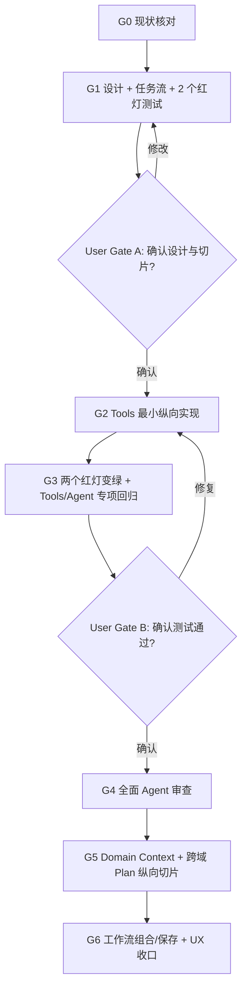

# Agent 站内内容推荐优化任务流程

> 状态：Gate B 已确认；WP1、Agent Loop 0.4.0、站内信息域 0.5.0 与工作流一致性 0.5.1 纵向切片已完成
>
> 对齐设计：`agent-content-workflow@0.5.6`
>
> 日期：2026-08-09
>
> 后续规则：用户确认设计后才做最小实现；用户确认最小测试全绿后，才开始全面 Agent 审查。

## 1. 门禁流程



当前已通过真实助手输入框验收跨 Learning/Tools 七天计划、额外比较分析、海报文本降级和长回答传输。正式 Domain Manifest、checkpoint、动态工作流组合与全项目审查仍未冒充完成。

## 2. 工作包总览

| WP | 用户结果 | 主责边界 | 依赖 | 状态 |
| --- | --- | --- | --- | --- |
| WP0 | 问题可复现，设计可评审 | Agent + Tools 读契约 | 无 | 已完成；红灯基线已转入 WP1 回归 |
| WP1 | 任务语言能找准站内工具 | Tools service | Gate A | 已完成；专项测试全绿，等待 Gate B |
| WP2 | Agent 能按需加载正确领域上下文 | 各 Domain + Agent Context Kernel | WP1 | 最小接入完成：模型自主选择 4 个站内只读工具；正式 Domain Manifest 待后续 |
| WP3 | 学习、工具和导航可在一轮组合，不可执行的需求可有界降级 | Agent planning/orchestration | WP2 | 0.4.0 纵向切片完成：跨域七天计划、数量/可见交付校验、媒体降级与诚实性守卫 |
| WP4 | 用户可生成、编辑并安全保存自己的工作流 | Tools compose + Users Assets | WP1、WP3 | 未开始 |
| WP5 | 返回结果易理解、可恢复、可追溯 | Assistant UI | WP1–WP4 | 最小切片完成：目标覆盖、执行步骤、部分完成、错误码与诊断编号 |
| WP6 | 证明全面边界、安全、性能和兼容没有回归 | 跨模块审查 | Gate B | Agent/Tools 专项完成；全项目审查待后续 |
| WP7 | 用户可配置模型并看到真实 Agent 执行过程 | Users Model Settings + Agent SSE + Settings/Assistant UI | WP3、WP5 | 已完成：数据库外凭据、灵活模型身份、真实 Qwen 页面验收、长回答分块与诊断链 |
| WP8 | 对话不会互相泄漏记忆，显式用户知识可受控复用 | Agent Sessions + Users Context/Knowledge | WP2、WP7 | 边界已确认；最小隔离测试待完成 |
| WP9 | 站内现有内容不会因长句查询漏检，必要时可用用户模型联网补证 | Learning + Agent Retrieval + Provider Web Search | WP2、WP7 | 站内全字段召回、前置证据、网页 DTO/安全边界与适配器 TDD 已完成；真实助手站内 RAG 验收通过，联网页面验收待可操作浏览器连接 |
| WP10 | 工作流正文、来源、步骤和保存草案保持同一证据链，并减少重复模型请求 | Agent Loop + Tools Workflow + Users Draft | WP3、WP7、WP9 | 已完成本地 TDD：草案仅使用模型本轮选中的站内工具；模板来源严格校验；有效预载证据不再触发同域模型工具往返 |

### 2.1 WP7 最小 TDD 与真实验收顺序

1. 服务测试先锁定：数据库没有任何 API Key/密文列、密钥只进入凭据存储、不回显、空密钥更新保留、写入冲突恢复旧密钥、私网/未允许域名拒绝。
2. Agent 测试锁定：真实 `create_agent`/`StateGraph` 仍执行，进度只报告安全阶段，工具或模型失败投影稳定诊断。
3. SSE/前端测试锁定：`started -> progress* -> answer delta -> completed` 严格递增；设置页分离预设、提供商名称、模型显示名称和模型 ID，空最大输出保持 Provider 默认，并具有保存、测试、删除个人配置与密钥不回显/不入库语义。
4. 重启本地 8088，使 `.env` 的 live model 和 stream 配置真正进入进程；校验公开 capabilities。
5. 在页面配置或确认模型，从助手输入框发送包含“推荐 + 分析原因 + 边界降级”的复合需求。
6. 验收页面同时出现阶段进度、真实工具步骤、目标覆盖、最终回答、模型/运行时状态；如失败，错误卡必须包含稳定代码和诊断编号。
7. 浏览器验收完成前，不把连接测试或直接 Python 模型调用称为真实 Agent 验收。

模型提供原则：

- 平台不配置、不宣传、也不静默选择基础模型；环境 Provider 配置不参与用户请求路由。
- 用户在设置页自行提供 endpoint、显示名称、真实 model ID 和 API key，并可测试、启停或删除；预设只做快速填入，最大输出留空时使用提供商默认值。
- 用户模型费用由用户与其模型服务商结算，站点不施加人民币请求/日预算。
- 站点仍负责连接超时、并发上限、工具预算、事实/链接守卫、敏感输入和写入确认。
- API Key 只保存在独立凭据系统：本机 Windows DPAPI 用户级保护的独立凭据目录（Credential Manager 可选）；生产 Vault/云 Secret Manager。安全后端不可用时失败关闭。
- API Key 只用于模型认证，不扩大站内权限；模型访问内容必须经过当前用户上下文中的已登记工具。

### 2.2 WP8 最小 TDD 与验收顺序

1. 证明 Session A 的历史不会出现在 Session B 的 Provider history 中，短期和长期会话各一例。
2. 证明 `sessionId/conversationId` 必须同时属于当前 `user_id`，他人会话继续返回稳定不存在错误。
3. 证明模型推断、工具结果和自动摘要不会写入 Users 全局上下文。
4. 证明用户明确保存且同意跨对话使用的偏好/知识可进入后续对话的最小投影；撤回同意后立即停止加载。
5. 浏览器用两个真实对话验证：第二个对话不能知道第一个对话的临时口令/偏好；保存为个人知识后才可在新对话使用。
6. 未登录浏览器直接打开 `/assistant` 时，先经过短暂 `checking`，确认没有可恢复会话后只显示登录门；输入框、会话创建与 Agent 请求均不可触发。
7. 已登录浏览器直接输入 `/assistant`、刷新页面以及从设置页返回时，不要求再次发生登录动作：等待 HttpOnly 会话恢复和 `/users/me` 验证后直接进入模型门禁或助手主体，且不得闪现或停留在登录门。
8. 构造两个并发认证刷新结果，证明较慢的旧结果不能覆盖较新的用户状态；退出登录后则必须重新落入登录门。
9. 通过 `start.ps1 -Restart` 启动后检查 `/assistant`、`assistant-page.js` 与 `auth-ui.js` 均要求缓存重新验证；同一已登录浏览器刷新后必须从 checking 自动进入助手主体，不能混用新助手模块与旧认证模块。
10. 对根级 `auth-session-store` 做状态机 TDD：多个消费者只触发一次恢复；强制刷新时较慢旧结果不能覆盖新快照；恢复失败必须稳定落入 `unauthenticated`，不能永久停留在 `loading`。页头与助手门禁的契约测试必须证明二者订阅同一 Store，组件层不再直接监听原始认证事件。

### 2.3 0.4.0 真实页面验收记录（2026-08-08）

| 用户输入类型 | 真实链路结果 | 迭代中发现并修复 |
| --- | --- | --- |
| RAG 学习内容 + 3 个工具 + 原因 + 7 天路线 | Learning 空结果保留缺口，Tools 推荐 3 项，7 天正文逐日展开；不生成错误工作流草案 | 重复检索、工具预算超限、GraphRecursionError、结构化节点把路线压缩成摘要 |
| 论文阅读工具的优势/限制/阶段/比较/顺序 | 1 次工具检索、3 次模型调用，4 个附加目标全部满足 | 证明不再只按单个推荐关键词输出卡片 |
| 直接生成“AI 学习营”海报图片 | 透明标记产品不能交付图片，降级交付文案、版式、提示词和设计原因；结果为语义正确的 `partial` | 未透明说明边界、编造日期/价格/名额、无证据声称具体产品是站内工具 |
| 超过 1,000 字符的长正文 | 完整通过 SSE 显示并保存到当前对话 | `AgentStreamEvent.delta` 单段过长导致连接中断，修复为有序分块 |

验收均从 Opera 中已登录助手页的真实输入框提交，经过会话 API、SSE、用户自选模型、LangChain Agent、LangGraph、站内工具与页面渲染，不是直调模型脚本。

### 2.4 0.5.0 信息域 TDD 与验收（2026-08-09）

1. 同一份站内数据分别用 `RAG`、`RAG 知识库问答` 和完整用户需求检索，旧实现只有精确词命中；以此锁定整句 `LIKE` 是直接根因。
2. Learning 专项测试要求完整需求首项为 `rag`，且 Agent context 同时返回命中词、命中字段、4 个课程章节和已发布资源摘要。
3. Agent Loop 测试要求 `prefetch_site_evidence` 在模型前使用原始用户问题检索 Learning/Tools，并允许模型随后做一次有实质差异的聚焦检索。
4. 联网适配器测试要求只接收 Responses API 返回的可追溯 HTTPS sources，丢弃 HTTP、localhost、IP 和重复链接；没有来源时失败关闭。
5. 页面真实模型输入“RAG 学习内容 + 3 个工具 + 原因 + 7 天路线”后，回答正确识别站内 `RAG`、`Embedding` 与《从 0 到 1 精通 RAG》，严格推荐 3 个工具并展开 7 天路线。
6. 页面进度文案只显示用户可理解的“检索站内信息/学习内容/工具”，内部召回策略名称不进入用户输出。
7. Browser Connector 已能读取页面与截图，但当前会话未提供可用的页面动作接口，系统级输入也被浏览器隔离；因此联网请求的页面最终验收仍保持未完成，适配器单测不得冒充真实 Agent 页面验收。

### 2.5 0.5.1 工作流一致性 TDD（2026-08-09）

1. 用真实页面失败样例锁定问题：正文与来源使用 Elicit、ChatPDF、ChatDOC、Consensus、Scite，草案却使用 Google NotebookLM、Perplexity、Claude。
2. 专项测试要求最终草案按 `selectedSourceKeys` 的站内工具顺序生成，未选中的模板候选不得进入步骤。
3. 工作流候选中的嵌套工具必须投影为可追溯来源；如果最终组合与模板不完全一致，`sourceRef` 留空。
4. `workflow_generation` 没有选中本轮证据中的站内工具时，结构检查必须失败并进入可见的部分完成诊断，不生成可保存草案。
5. 站内前置检索已有结果时，模型侧不再重复获得同域通用检索工具；专项测试将常见路径由 3 次模型调用降为 2 次，零结果领域仍保留补检能力。
6. 按用户要求，完成本地专项与全量回归前不再发送真实模型请求；最终只做一轮关键页面验收。
7. 修复后已安全重启 8088 并确认新服务健康；在已登录的真实助手页点击“生成论文阅读工作流”完成一轮关键验收。页面显示“真实 Agent Loop · 3 次模型调用”，正文核心工具、来源卡片与可保存草案均按 Google NotebookLM → Perplexity → Claude 对齐，未再出现正文与草案错配；本轮未继续发送第二个模型请求。

### 2.6 0.5.2 模型能力与输出误判修复（2026-08-09）

1. 真实失败样例表明模型已完成学习内容、3 个工具与 7 天路线，但最终投影返回 `AGENT_MODEL_OUTPUT_REJECTED`，问题位于输出守卫而非模型规划或检索能力。
2. 输出守卫专项红灯确认 `app.py`、`requirements.txt`、`README.md` 被通用域名正则误判；改为仅识别受控公共域名后，文件名用例与原有链接、域名、IP、伪造引用、密钥和 HTML 边界同时通过。
3. 第二次真实失败进一步确认：模型选中的 Dify、ChatPDF、Coze 官方域名存在于站内工具事实，却未被最终卡片投影带入允许集合。Agent Loop 改为只从最终选中的证据记录提取官方域名，并记录不含正文的安全拒绝原因。
4. 生产配置、工厂和运行时状态契约移除 `fake` 入口；测试替身只存在于测试隔离环境，不由应用工厂加载。无用户模型时保留真实站内证据兜底，但必须显示为未完整完成。
5. 助手页隐藏框架名、模型调用次数、内部检索策略、降级类型和错误代码；工具来源显示为“学习内容、工具、工作流、个人信息、站内页面、网页资料”等用户语言。
6. 最终从已登录助手输入框发送同一条 RAG 复合请求，页面完整显示 RAG、Embedding、Prompt、LLM 基础，严格给出 Dify、Coze、ChatPDF/ChatDOC 三组工具及理由，并展开第 1 天至第 7 天；状态为“已完成”，未再触发输出拒绝。

### 2.7 0.5.3 通用恢复链路（2026-08-09）

1. 先查服务日志，不用真实模型反复猜测；三个失败请求的拒绝原因均为 `link`，证明问题在最终正文守卫，不在 Learning/Tools 召回或模型推理。
2. 新增独立 `recover_answer` 节点和 recovery 模块。Markdown/URL 地址与未取证外部域名从正文移除、可读名称保留，实际跳转继续只来自卡片白名单；学习推荐最多跳转本站学习节点，这类机械修复不追加模型请求。
3. HTML、密钥样式、伪引用、未取证域名等硬失败继续拒绝原文，随后只用本轮 Tool Records 投影出的标题、描述和理由生成可用回答；证据字段再次失败时使用不插值目录文本的紧急说明。
4. 模型循环、结构化输出或单个工具失败时，已成功的 Tool Records 不重新查询，直接成为恢复输入。没有证据时明确说明缺口，不伪装成功。
5. 前端不再直接显示内部校验阶段、错误文案和诊断编号；显示用户可理解的恢复结果，支持信息放入默认收起的“查看技术信息”。
6. 回归不以三个推荐问题为硬编码：专项测试同时覆盖链接归一化、硬拒绝、模型异常、结构化异常、工具局部失败、工作流一致性、媒体边界和来源安全；真实页面只在本地回归全绿后各调用一次。

### 2.8 0.5.4 批判重编与请求级诊断上下文（2026-08-09）

1. 图更新为 `prefetch -> run_agent -> structure_answer -> inspect -> reflect_answer -> recover_answer -> project`；三个推荐入口只保留为回归用例，没有新增问题文本分支。
2. `reflect_answer` 只在最终正文未过边界校验时请求模型重编一次。输入是稳定的 `diagnosticNote`、原目标和已验证证据；密钥样式、控制字符等内容不会原样再次送入模型。
3. State 中的请求级 NotePad 只保存阶段、节点、类别、次数、工具和下一步动作；最近 Trace 只保存脱敏状态。异常栈留在服务端日志，本轮结束后 NotePad/Trace 不进入会话历史或 Users 数据库。
4. Base 定义统一的三次失败接管协议；每个 Domain 返回自己的恢复建议。同一站内工具连续异常三次后停止工具重试，由模型使用现有证据主导可完成部分，最终投影仍禁止伪造站内事实、站外跳转和未执行动作。
5. 学习与工具 Domain 的模型可见工具按当前任务语义缩小，但模型前的原始问题检索仍覆盖两域；纯学习/纯工具常见路径避免一次无关 Domain 往返。
6. TDD 先验证批判重编、硬失败证据兜底、三次工具异常接管、NotePad 不含原始异常/诊断编号，再运行完整 Agent 与前端契约回归；真实模型页面只做最后一轮关键验收。

### 2.9 0.5.5 对话内 Context 收口（2026-08-09）

1. 复用现有持久化助手最终回答作为 `final_report`，不新增模型摘要调用或跨对话记忆表。
2. `AgentSessionService.context` 从同一会话读取有界历史：最近两轮保留原文，较早完整轮次投影为最多四条紧凑任务记录，再执行总字符预算裁剪。
3. 专项测试验证短期/长期会话所有权、整条消息裁剪、对话 A/B 隔离，以及压缩内容不包含 Trace、NotePad、toolEvidence 或异常栈。
4. 个人偏好/知识继续只由 Users 领域在用户明确保存或修改后写入；Agent 会话追加与上下文压缩没有任何 Users 写接口。
5. 真实页面验收必须在所有文件修改与自动重载结束后执行，避免开发服务器重载把进行中的模型请求误判为 Agent 失败。
6. 真实页面还需覆盖一次过期访问令牌：刷新成功后使用稳定 `userUid` 保持同一会话 Epoch，原请求继续流式显示；真正换用户仍必须取消旧操作并清空私有会话视图。

### 2.10 0.5.6 阶段恢复状态校准（2026-08-09）

1. 先用页面参考编号 `request-43c39480-e729-4341-9b93-44a21609d817` 定位日志；真实根因是 `run_agent` 的 `APIConnectionError`，而不是推荐、学习检索或最终内容校验失败。
2. 红灯测试固定该状态序列：模型主循环连接中断，但前置站内证据存在，随后结构化整理完整覆盖目标并通过输出守卫；旧实现仍错误返回 `partial`。
3. State 新增请求内 `loop_recovered` 语义。只有结构化整理成功时写入；`inspect/project` 据此不再把已经恢复的旧错误投影给用户，服务日志仍记录失败和恢复两个事件及同一 requestId。
4. 定向回归同时锁定三条反例：无证据的模型异常仍失败、站内工具异常仍部分完成、结构化整理无效仍部分完成，避免把“更友好”实现成静默吞错。
5. 不提高全局模型请求预算，不重放已完成检索。完整 Agent 回归通过后才允许进行一次真实助手页复核，避免用用户模型承担调试循环。
6. 修复后 Agent Python 157 项、助手前端/SSE 3 项、静态检查与差异检查通过。Opera 连接器读取真实会话确认旧响应确为“三个目标均满足但状态为部分完成”；当前连接器未提供输入或点击动作，因此未发送新的模型请求，也不把只读复核冒充为修复后的真实页面验收。

## 3. WP0：现状与 TDD Red Gate（本轮）

### 3.1 输入证据

- 用户截图：相似工具问题一次有结果，一次 `tools.search 0`，缺少可用的修复信息。
- 当前 Tools 本地事实快照：134 个已发布工具、136 个有效摆位、7 个分类。
- 当前行为：`AI制图` 可召回无关搜索/办公/视频工具；`制作一张小红书封面` 可返回 0。
- 工作流建议仅硬编码视频、论文、代码 3 个场景。
- Agent 仍使用互斥关键词意图与固定 capability map，Provider 只能替换答案文字。

### 3.2 本轮变更

1. 新建设计文档，固定边界、目标上下文栈、能力契约、执行流程和进化门。
2. 新建本任务流程，明确两个用户确认门。
3. 在 Tools service 层添加 2 个行为测试，使用隔离 SQLite 测试库执行，禁止网络和真实 Provider。

### 3.3 红灯期望

| 测试 | 当前失败原因 | 未来通过意义 |
| --- | --- | --- |
| 自然任务语言检索小红书封面 | 无从交付物到绘图/设计能力的归一化 | 用户不需要猜工具分类词 |
| `AI制图` 前 5 项领域精度 | `AI` 成为足够命中信号 | 通用前缀不再压过真实任务意图 |

完成定义：测试稳定失败于上述行为，而不是因 fixture、迁移、网络或 Provider 故障。

## 4. WP1：Tools 任务语义检索最小纵向切片

### 4.1 简单 TDD 循环

1. 保持 WP0 两个红灯不改动断言意图。
2. 在 Tools 域实现最小 `TaskQueryNormalizer`，将低信息词、任务、交付物和必要能力分开。
3. 新增可维护的 capability taxonomy，首批只覆盖绘图/设计垂直切片，不一次生成全站词库。
4. 调整候选召回与排序：有实质词时，仅 `AI` 匹配不可接受。
5. 两个测试变绿后，运行全部 Tools 专项测试和目录审计。
6. 仅在回归通过后重构共享词法与评分组件。

### 4.2 产出

- Tools 域内的结构化查询 DTO 与兼容 adapter；
- 绘图/设计首批 taxonomy 与可解释 reason code；
- catalog version/fingerprint/readiness 元数据；
- Tools 专项测试全绿证据；
- 对截图两类请求的本地 Agent 回放证据。

### 4.3 验收

- 自然任务语言非空，前 5 项均具有视觉创作、绘图、设计、排版或修图证据；
- `AI制图` 不靠 `AI` 匹配放行无关搜索/办公候选；
- `ChatGPT` 精确搜索、企业级工具、免费筛选和 134 工具事实快照不回归；
- 无 SQL 进入 Agent adapter，无前端快照成为新事实源。

### 4.4 暂停点

WP1 达到全绿后提供命令、测试数和输出摘要，等待 `User Gate B`。未获得“测试通过，可开始全面审查”的确认前，不开始 WP6。

### 4.5 实施结果（2026-08-08）

- 新增 Tools 域内 `TaskQueryNormalizer` 与首批 `visual_creation` 能力分类，不将任务语义塞入 Agent 路由或前端。
- `AI制图` 与“制作一张小红书封面”均稳定返回 5 个具备绘图、图像、设计、排版或修图证据的候选；通用词 `AI` 不再单独放行无关结果。
- 搜索结果新增 `matchedCapabilities`、`reasonCodes`；目录快照新增 version、fingerprint、数量与 readiness，Agent adapter 仅透传公开投影。
- Tools 专项测试、目录一致性审计、Python 编译与静态检查、前端 Tools 脚本语法检查均通过；详细证据以本轮交付说明为准。
- 后续复测暴露了固定路由和模板合成的根本限制，因此 Gate B 后已推进真实 Agent Loop；WP1 的事实检索仍作为 Loop 的 Tools 能力基础。

## 5. WP2：Domain Pack 与 Context Kernel

依赖：WP1 可用，可与 WP3 小步交替，不建空壳 Domain。

### 5.1 任务

1. 定义 `DomainManifest`、`DomainSelection`、`ContextSnapshot`、`EvidenceRef`、`EvidenceQuality`。
2. 先将 Tools 接入 Domain Pack，以 2–4 个测试证明激活、预算、版本和薄 adapter。
3. 再把现有 Learning 契约投影为 Learning Domain Pack，不修改 Learning 业务所有权。
4. Navigation 保持最小；Users Domain 只暴露获准上下文与现有保存权限摘要。
5. 为 Context Snapshot 记录版本、大小估算和摘要哈希，不保存完整 Prompt。

### 5.2 验收

- 一次只加载被选中领域的工具和指令；
- Base 规则不能被 Domain/用户/内容覆盖；
- Tool adapter 不导入 repository/SQL；
- Users 上下文无身份秘密、完整资产或审计数据；
- 功能开关、登录态和请求阶段能动态缩小工具集。

## 6. WP3：跨域计划、执行与证据检查

### 6.1 第一个纵向用例

```text
“我想零预算学习提示词，然后找一个工具练习，给我一个 7 天计划。”
```

期望领域：Learning + Tools，Users Context 仅在个性化需要时读取。

期望步骤：学习证据→练习工具→七天计划组合。

### 6.2 简单 TDD

1. 一条测试锁定多领域选择与最多三个领域预算。
2. 一条测试锁定 Learning 结果空时 Tools 独立步骤仍继续。
3. 一条测试锁定证据弱时最多一次查询修复，之后由模型在“文本交付物 / 替代工具 / 工作流引导 / 最少澄清”中选择受控降级。
4. 一条测试锁定引用、链接、卡片和工具 slug 始终来自确定性结果。
5. 一条测试锁定“直接生成招新海报”不伪称已生成图片，但会返回可用文案、版式/生图提示词与站内替代路径；原创文本不伪装成站内证据。
6. 一条测试锁定纯文本交付模式在无站内 Evidence 时仍可调用 Fake Provider，但外部事实、外链、伪引用或“已生成图片”声明会被输出守卫拦截。

### 6.3 运行时决策

- 先在现有 orchestrator 后面实现有界的结构化计划与执行，验证用户闭环。
- 新增窄 `ResolutionPlan` 输出契约，让模型主导选择降级交付，后端只验证能力状态、事实引用、写入确认和禁止的伪执行声明。
- 更新 Provider 调用门和 Base Prompt 版本：站内事实继续必须有 evidence，获准的文本创作/转换/规划可基于用户输入生成且不伪造引用。
- 如触发设计文档第 8.3 节条件，单独提交 Runtime ADR，才引入真实 LangChain Agent + LangGraph `StateGraph`。
- 禁止用更大的关键词 `if/elif` 或自制无界 Tool Loop 实现目标复合路径。

### 6.4 已完成的真实 Loop 切片（2026-08-08）

- `AgentOrchestrator` 在已配置 live Provider 且用户已授权时进入 LangGraph `StateGraph`；游客、未同意或未配置 Provider 仍走明确的确定性回退。
- `run_agent` 节点运行真实 LangChain `create_agent`，模型可以连续调用 Learning、Tools、Navigation 与 Workflow 四个只读工具；工具层仍保持薄适配。
- `structure_answer` 节点使用 JSON schema 校验 answer、intent、objectives、selectedSourceKeys 与 followups；“推荐并说明原因”被拆成两个可检查目标，推荐卡片数量由最终选中的 sourceKey 约束。
- `inspect` 将 Tool Error、目标缺口和模型失败投影为 `complete/partial/failed`，保留已成功结果。
- `project` 只使用真实 Tool 结果生成卡片、引用和步骤；模型输出继续经过链接、密钥、HTML、伪引用与长度守卫。
- UI 新增需求覆盖、执行计划、部分完成、稳定错误码、可重试性和诊断编号，隐藏原始异常与思维链。
- 真实链路测试使用脚本化 Chat Model，但经过实际 `StateGraph`、`create_agent`、Tool Call、ToolMessage 和结构化响应；普通测试不会访问外部模型。
- 百炼兼容层使用 `tool_choice=auto`，并在 Qwen 3.5 上关闭默认思考模式；这些差异只存在 Provider adapter，不泄漏到 Domain Tool 或 Agent 决策逻辑。
- 2026-08-08 真实外部烟测（纯合成问题）：3 次模型调用、1 次站内工具检索、2 个用户目标均完成、精确投影 3 张推荐卡片，最终状态 `complete`。

## 7. WP4：动态工作流草案与 Users 保存

### 7.1 任务

1. 为 `tools.workflow.compose` 先建立 2–4 个测试：封面创作、缺口、无伪造 slug、步骤成功条件。
2. 使用 Tools 候选与小型 workflow pattern 组合草案，不再以 3 个硬编码场景作为主路径。
3. 保持 `AgentWorkflowDraft` 与 Users create DTO 对齐；新字段必须可选且向后兼容。
4. 复用已有草案编辑、明确确认、幂等保存、409 冲突和深链核对。
5. 不新增 Agent 直接 SQL，不新建第二份用户工作流存储。

### 7.2 验收

- 封面创作、学习实践等新任务可生成有根据的可编辑草案；
- 不存在合适工具时显式展示 gap，不用无关工具填充；
- 草案预览为 0 次写请求；
- 正常保存只创建 1 条资产，重放不重复创建；
- 结果不明或冲突时不猜测 `workflowUid`。

## 8. WP5：用户体验收口

只在后端垂直闭环稳定后做小幅 UI 改进：

1. 卡片展示匹配原因和约束，默认隐藏技术调用明细。
2. 零/弱结果展示可操作澄清，区分“无匹配”与“目录未就绪”。
3. 复合请求展示最多 5 步的紧凑计划、局部完成和可重试项。
4. 工作流草案在原位可编辑，明确区分“草案”与“已保存”。
5. 保持键盘、读屏、390px 移动端、reduced motion 和无横向溢出基线。

## 9. WP6：全面审查（等待 User Gate B）

只有用户确认 WP1 测试通过后才开始。审查是证据采集与差距报告，不自动扩张为全量修复。

### 9.1 审查面

- 意图/任务分解：单意图冲突、多需求、指代、追问和会话压缩。
- 全站内容覆盖：Learning、Tools、Navigation、Users 获准投影，不泄漏未授权业务数据。
- 数据就绪：迁移、缓存、catalog fingerprint、发布状态、稳定 UID 和链接质量。
- 能力边界：Router/Tool/Agent 无复制 SQL/业务规则，Users 写命令不被绕过。
- 运行时：Provider 成功/回退、取消、超时、并发、成本、会话、SSE 和重放。
- 证据安全：引用完整性、URL 白名单、Prompt injection、私密最小化、无密钥/原文日志。
- 可观测性：Domain 选择、capability、coverage、repair、catalog version 和稳定失败类别。
- 评测：扩展版本化用例集，不把模型自由文本当作完全相等断言。
- UX：结果信息层级、可恢复空态、工作流编辑/保存、键盘/读屏/移动端。

### 9.2 审查产出

1. 按 P0–P3 的发现清单，每项有文件/测试/运行证据。
2. 已确认的目标架构与当前实现差距图。
3. 以用户纵向闭环排序的后续 backlog，不以文件夹或技术名称排序。
4. 对“是否需要 LangChain/LangGraph、语义搜索、共享状态”提供证据化决策，不默认引入。
5. 最小回滚与发布门。

## 10. 统一验证命令规划

实施期使用项目的可用 Python 运行时，默认禁止 dotenv 和网络 Provider：

```powershell
# Red/Green 单点
<python> -m unittest `
  tests.test_tools_services.ToolsServicesTest.test_task_language_retrieves_visual_creation_tools `
  tests.test_tools_services.ToolsServicesTest.test_generic_ai_prefix_does_not_dominate_visual_intent

# Tools 专项
.\scripts\verify-tools.ps1

# Agent 专项（WP2 以后）
.\scripts\verify-agent.ps1

# 基础全回归（Gate B 前）
.\scripts\verify-foundation.ps1
```

真实 Provider 不进入上述命令。只有确定性测试全绿、配置与成本门就绪、用户明确授权后，才执行单条专用完整链路验收。

## 11. 变更规则

- 每个 WP 先选一个完整用户场景，写 2–6 个关键失败测试，完成最小垂直闭环后再重构。
- 如发现当前设计需要改变领域所有权、公共响应契约或 Agent Runtime 拓扑，先提交问题、证据、最小变更、迁移和回滚说明，不在实现中悄然扩张。
- 每个完成声明必须同时列出产品闭环、契约、测试、运行证据、已知剩余风险与回滚。
