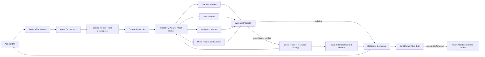
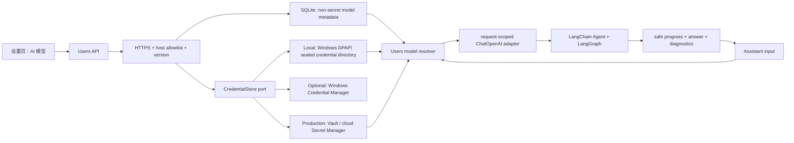
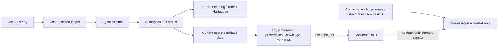
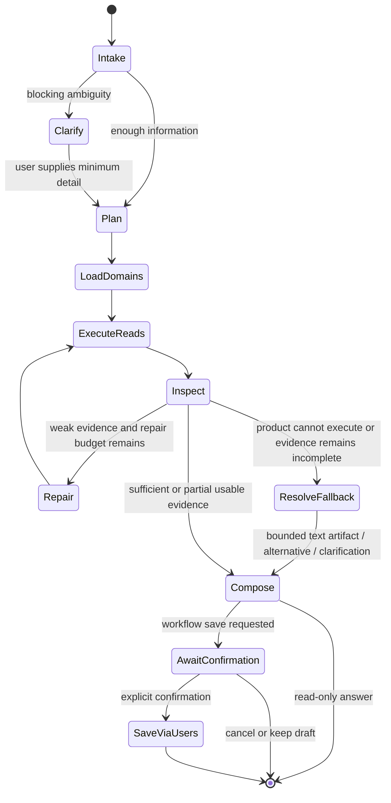
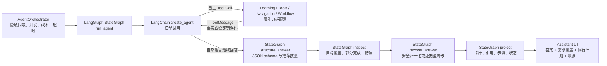

# Agent 站内内容推荐与个人工作流优化设计

> 状态：Gate B 已确认；站内信息域与工作流一致性切片已实现，真实工作流页面验收通过，联网最终验收待后续按需执行
>
> 设计版本：`agent-content-workflow@0.5.6`
>
> 日期：2026-08-09
>
> 本轮边界：已完成 Learning 全字段召回、模型前置站内证据收集、Qwen 原生联网搜索适配、工作流同源投影、反思重编、请求级诊断便笺、对话内 Context 收口与阶段恢复状态校准；不宣称已完成全项目审查或所有提供商的联网兼容。

## 1. 结论

当前 Agent 的核心缺口不是“没有站内工具数据”，而是“用户任务→检索意图→领域能力→证据质量→可执行结果”之间缺少稳定的中间契约。

本项目应采用以下目标架构：

1. 以 **Tools 领域检索与工作流组合能力** 作为第一个纵向切片，先修复“站内有内容但 Agent 找不准/找不到”。
2. 将上下文组装为 **Base + Runtime Policy + Conversation + Domain + Task/Step + Evidence + Response Schema**，而不是把全站内容和全部工具一次塞给模型。
3. 每个业务域维护独立的 `Domain Pack`；Agent 运行时只做发现、选择、组装、调用与质量检查。
4. 简单请求走快速路径；多领域、多步、需要局部失败继续或用户确认的请求才进入结构化 `Plan -> Execute -> Inspect -> Repair/Clarify -> Compose`。
5. 个人工作流继续由 Users Assets 作为唯一事实源。Agent 只产生可编辑草案，用户明确确认后，经现有 Users command facade、幂等和审计链保存。
6. 不引入“通用 Agent 平台”、多 Agent、向量库、插件市场或微服务。运行时使用真实 LangChain Agent + LangGraph `StateGraph`，不用关键词分支或自制 Tool Loop 替代。

### 1.1 0.3.1–0.4.0 增量决策

- 参考 `D:\ai-signal-studio` 的模型状态、测试连接、错误代码和阶段式输出，但不复制其单工作区全局配置。
- 模型配置归 Users 领域：每位用户可保存一套 OpenAI 兼容模型；数据库只保存非敏感元数据，API Key 通过独立凭据端口保存，任何读取接口只返回 `hasApiKey`；产品不提供或静默切换站点默认模型。
- 提供商预设只是可选的快速填入器，不是固定枚举：`providerKey` 记录所选预设，`providerName`、`baseUrl`、`modelDisplayName` 和真实请求使用的 `modelId` 均可独立编辑。
- `maxOutputTokens=null` 表示不向提供商发送最大输出参数；新配置默认采用该语义，页面提供默认、8K、16K、32K、64K 快捷值，运行时只在用户明确填写时注入 `max_tokens`。
- 本机 Windows 默认适配器使用 DPAPI 用户级保护，并把密文放在 `%LOCALAPPDATA%` 的独立凭据目录；Credential Manager 作为可选适配器。服务器部署必须替换为 Vault 或云 Secret Manager，未配置安全后端时失败关闭，不回退到数据库、普通配置文件或浏览器存储。
- Agent 只通过薄运行时适配器在请求执行期读取凭据；模型不能直接访问数据库，只能调用受权限与 DTO 约束的站内工具。
- 普通消息、模型推断、工具结果和摘要严格限于同一对话；跨对话只允许使用用户明确录入并授权的偏好、知识或工作流资产。
- UI 展示“理解需求、工具执行、综合回答、边界检查”等可审计阶段及诊断编号；不输出模型私有思维链。
- 最终验收必须从助手输入框发起真实用户任务，经过 HTTP、SSE、Agent、Tool、LangGraph 与页面渲染全链，不以单独模型连通脚本代替。

### 1.2 0.5.0 信息域与联网决策

- 用户原始问题先由 `prefetch_site_evidence` 对 Learning 与 Tools 的公开读模型做一次确定性检索，再由真实 Agent 筛选、比较、解释或发起一次聚焦检索。该内部策略不以“宽泛”“宽召回”等术语展示给用户；页面只显示“检索站内信息/学习内容/工具”。
- Learning 召回由 Learning 领域维护，扫描节点 slug/标题/副标题、标签、主资料标题/说明/概览、章节标题/说明和已发布资源，不把 SQL 或业务词典搬进 Agent。
- 混合中文/英文长句使用确定性词项拆分和可解释字段权重。精确词仍优先，但完整需求中的 `RAG`、`知识库`、`问答` 可以独立命中，零结果不能再直接推导为“站内没有课程”。
- Agent 上下文除节点摘要外，还提供命中词、命中字段、章节要点和资源要点；公开 `/learning/search` 契约保持原字段不变。
- 联网搜索是可插拔能力端口。当前仅在用户配置的 DashScope/Qwen 提供商上启用官方 Responses API `web_search`；API Key 仍只从数据库外凭据系统在请求期读取。
- 站内证据始终优先。只有最新/外部信息或站内覆盖不足时才允许联网；网页结果必须标为 `web`，只接受提供商返回的可追溯 HTTPS 来源，不在应用服务器抓取结果 URL，也不把网页称为站内内容。
- 联网失败只影响该步骤：保留站内结果，返回稳定 `WEB_SEARCH_FAILED` 与诊断编号。外部卡片只允许 HTTPS、无账号密码、非 localhost、非 IP 地址，并在新标签页以 `noopener noreferrer` 打开。

### 1.3 0.5.1 工作流一致性与请求复用

- 工作流候选仅作为模型可选择的证据，不再直接成为最终草案。最终 `workflowSteps`、来源卡片与 `workflowDraft.steps` 统一由 `selectedSourceKeys` 中的站内工具按顺序投影。
- 如果模型没有选择任何本轮证据中的站内工具，不生成可保存草案，并以目标覆盖错误暴露为部分完成；不得展示与正文推荐不一致的模板步骤。
- 只有最终步骤与某个站内模板完全一致时才保留模板 `sourceRef`；模型重新组合后的个人草案不冒充原模板。
- 原始请求的站内检索已有有效结果时，内层 Agent 不再获得相同通用检索工具，直接复用预载证据；零结果领域仍允许模型进行聚焦检索。工作流、导航和联网等未预执行能力继续由模型按需决定。
- 该复用规则减少重复的模型与工具往返，但不缩短答案、不降低复杂任务的全局安全上限，也不绕过真实 LangChain Agent 与 LangGraph 链路。

### 1.4 0.5.2 输出守卫与用户文案

- 输出安全校验按真实风险分类，不能用通用 `name.suffix` 正则把 `app.py`、`requirements.txt`、`README.md` 等技术文件名误判为外部域名并隐藏整篇回答。
- 模型最终选中的站内工具可以引用该工具事实记录中绑定的官方域名；允许集合从本轮被选中证据投影，未选中或不在站内记录中的域名仍失败关闭。
- 生产配置和 Agent 工厂不再接受或构造 FakeProvider。用户未配置模型、凭据未授权或模型调用失败时，只允许返回基于真实站内检索结果且明确带诊断信息的兜底，不得伪装为模型成功。
- 普通助手页不展示 Agent 框架名、模型调用次数、内部检索策略、降级实现名、技术错误码或诊断编号；只展示完成状态、用户可理解的处理步骤、需求覆盖和来源。支持排障的参考编号放在默认收起的技术信息中，内部原因保留在结构化响应与服务日志。

### 1.5 0.5.3 通用恢复节点与 Harness 取舍

- 三个推荐入口只是回归样本，运行时禁止按固定问题文本分支。所有意图统一经过 `recover_answer`：正常输出直接通过；正文中的模型链接和未取证外部域名移除地址、保留可读名称，入口只由安全卡片承担；其他硬失败改用本轮已取得的证据生成完整降级回答。
- 学习推荐只跳转到本站学习节点，外部课程资料由学习页承接；工具和导航同样只使用站内入口。只有用户明确要求联网补证时，外部来源才以独立网页资料卡片展示，不能伪装成站内内容。
- 恢复节点不重新检索、不进行盲目模型重试，复用当前 StateGraph 中不可变的 Tool Records，相当于一次请求内的轻量检查点；既减少用户模型调用，也避免错误重试污染上下文。
- 读操作按低风险自动执行；保存个人工作流继续使用现有显式确认、幂等键和 Users 命令边界。只有未来出现长时后台任务或新的高风险写操作，才引入持久化 checkpointer 与通用 `interrupt/resume`，避免为短只读回答增加无收益的状态设施。
- Base 规则只约束事实、隐私、伪执行和写入；Domain 工具按请求动态缩小。模型仍负责分析、说明原因、选择与组织答案，机械守卫不替代模型判断。
- 服务日志记录低敏的拒绝原因和恢复策略；用户界面显示“回答已自动调整”等行动结果，技术参考信息默认收起，不暴露原始模型输出和隐藏推理。
- 最终验收必须使用助手输入框发送完整复合需求；验证正文、推荐理由和逐日路线真实可见，而不是只检查目标摘要或来源卡片。

### 1.6 0.5.4 批判重编、Trace 与请求级 NotePad

- `inspect` 后新增 `reflect_answer`。正文不符合事实、链接、隐私或产品边界时，不直接把校验失败交给用户；批判节点只接收稳定原因类别、具体修改建议、原目标和已取得证据，最多调用模型重编一次。重编仍不合格时才进入 `recover_answer` 的证据兜底。
- NotePad 是请求级诊断便笺，不是跨对话记忆。它只记录 `stage/node/category/attempt/nextAction/tool`，禁止写入异常栈、完整模型回答、完整 Prompt、API Key 或用户秘密；本轮结束即释放，不写入会话或 Users 数据库。
- State 内保留经脱敏的最近 Trace 和 Tool Records。Trace 用于定位失败节点，Tool Records 用于恢复证据；两者职责分开，避免把不断增长的错误文本反复塞回上下文。
- Base 只定义通用产品边界、事实/隐私约束、三次失败接管协议和最终投影规则；Learning、Tools、Navigation、Workflow、Web 各 Domain 提供自己的失败后行动建议。同一工具连续异常三次后机械重试停止，由模型使用已有证据主导讲解、分析、选择标准或文本步骤，系统继续负责不伪造站内内容、链接和已执行动作。
- Domain 激活根据任务语义缩小内层工具集；原始问题仍会先经过 Learning/Tools 的站内证据收集，以免动态工具选择造成漏检。这样既保留召回完整性，又避免为明显的纯学习或纯工具问题增加无关模型工具往返。
- 实践取舍参考 [Anthropic Context Engineering](https://www.anthropic.com/engineering/effective-context-engineering-for-ai-agents) 的有限上下文、动态检索、压缩和结构化笔记原则，[LangChain Structured Output](https://docs.langchain.com/oss/python/langchain/structured-output) 的错误反馈重试，以及 [LangChain Middleware](https://docs.langchain.com/oss/python/langchain/middleware/overview) 的有界重试/回退思路；本项目只采用短只读请求需要的最小切片。

### 1.7 0.5.5 对话内任务收口与 Context 清理

- 每轮最终校验通过的助手回答就是该任务的 `final_report`，继续由现有短期/长期会话消息表持久化；不新增第二套“模型记忆数据库”，也不额外调用小模型做摘要。
- 组装下一任务上下文时，最近两轮问答保留原文；更早的完整问答只投影为最多四条“用户目标 + 最终结果”的紧凑任务记录。完整历史仍可由用户在原对话查看，但不会全部重新进入模型窗口。
- ToolMessage、工具结果、Trace、NotePad、异常栈、Provider payload 与完整 Prompt 从不写入会话消息，因此任务结束后自然离开模型上下文；压缩投影也不会把这些运行态重新带回。
- 压缩严格按当前 `sessionId/conversationId` 查询，短期升级为长期后仍沿用同一来源对话；其他对话的任务、偏好和临时信息不能进入本轮上下文。
- 聊天中出现的偏好或个人知识不会自动写入 Users Context。只有用户明确要求保存/修改并完成确认后，才通过 Users 领域既有写入边界更新；撤回或未确认时只在当前对话中使用。
- 助手页的会话 Epoch 使用认证快照中的稳定 `userUid` 判断身份切换；同一用户的访问令牌刷新不能清空当前任务或取消流，只有真正退出或换用户才中止旧请求。
- 该策略采用 [Anthropic Context Engineering](https://www.anthropic.com/engineering/effective-context-engineering-for-ai-agents) 所述的压缩、结构化笔记和按需选择原则，但保留本站“用户自带模型、无默认小模型、对话隔离”的约束。

### 1.8 0.5.6 阶段恢复与完成状态校准

- `run_agent` 的临时连接错误仍写入请求级 NotePad、Trace 和服务日志；只要先前 Tool Records 已包含真实证据，`structure_answer` 可以从该节点边界继续整理，不重新执行已经成功的站内检索。
- 后续整理结果只有在 schema、目标覆盖和最终输出边界全部通过时，才把本轮标记为“已恢复完成”。此时原始连接错误保留在内部诊断中，不再进入面向用户的 `execution.errors`、`fallbackReason` 或“部分完成”提示。
- 没有证据、结构化整理失败、目标仍有缺口、工具本身失败或反思重编失败时，继续保持原有 `failed/partial` 语义，禁止用恢复标志掩盖真实缺口。
- 不开启整段 Agent 的自动重放，也不为该场景新增第二套恢复链。用户自有模型调用仍以阶段最少化为原则：复用当前 StateGraph 的已完成写入，只执行一次必要的结构化整理。
- 用户可见进度使用“回答整理完成”等产品语言；“循环失败、降级综合、恢复策略”等实现词仅保留在结构化日志中。
- 该取舍参考 [LangGraph Persistence](https://docs.langchain.com/oss/python/langgraph/persistence) 对节点边界、已完成写入和故障恢复的定义，以及 [LangChain Thinking in LangGraph](https://docs.langchain.com/oss/python/langgraph/thinking-in-langgraph) 对“临时错误重试、模型可修复错误回流、意外错误留给诊断”的分类。本项目是短时只读请求，因此采用请求内状态复用，而非立即引入持久化 checkpointer。

## 2. 当前事实与问题定位

### 2.1 已有能力

- Tools 数据已归一到 SQLite 事实库，当前本地快照为 134 个已发布工具、136 个有效摆位；页面与 Agent 都可通过 Tools service 消费。
- Learning 已提供用户无关的搜索、Agent 紧凑上下文和下一节点契约。
- Users 已提供最小 Agent 上下文投影，且已存在“工作流草案→显式确认→幂等保存→深链查看”的写入闭环。
- Agent 已有确定性检索、引用守卫、Provider 回退、会话、SSE、可观测性与离线评测地基。

### 2.2 根因

| 现象 | 当前机制 | 影响 |
| --- | --- | --- |
| `AI制图` 的结果混入搜索、办公、视频工具 | 检索将低区分度的 `AI` 与任务词同等计分，且“制图”没有稳定领域映射 | 有召回但精度低，用户不信任推荐 |
| `制作一张小红书封面` 可直接返回 0 | 检索仅处理工具名、分类和少量手写扩展，没有从“交付物/任务”归一化到能力词 | 具体用户需求反而比短关键词更难检索 |
| 工作流只覆盖视频、论文、代码 3 个场景 | `workflow_suggestions()` 是硬编码场景表 | 无法根据 134 个工具的能力动态组合新任务 |
| 同一请求中“学习 + 工具 + 流程”不能完整完成 | 关键词分类只返回一个互斥意图，固定 capability set 只调用少量能力 | 复杂需求被缩成单一搜索 |
| Provider 能组织文字但不能修复召回 | Provider 仅替换 `answer`，卡片、引用、步骤都来自一次确定性检索 | 证据包本身错误时，更好模型也无法挽救 |
| 网站不能执行的需求往往只能返回空结果 | 当前 Provider 在没有站内 evidence 时不运行，系统指令又把所有回答都限制为站内证据复述 | 无法生成文案、提示词、版式、检查清单等安全文本替代交付 |
| 截图中运行服务与当前快照行为不一致 | 缺少 catalog version/fingerprint 和 readiness 投影 | 难以区分“真的没内容”与“服务数据过旧/缓存未刷新” |

### 2.3 不应用 Prompt 掩盖的问题

- 查询归一化、匹配阈值、分类与质量分必须位于 Tools 领域，不是 Base Prompt。
- Learning、Tools 和 Users 的事实边界不能因 Agent 便利而合并。
- 模型不能自由生成工具 slug、站内 URL、保存命令或引用 ID。
- “零结果”不能直接被视为“站内没有内容”；必须经过查询修复、目录健康和覆盖度检查。

## 3. 目标与非目标

### 3.1 用户目标

1. 用户可以用任务语言提问，例如“制作小红书封面”、“零预算学习 RAG 并做一个 Demo”。
2. Agent 能在 Learning、Tools、Navigation 及获准的 Users Context 中选择一个或多个领域。
3. 推荐说明“为什么匹配、符合哪些约束、哪些信息缺失”，并链接到站内事实。
4. 复合请求返回可见计划、局部结果和最少必要澄清，而不是死板的单意图回答。
5. 用户可编辑 Agent 生成的工作流草案，明确确认后保存到自己的工作流。
6. 当网站无法直接执行用户目标时，Agent 仍尽量完成其中可交付的部分：例如不伪称已生成海报，但可返回海报文案、排版规格、生图提示词、实施步骤与站内替代工具。

### 3.2 非目标

- 不让 Agent 直接抓取任意网站或执行任意 HTTP。
- 不把“产品内无执行能力”等同于“不能帮用户”。除安全、权限或真正阻塞输入外，应允许模型用文本交付物或替代路径降级完成。
- 不把 Learning 内容、Users 资产或 Tools 数据复制到 Agent 表。
- 不在首个切片引入向量库或语义搜索服务；先证明结构化任务归一化、领域词典和可解释排序的上限。
- 不建设通用拖拽工作流编辑器、通用插件市场或多 Agent 自治系统。
- 不在本轮宣称已完成实现、发布或全面审查。

## 4. 设计原则

1. **领域事实归领域。** Tools 排序留在 Tools，Learning 路线留在 Learning，Users 私人写入留在 Users。
2. **Agent Tool 是薄适配器。** 它只校验 DTO、传递 Execution Context、调用 application service/facade 并投影紧凑结果。
3. **渐进披露。** 先载入小型 Domain Index，确定 Domain 后才提供 1–8 个当前可用工具。
4. **检索与生成分离。** 候选、引用、链接和工具 ID 是确定性结果；模型只解读、取舍、组织语言或输出结构化计划。
5. **上下文是有预算的产品资源。** 每层有版本、大小上限、信息来源和红线。
6. **错误是流程的一部分。** 区分零结果、低相关、目录过旧、约束冲突、权限不足和 Provider 失败。
7. **写入二次确认且幂等。** 草案预览不写入；保存继续走 Users 命令链。
8. **用评测管理工具质量。** 不对自由文本做脆弱全等断言，重点检查领域命中、相关性、引用、约束、写入安全和局部失败。
9. **能力边界确定，降级策略可由模型主导。** 系统决定哪些动作真正可执行、哪些事实必须引用、哪些写入需要确认；模型在这些边界内选择最有助于用户的文本交付物、替代方案或最少澄清，不为每种特殊请求写死关键词分支。

## 5. 目标架构



### 5.1 模块责任

| 模块 | 负责 | 不负责 |
| --- | --- | --- |
| Domain Router | 从一条请求中选出 1–3 个领域与任务类型 | 直接查数据库、生成站内 URL |
| Task Decomposer | 形成最多 5 个可验证步骤、依赖和成功条件 | 隐藏思维链、无上限规划 |
| Context Assembler | 按预算组装 Base/Domain/Task/Evidence | 将全站快照塞进 Prompt |
| Tool Broker | 从 Domain Manifest 选择已登记且已授权的工具 | 绕过能力开关、角色、权限或安全限制 |
| Domain Adapter | 校验输入并调用领域 service/facade | 复制业务排序、SQL 或写入规则 |
| Evidence Inspector | 检查覆盖、相关、可引用、约束和目录健康 | 用“调用成功”冒充“结果可用” |
| Response Composer | 组合确定性结构和自然语言 | 伪造卡片、引用、工具或已执行状态 |
| Resolution Strategy | 在产品无法直接执行时，让模型在受控模式中选择文本交付物、替代工具、引导流程或最少澄清 | 宣称已执行网站不具备的动作，或绕过安全/权限边界 |
| Users Assets | 保存、版本、归档用户工作流 | Agent 规划和检索 |
| Users Model Settings | 保存非敏感模型配置、外部凭据引用规则、版本冲突、允许域名、连接状态 | 在业务数据库或浏览器保存 API Key；Agent 规划、工具选择、输出内容 |

### 5.2 用户模型配置与运行时解析



安全与体验约束：

1. `GET/PUT/POST test/DELETE /api/v1/users/me/agent-model` 是唯一配置入口；API Key 永不回显、永不写入站点数据库/日志/浏览器存储，空 key 更新表示保留系统凭据中的原密钥。
2. 自定义地址必须为 HTTPS、不能含账号/查询/片段、不能是本机或私有 IP，域名需在部署允许列表中。
3. 配置变化后状态进入 `needs_retest`；测试结果使用稳定错误码，不把上游异常、请求头或密钥返回给页面。
4. 每个 Agent 请求只按用户解析模型；个人配置未启用时不调用外部模型，明确降级并引导配置。
5. 进度流是运行摘要，不是隐藏思维链：只包含阶段、状态、工具名、结果数、安全说明和错误码。
6. 单次模型 HTTP 超时与完整 Loop 超时分离；用户模型单次默认 30 秒、不做自动重试，完整 Loop 不少于 90 秒，避免重复整段慢请求，并给综合/检查节点留出时间。
7. 用户自带密钥的模型不使用站点人民币成本、单请求或日预算；仍受单次/整链超时、并发、输出长度、工具调用上限和安全检查约束。
8. 凭据写入和元数据版本更新使用补偿逻辑：版本冲突或数据库失败时恢复旧凭据；安全凭据后端不可用时返回稳定 `AGENT_MODEL_CREDENTIAL_STORE_UNAVAILABLE`，不得降级为数据库密文或明文文件。
9. 本机 DPAPI 凭据目录只降低数据库泄露、数据库备份泄露和误查询风险；运行 Agent 的 Windows 账号在执行期仍必须能解密用户密钥，因此进程或该账号被完全攻陷时不能承诺密钥绝对安全。生产使用独立 Secret Manager、最小权限、访问审计和轮换进一步缩小风险域。
10. 用户不设置 `maxOutputTokens` 时不向提供商发送 `max_tokens`；Agent 可见正文上限为 12,000 字符，SSE 按小段输出，不用传输层限制迫使模型压缩交付物。
11. 常规上限为 10 次模型回合、8 次有效站内工具执行；成功证据直接复用，零结果允许最多两次有实质差异的改写。这些是防止明显循环的宽松上限，不是成本预算。

### 5.3 站内数据访问与记忆边界



1. API Key 只证明用户有权调用所选模型服务，不授予任何站内数据权限。
2. 模型不接收数据库连接、SQL 工具或仓储对象；所有读取经过领域 service/facade、当前用户身份、发布状态与字段白名单。
3. 公开内容可由已登记工具检索；私人内容只能读取当前用户已获授权的最小投影。
4. 完整助手页要求登录：前端未登录时不创建会话、不开放输入框并展示登录门；后端 `/agent/chat` 与会话 API 继续以身份和权限作为最终门禁。前端门不得替代服务端鉴权。
5. 前端认证门禁采用 `checking -> authenticated | unauthenticated` 三态，而不是把“是否刚执行登录动作”或“模块加载瞬间是否已有 access token”当作登录态。首次进入或刷新页面必须等待 HttpOnly 持久会话恢复完成，并以 `/users/me` 返回的当前用户作为放行依据；恢复期间只显示中性的“正在确认登录状态”，不得提前闪现登录门。
6. 登录、退出、token 刷新和跨页恢复都收敛到根级 `auth-session-store`。Store 是唯一会话恢复执行者，在 `/users/me` 验证后发布不可变认证快照；页头认证 UI 与助手门禁都只能订阅快照，不得各自恢复会话、复制当前用户或监听原始 token 事件。并发刷新使用版本号丢弃过期结果，避免较慢的旧请求覆盖新的登录态；同一次初始化 Promise 必须被所有消费者复用。
7. 本地源码部署没有构建期内容哈希，因此 HTML 与普通 JS/CSS 响应必须使用 `Cache-Control: no-cache` 重新验证；只有文件名包含内容指纹的资源可使用长期 immutable 缓存。首次引入该策略时使用一次显式资产版本切换，避免浏览器继续执行此前已经缓存的旧 ES Module。
8. 短期会话与长期会话都以 `sessionId/conversationId + user_id` 隔离。所谓“长对话”只改变保留时长，不产生跨对话模型记忆。
9. 只有用户明确录入或确认保存的知识、偏好和工作流资产可跨对话使用，并受独立开关/同意控制；模型自行推断的画像、普通消息、工具原文和自动摘要不得升级为长期知识。
10. 删除对话会删除其对话级上下文；删除或撤回显式知识/记忆同意后，后续对话不得继续加载该投影。

该门禁模式参考成熟认证 SDK 的公开约定：[Firebase Web Auth](https://firebase.google.com/docs/auth/web/manage-users) 建议监听认证状态，因为 SDK 初始化完成前 `currentUser` 可能暂时为 `null`；[Auth0 React Quickstart](https://dev.auth0.com/docs/quickstart/spa/react) 也将 `isLoading` 与 `isAuthenticated` 分离。项目不绑定具体 SDK，但复用其“先等待认证初始化，再判定当前状态”的状态机原则。

## 6. Base + Domain 上下文工程

### 6.0 当前 0.5.5 纵向切片

当前实现将参考项目的 Base + Domain + Task 原则收敛为一个小型生产图，没有引入通用 Workspace Planner：

1. `prefetch_site_evidence`：使用完整用户问题从 Learning 与 Tools 收集首轮站内证据，防止模型第一次查询改写过窄而漏掉实际存在的内容。
2. `run_agent`：真实 LangChain `create_agent`，Base 定义产品/事实边界，Domain 动态提供站内聚焦检索、导航、工作流与可选联网工具，Task 保留完整交付要求。
3. `structure_answer`：使用模型结构化综合，再校验“N 天路线是否逐日可见”、“推荐数量是否一致”、“媒体任务是否透明降级”；不符合时让模型自主修正一次。
4. `inspect`：区分真实失败、站内内容缺口、联网缺口和产品能力边界；局部失败不丢弃其他已验证证据。
5. `reflect_answer`：仅在正文边界不合格时，根据请求级诊断便笺让模型重编一次；不新增检索，不改变证据集合。
6. `recover_answer`：反思仍失败、结构化失败或模型中断时，只使用本轮已验证 Tool Records 生成可用兜底。
7. `project`：从真实工具证据投影站内卡片、网页来源、引用、链接和可保存工作流；无显式选择时保留最多 8 个站内入口和 4 个网页来源。
8. 传输层：长正文使用最多 1,000 字符的 SSE delta，并保持序号递增；长回答可以在当前对话内保存与继续使用。

### 6.1 上下文栈

| 层 | 载入时机 | 内容 | 建议上限 |
| --- | --- | --- | --- |
| Base | 每次模型调用 | 身份、站内事实边界、不伪造、数据最小化、写入确认、错误规则 | 稳定小型文本，显式版本 |
| Runtime Policy | 每轮，不一定给模型全文 | 已启用能力、登录态、开关和写入权限 | 结构化摘要 |
| Conversation | 每轮 | 当前 `sessionId/conversationId` 内的最近消息、已确认目标、未解决约束、当前草案 ID | 最近原文 + 同一对话旧消息摘要；禁止跨对话 |
| Domain | 选中领域后 | 术语、激活规则、可用能力、紧凑示例、领域错误 | 最多 3 个 Domain Pack |
| Task/Step | 复合请求或当前步骤 | 目标、输入、依赖结果 ID、成功条件、预算 | 最多 5 步 |
| Evidence | 检索后 | 稳定 ID、标题、紧凑摘要、站内路径、相关原因、质量/新鲜度 | 每步最多 10 项 |
| Response Schema | 每次模型调用 | 只允许的计划、澄清或回答字段 | 固定 Schema |
| Diagnostic NotePad | 仅发生错误时 | 阶段、节点、稳定类别、尝试次数、下一步动作 | 最近 6 条；请求结束清空 |
| Recent Trace | 每个状态节点/工具步骤 | 脱敏状态、节点、工具、稳定错误码 | 最近 12 条给模型，State 内最多 48 条 |

后层不得覆盖前层。Domain 文本、站内内容、用户消息和工具结果都是不可信数据，不能改写 Base 安全规则。

### 6.2 Domain Pack

建议就近放在各业务域内，不在 Agent 目录建第二份业务知识：

```text
backend/app/<domain>/agent/
├── manifest.py       # 轻量发现、版本、激活和能力列表
├── context.py        # 紧凑领域指令和上下文投影
├── tools.py          # 薄 Agent Tool adapter
├── schemas.py        # 输入、结果和证据引用 DTO
└── examples.py       # 少量激活/计划示例
```

首批 Domain：

| Domain | 首批能力 | 读/写 |
| --- | --- | --- |
| Tools | `tools.search` v2、`tools.get`、`tools.workflow.compose` | 读；只生成草案 |
| Learning | 复用 `learning.search`、`learning.get_context`、`learning.recommend_next` | 读 |
| Navigation | 复用 `navigation.read` | 读 |
| Users | 复用最小 `users.context`；保存委托 Users Assets | 读 + 显式确认写 |

Users Context 必须区分“显式跨对话资产”和“对话运行态”。前者仅包含用户确认保存的偏好、知识与工作流摘要；后者只能从当前会话仓储读取，不能放入 Users 全局上下文投影。

## 7. 工具优先的能力设计

### 7.1 `tools.search` v2

保留同一能力名，通过新的内部 DTO 和兼容投影渐进演进，不新建另一套目录事实。

```json
{
  "goal": "制作一张小红书封面",
  "taskType": "create_visual",
  "deliverables": ["社交媒体封面"],
  "capabilities": ["文生图", "排版", "修图"],
  "constraints": {"freeFirst": true, "cnFirst": false},
  "limit": 7
}
```

返回必须包含：

- `catalogVersion` 与可比较的 `catalogFingerprint`；
- `normalizedQuery` 和被识别的任务/能力；
- 每个候选的 `matchedCapabilities`、`matchedConstraints`、`reasonCodes`、`score`；
- `coverage` ：`good | partial | weak | none`；
- `repairHints` ：仅在覆盖不足时返回，不在页面或 Agent 里复制同义词。

排序采用可解释的分阶段机制：

1. 去除 `AI`、“工具”、“帮我”等低信息词的主导权；
2. 将“交付物/任务”归一化为站内可维护的 capability taxonomy；
3. 先做必要能力召回，再按相关度、约束、内容质量和热度排序；
4. 有实质任务词时，仅命中 `AI` 不构成可接受结果；
5. 评估覆盖和分布，避免五个名次都是同一子类型；
6. 最多进行一次可观测查询修复，禁止无上限重试。

### 7.2 `tools.workflow.compose`

用任务和经证实的 Tools 候选生成可编辑草案，取代只有 3 个硬编码场景的主路径。

输入：用户目标、交付物、约束、候选工具引用、最多步骤数。

输出：标题、说明、有序步骤、每步目标、工具稳定 slug、站内路径、引用、缺口和可编辑字段。

规则：

- 每步至少有一个成功条件，不用“第 N 步”作为假目标；
- 不存在合适站内工具时显式返回 gap，不伪造 slug；
- 草案不写入数据库；
- 保存仍调用现有 `/api/v1/agent/workflows/save` 委托链，不让 Tools 领域拥有用户资产。

### 7.3 目录健康

增加只读的目录元数据，用于 API、Agent trace 与运维：

```json
{
  "source": "tools.database",
  "contractVersion": 2,
  "catalogVersion": 3,
  "catalogFingerprint": "...",
  "publishedToolCount": 134,
  "placementCount": 136,
  "loadedAt": "..."
}
```

当发现运行快照过旧、未迁移或缓存与数据库版本不同时，不把零结果告诉用户为“站内没有内容”，而是返回稳定的 `catalog_unready`/`catalog_stale` 回退原因并记录 request ID。

### 7.4 有界的模型主导降级

产品能力解析不只返回“允许/禁止”，而是返回以下四类可用策略：

| 策略 | 含义 | 例子 |
| --- | --- | --- |
| `execute_in_product` | 网站有已登记能力，可读或在确认后写入 | 检索学习节点、推荐工具、保存已确认的工作流 |
| `recommend_alternative` | 网站不执行目标，但站内有可完成目标的工具或学习内容 | 网站不生成海报，但推荐站内图像/设计工具并说明取舍 |
| `produce_text_artifact` | 目标可以文本形式完成或为外部执行做准备 | 海报文案、信息层级、版式规格、生图提示词、工作流步骤、学习练习题 |
| `clarify_or_decline` | 缺少真正阻塞的输入，或请求触发安全/权限边界 | 询问尺寸/受众，或拒绝越权获取私人数据 |

模型可根据用户目标从中选择一种或组合多种，例如对“帮我做一张招新海报”同时返回：

1. 明确说明网站未实际渲染图片；
2. 可直接使用的标题、副标题、正文和 CTA；
3. 版式、配色、字体层级和生图提示词；
4. 站内相关工具推荐或可保存的制作工作流草案。

约束只锁定不可越过的事实：

- 站内工具、学习内容、链接和用户资产声明必须有站内证据；
- 模型原创的文案、提示词、检查清单和方案属于“生成的文本交付物”，不伪装成站内事实且不需要虚假引用；
- 模型不得声称已生成图片、访问外部服务、保存资产或执行其他未发生的动作；
- 降级交付优先于笼统拒绝；只有真正阻塞或必须保护的边界才询问或拒绝。

建议模型输出窄的 `ResolutionPlan` Schema，由后端校验它选择的模式，而不在代码中穷举“海报、PPT、视频、表格……”的关键词分支。

这需要将 Provider 调用门从“必须存在站内 evidence”改为“必须存在获准的 resolution mode”：

- `execute_in_product` 与 `recommend_alternative` 仍以站内 Evidence 为事实来源；
- `produce_text_artifact` 可在没有站内 Evidence 时使用用户请求、已确认约束和紧凑的生成任务 Schema，但不得输出外部事实、外链、站内引用或伪执行声明；
- `clarify_or_decline` 只把真正阻塞字段与稳定原因交给模型；
- Provider 未启用或回退时，确定性路径应仍给出可选替代类型、已找到的站内工具和最少澄清；它不伪装成已完成的创意交付物。

因此 Base Prompt 不再是笼统的“只能复述 site evidence”，而要明确区分：事实性声明必须有对应来源；用户要求的创作/转换/规划文本可由模型生成，但必须如实标识为建议或草案，不伪造执行、资源或引用。

## 8. Agent 工作流

### 8.1 快速路径

适用于单领域、只读、一次或少量 Tool Call 即可验证的请求：

```text
Prefetch -> LangChain Agent(model <-> tool) -> Structure -> Inspect
         -> Reflect(only when rejected, once) -> Recover -> Project
```

例如“推荐三个 AI 制图工具并说明原因”。模型必须同时识别“推荐”和“说明原因”，自主决定必要的聚焦检索，并根据工具返回的描述完成综合回答。所有请求经过同一张图；反思节点按状态条件自然空转或执行，不按固定问题文本创建旁路。

### 8.2 复合路径

适用于多领域、多步、存在依赖、局部失败继续或需要用户确认的请求：



边界：

- 一轮最多 5 步，最多 3 个 Domain，最多 1 次查询修复；
- 独立步骤默认继续，依赖步骤在前置失败时跳过；
- 只展示目标、步骤、来源、状态和结果，不展示隐藏思维链；
- 生成工作流草案属于只读结果，只有保存是写入步骤。

### 8.3 运行时进化门

用户复测已经证明该门被触发：固定 `classify_intent()`、预先执行工具和模板答案只能改变检索结果，不能覆盖“分析、讲解原因”等附加目标，也不能证明模型实际经过工具循环。因此生产 Provider 路径已升级为真实 LangChain Agent + LangGraph `StateGraph`；确定性 service 仅保留为未配置、未同意或运行失败时的明确回退。

只有在以下任一条件被可复现测试证明时，才提交 Agent Runtime ADR 变更：

1. 跨领域计划需要断线恢复或后台长任务；
2. 保存之外出现新的可审批写入，需要通用 `interrupt/resume`；
3. 并行步骤、局部失败和重规划无法在现有简单编排中保持清晰；
4. 现有会话/SSE 持久化不足以支持步骤级 checkpoint。

如触发，目标必须是真实 LangChain Agent + LangGraph `StateGraph`：LangChain 负责模型、动态 Prompt/Tool、结构化输出与 Agent Loop；LangGraph 负责计划状态、checkpoint、并行、重试与 `interrupt/resume`。不在旧 `classify_intent()` 中继续堆叠关键词，不用自制循环冒充目标运行时。

### 8.4 当前可执行拓扑（`agent-loop-v4`）



当前边界：

- 模型负责识别全部用户目标、选择只读工具、决定查询和综合回答；
- Tool adapter 仍通过各 Domain facade/service 获取事实，不访问 SQL；
- 外层 StateGraph 负责 `prefetch_site_evidence → run_agent → structure_answer → inspect → recover_answer → project`，不自制模型/工具循环；
- 最多 8 次站内 Tool Call；结构化节点允许 1 次有界修复，正文恢复不追加模型调用；
- 供应商兼容性独立在 adapter：百炼仅使用 `tool_choice=auto`，Qwen 3.5 Agent 交互关闭默认思考模式，避免思考 token 挤占结构化输出预算；
- 工具失败返回稳定错误码，其他成功结果继续；最终状态为 `complete/partial/failed`；
- UI 展示目标覆盖、步骤状态和可理解的恢复说明；参考编号默认收起，不展示隐藏思维链、内部错误码或原始异常；
- 工作流保存继续走已有显式确认与 Users 幂等命令，不进入只读 Agent Loop。

## 9. 个人工作流产品闭环

1. Agent 理解目标、交付物与约束。
2. Tools 能力返回有引用的候选；缺口必须可见。
3. `tools.workflow.compose` 返回可编辑草案：标题、说明、有序步骤、步骤目标和工具。
4. UI 允许用户在原位编辑，并明确标示“尚未保存”。
5. 用户选择“保存到我的工作流”后，前端固定草案指纹与幂等键。
6. Agent API 要求 `confirmed=true`，委托 Users Assets command facade。
7. 保存成功返回 `workflowUid`并深链到设置页；结果不明时只提供中性核对入口。

这一闭环保留已实现的 Users 所有权、确认、幂等、冲突与审计契约，优化点是草案生成质量，而不是再造一条保存链。

## 10. UI/UX 建议（非首要实施）

- 回答主区先展示结论与 3–5 个高质量卡片，不把原始 Tool JSON 暴露给用户。
- “为什么推荐”使用简短标签，例如“文生图”、“免费优先”、“中文可用”，支持展开查看来源。
- 复合请求展示紧凑计划和步骤状态；局部失败不清空已成功结果。
- 工作流草案用一个可编辑组件呈现，只有最后的保存按钮是写入动作。
- “来源”技术调试芯片默认收起，普通用户只看可理解状态；运维/调试模式可看 capability、result count、coverage、catalog version 和 request ID。
- 零结果时优先给出 1–2 个有信息量的澄清选项，不让用户自己猜应该换哪个关键词。

## 11. 质量、安全与可观测性

### 11.1 结果质量门

每个读步骤输出 `EvidenceQuality`：

```text
coverage: good | partial | weak | none
relevance: 0..1
constraintMatch: complete | partial | unknown | conflict
catalogHealth: ready | stale | unready
citationIntegrity: pass | fail
```

只有 `catalogHealth=ready` 且至少一项可引用证据时，才可声称某项是站内推荐。`weak/none` 先执行一次受控查询修复；仍不足时可以输出明确标识的模型文本交付物或通用实施路径。只有缺少关键输入时才询问最少澄清；不得为文本交付物伪造站内引用。

### 11.2 跟踪字段

保留低基数、无原文、无用户身份的字段：

- `requestId`、`workflowVersion`、`basePromptVersion`；
- 选中的 Domain ID 和版本；
- 实际 capability、耗时、结果数、coverage；
- query repair 次数与稳定原因码；
- catalog version/fingerprint；
- 引用守卫、约束检查和回退分类。

不记录用户原始问题、Provider 密钥、完整 Prompt、完整 Users 资产或未授权私人内容。

## 12. 测试策略

一个纵向用户行为配 2–6 个关键测试，默认使用临时 SQLite、Fake Provider 和确定性 fixture：

| 层 | 首批要点 |
| --- | --- |
| Tools 单元/服务 | 任务语言召回；`AI` 不主导排序；约束与原因码；零结果覆盖 |
| Domain 契约 | Manifest 唯一、能力登记、输入/输出 Schema、不导入 repository |
| Agent 计划 | 单领域快路；多领域分解；工具预算；最少澄清；局部失败 |
| 有界降级 | 无海报渲染能力时生成文案/版式/提示词；不伪称执行；站内推荐仍需引用；真正阻塞才澄清 |
| 证据/安全 | 无伪造 slug/URL/citation；外部内容不能注入；私人投影最小化 |
| Users Command | 草案零写入；明确确认；幂等重放；冲突不重复创建 |
| HTTP/前端 | 结构兼容；零结果可恢复；草案编辑/保存；键盘、移动端和无溢出 |

首个红灯切片只锁定：

1. `制作一张小红书封面` 能返回非空且与绘图/设计相关的工具；
2. `AI制图` 的前 5 项不能由搜索、办公或视频工具通过 `AI` 一词占据。

## 13. 兼容、迁移与回滚

- 先在 Tools service 内新增结构化 query/ranking，现有 `search_tools(query_text, limit)` 作为兼容适配器；页面不需要同步重写。
- Agent 响应字段保持兼容，先只增加可选质量与版本元数据。
- 保留现有确定性路径作为功能开关回退；Tools v2 不满足评测时关闭新排序，不回滚目录数据。
- 工作流保存 DTO 保持与 Users Assets 对齐；不做数据迁移即可回到现有草案生成器。
- 本轮恢复节点已实施并通过脚本化模型专项回归；真实助手入口验收完成后记录页面证据。今后的实质拓扑变更仍必须同步设计、客户端事件契约与测试。

## 14. 参考与本项目取舍

- `D:\ai-signal-studio\docs\02-module-review-agent\02-03-agent-context-engineering-and-workflows.md`：复用 Base + Domain + Task/Step、渐进工具披露、Evidence Inspector 和复杂请求可恢复的思路；不照搬其 Workspace Agent 全量体量。
- `D:\ai-signal-studio\AGENTS.md`：复用薄 Tool/Router、Application Capability 所有权、简单 TDD、显式审批和幂等边界。
- [LangChain Context Engineering](https://docs.langchain.com/oss/python/langchain/context-engineering)：将 model context、tool context 和 lifecycle context 分开，并根据状态/权限动态选择工具。
- [LangChain Agents](https://docs.langchain.com/oss/python/langchain/agents)、[Structured output](https://docs.langchain.com/oss/python/langchain/structured-output)：使用真实 `create_agent` 模型/工具循环，并将结构化校验作为独立可观测阶段。
- [LangChain Middleware](https://docs.langchain.com/oss/python/langchain/middleware/overview)：采用可组合的日志、动态 Prompt/Tool、重试与降级思路，但把站内证据恢复保留为独立模块，避免与领域检索耦合。
- [LangGraph Workflows and Agents](https://docs.langchain.com/oss/python/langgraph/workflows-agents)、[Interrupts](https://docs.langchain.com/oss/python/langgraph/interrupts)：固定工作流与动态 Agent 按任务复杂度取舍；恢复会重运节点，因此副作用必须幂等。
- [LangGraph Persistence](https://docs.langchain.com/oss/python/langgraph/persistence)：借鉴按步骤保存状态与从最近成功点恢复的原则；当前只读短请求先复用内存中的 Tool Records，持久化检查点留给确有中断恢复价值的长任务。
- [OpenAI Agents SDK Human in the Loop](https://openai.github.io/openai-agents-python/human_in_the_loop/)：审批绑定敏感工具调用而不是绑定自然语言关键词；本站继续仅对工作流保存等写操作要求用户确认。
- [Anthropic: Effective context engineering for AI agents](https://www.anthropic.com/engineering/effective-context-engineering-for-ai-agents)、[Writing effective tools for agents](https://www.anthropic.com/engineering/writing-tools-for-agents)：只向当前步骤提供高信号上下文，工具名称/输入/返回应清晰、低重叠且紧凑。
- [OpenAI Agents SDK Tools](https://openai.github.io/openai-agents-python/tools/)、[MCP Client Best Practices](https://modelcontextprotocol.io/docs/2026-07-28/develop/clients/client-best-practices)：借鉴 namespace、deferred loading 与能力发现；不将业务权限交给 Provider 专属工具搜索。
- [百炼 OpenAI 兼容 Chat](https://help.aliyun.com/zh/model-studio/compatibility-of-openai-with-dashscope)、[错误码](https://help.aliyun.com/zh/model-studio/error-code)：百炼 Function Calling 使用 `auto/none`，供应商差异留在 adapter 内。

## 15. 已确认决策与后续门禁

1. 用户已根据现有失效输出明确要求进入真实 Agent Loop，因此 Runtime 演进门禁已触发。
2. Domain Pack 就近归属各业务域，Agent 只负责模型驱动的选择、组装和结果投影。
3. 语义检索/向量库仍是后续证据驱动选项，当前先保留可解释的 taxonomy + ranking 基线。
4. 本轮已完成跨 Learning/Tools 长任务、附加分析目标、媒体降级和长 SSE 的纵向验收；checkpoint、动态工作流组合与全项目审查仍需后续门禁。
